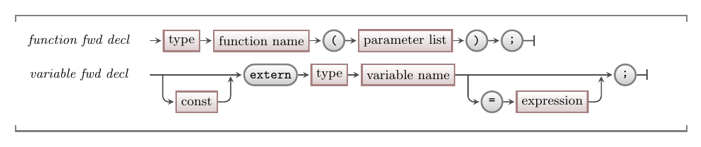

As we have mentioned before, the C/C++ compiler is very primitive. In order to use something, a function, procedure, variable, or constant, the compiler must have already seen its declaration.

This means that the language needed a way of *forward* declaring things. These are like promises to the compiler that you will build thing you are declaring somewhere else in the code. The compiler will then trust you, and the linker will fail if the thing you declared does not exist when everything is finally put together.

## Header Files

Header files are full of forward declarations of functions, procedures, and constants. If we think about the "splashkit.h" header, it tells the compiler "trust me... there is an `open_window` funtion with three parameters - a string and two doubles". This means you can call `open_window` and the linker is then told to look in the SplashKit library where it finds the code we have written to create this.

:::tip[In C/C++]



The forward declaration of a function or procedure is just its header. In the syntax we show only functions, but remember that in C/C++ a procedure is coded as a `void` function. This is a promise that there is function of this declaration in the code elsewhere.

Variable forward declarations are achieved using the **extern** keyword. As with the function forward declarations, these are promises that the variable exists elsewhere.

:::

## Multiple cpp files

Using header files, you can now start to code your program using multiple files. Each C/C++ file can contain a part of the programs code with the shared things declared in a header file. This can be a great way to help further organise the code in your program.

Make sure to only use forward declarations in your header files. You will potentially include these in multiple files. If you declare a function or a procedure in the code, then it will be created multiple times. This will then become an issue - so watch out for errors relating to re-defining things that already exist.

To help protect against this, the C/C++ pre-processor includes the ability to skip code in a file using either a `#ifdef` or a `#ifndef` guard. These guards only include code *if* something is declared (`#ifdef`) or not declared (`#ifndef`).

In general, you wrap all code in each header file in its own unique guard like this:

```cpp
#ifndef GAME_LOGIC_H
#define GAME_LOGIC_H

// the header file code here!

#endif
```

This says, if `GAME_LOGIC_H` is not defined, then include the code that follows up to the matching `#endif`. The second line then declares `GAME_LOGIC_H`, ensuring that any subsequent include of this header file does will skip this code as the `GAME_LOGIC_H` is now defined.


## Example

We can split our global variables example across multiple files like this:

In **program.cpp**:

```cpp
#include "splashkit.h"
#include "logic.h"

using std::to_string;

int main() 
{
  x = 9;
  write_line("Value of global variable x = " + to_string(x));
  write_line("Value of global variable message = " + message_text);
  
  x = 3;
  my_procedure();
  write_line("Value of global variable x = " + to_string(x));
  write_line("Value of global variable message = " + message_text);

  return 0;
}
```

The **logic.h** header can forward declare the elements that main needs.

```cpp
#ifndef LOGIC_H
#define LOGIC_H

// Declare (unnecessary) global variables
extern int x;
extern string message_text;

void my_procedure();
#endif
```

Which can then be coded into **logic.cpp**. The compiler will not care what the filename is called, but this will help us link the two together as we go forward.

```cpp
#include "splashkit.h"

using std::to_string;

// Declare (unnecessary) global variables
int x;
string message_text = "Hello world";

void my_procedure()
{
  write_line("In my procedure");

  // Global variables declared outside of functions and procedures
  message_text = "Hello Jupiter";
  write_line("Value of global variable x = " + to_string(x));

  x = x + 1;
  write_line("Value of global variable message = " + message_text);
  
  write_line("Ending my procedure");
}
```

To compile this, we now need to compile both cpp files. If these are the only files in the current folder, then you can use the "*.cpp" wildcard to compile all cpp files. Alternatively, you can list each of the filenames in the call.

```sh
clang++ program.cpp logic.cpp -l SplashKit -o test

clang++ *.cpp -l SplashKit -o test
```

You do not include the header files in the compiler call. The preprocessor will read those for you and embed their code where the `#include` is encountered.

:::note[Summary]

- Forward declarations let you make promises to the compiler.
- These promises let you divide you code between files - which the compiler reads one at a time.
- You may get linker errors as a result of failing to fulfil a promise or accidentally creating something multiple times.
- Header files provide a way of sharing these promises between files. You code the promises in the header, and you can include the header wherever you want to use those things.

:::
