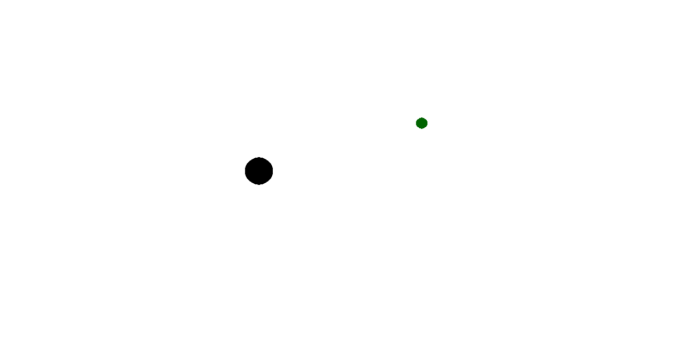

import { Accordion, AccordionItem } from 'accessible-astro-components'
import { Steps } from '@astrojs/starlight/components';
import Aside from '/src/components/Aside.astro'

For this tour, we'll be expanding upon what we learned in Explore Structs (GUI), to create a small game where the player controls a spider on a web and catches flies. We'll focus on using _composition_, that is, structs within structs, to help us model our game's digital reality in a more meaningful way. By the end of this, you should feel more confident when structuring your programs, and understand various ways `struct`s can be used and designed.

Here's an outline of the game:

| **Name** | *Fly Catch* |
|---|---|
| **Description** | A small game where the user controls a spider using the keys on the keyboard. The user can move the spider around on their web, catching each fly as it appears. Take too long, and the fly escapes. |

The finished game will look like this:


However, for now our focus will be on capturing the digital reality that best describes this game - so our version will look like this at first:



It's a bit simplified :)

The neat thing here is that the underlying code is almost identical between these two versions! This is because the digital reality that describes these two programs is the same - the only difference is that we added some nice art to the top one.

---

Let's start by progressing similarly to the last page. We'll start by:
 - Identifying our main entities.
 - Writing structs for them.
 - Get them drawing on the screen.

We'll be iterating and adjusting these structs as we go, so no need to make them perfect first try.

<Aside type="thinking" title=" ">
### Question time :)
1. First off, what are the two main entities you can identify? We'll code these up as [structs](/book/part-2-organised-code/2-structuring-data/5-reference/03-01-struct/).
    <Accordion>
    <AccordionItem header="Let's check...">
        1. Spider
        2. Fly

        ##### What about the web?
        This is a fair question! For the program we write, we won't need to think of it as an entity. The web won't _exist_ in our digital reality - it will just be a static image. _We_ will see a "web", but to the computer, it will just be an image that could be anything.

        In a different design, the web could very well be an entity!
    </AccordionItem>
    </Accordion>
2. What things do we need to _know_ about these entities? These will be the fields within each struct.
    <Accordion>
    <AccordionItem header="Let's check...">
        Some possibilities:

        Spider:
         - Its position on screen (x and y)
         - Its image or colour

        Fly:
         - Its position on screen (x and y)
         - Its image or colour
         - Whether it's caught in the web
         - How long remains until it escapes

        Both structs will definitely need an x and y position, so we'll start with that.

        These other fields will need some more careful thinking. We can do this after we get them drawing on the screen.
    </AccordionItem>
    </Accordion>
3. What do we need to _support_ our digital reality? How will we write our program so that we can display our spider and fly, and enable the user to interact with it?
    <Accordion>
    <AccordionItem header="Let's check...">
        Since our program is graphical and takes user input, we'll need:
        - a window to display things in
        - a loop that handles input events, so that we can continuously redraw the screen after use input.
        - some way to draw the spider and flies - we'll just use circles for now, but later on we'll switch to images.
    </AccordionItem>
    </Accordion>
</Aside>

Now that we have a vague plan of our entities, let's start writing some code!

<Steps>
1.  ### Setting up the event loop

    Let's start by setting up our window and event loop, since the rest of our entities will exist within it. This should be very similar to the last program.

    Here are the signatures of the functions/procedures to use - memorization isn't the goal here, but have a go at using these to write the event loop on your own inside `main`:
    ```c++
        window open_window(string title, int width, int height);
        void clear_screen(color clr);
        void refresh_screen();

        void process_events();
        bool quit_requested();
    ```
    For the window, let's give it a size of 1280 by 720 - add some global constants for the width and height so it can be adjusted easily later.

    <Accordion>
    <AccordionItem header="Try it on your own first! But check here if you get stuck.">
    ```c++
    #include "splashkit.h"

    const int SCREEN_WIDTH = 1280;
    const int SCREEN_HEIGHT = 720;

    int main()
    {
        open_window("Fly Catch", SCREEN_WIDTH, SCREEN_HEIGHT);

        // The event loop
        while (!quit_requested())
        {
            // Get any new user interactions
            process_events();

            // Draw the game
            clear_screen(COLOR_WHITE);

            // Show it to  the user
            refresh_screen();
        }
    }
    ```
    </AccordionItem>
    </Accordion>
2.  ### Setting up our structs

    Next, let's add in our structs for the spider and the fly - for now we'll just give them both fields for their position (x and y as doubles). Try writing both structs, and declare variables for the fly and the spider at the top of `main`. We'll handle initializing them in a moment.

    :::tip[What to name the types?]

    On the previous pages we named our structs `something_data` (for instance `target_data`). This is because we can't give both the variable and the type the same identifier, so one option is to add `_data` to the end of the struct's name.

    We will continue using this naming scheme for the rest of the tutorial.

    However, depending on the language or code base, there are also alternative naming schemes. One option is giving types PascalCase names, while variables have camelCase (e.g. `Spider spider;`) - this may appeal to you more.
    :::
    <Accordion>
    <AccordionItem header="Adding the spider and fly structs">
    ```c++ {3-13, 17-18}

    ....

    struct spider_data
    {
        double x;
        double y;
    };

    struct fly_data
    {
        double x;
        double y;
    };

    int main()
    {
        spider_data spider;
        fly_data fly;

        open_window("Fly Catch", SCREEN_WIDTH, SCREEN_HEIGHT);

        ...
    }
    ```
    </AccordionItem>
    </Accordion>

3. ### Adding `new_spider` and `new_fly`
    Now let's initialize the spider and fly.

    We could use brace initialization as follows:
    ```c++
        spider_data spider = {SCREEN_WIDTH/2, SCREEN_HEIGHT/2};
        fly_data fly = {100, 100};
    ```
    However, this isn't ideal.

    Brace initialization is absolutely fine for simple static types (like `color`, which has an `r` `g` `b` and `a`, or `point_2d` which has an `x` and `y`), but for structures that might change or grow, it will lead to issues later on. Besides, we will want to add logic that runs when initializing the fly and spider, so it makes more sense to move this initialization elsewhere.

    Let's create a `new_spider` and a `new_fly` function instead. For now, both of them will take no parameters, and return their respective type. The spider should be initialized in the center of the screen, while the fly can be placed anywhere.

    This should be familiar after writing `new_target` in Explore Structs (GUI). Have a go at writing these functions, and adjusting your initialization code in `main` accordingly.

    <Accordion>
    <AccordionItem header="Adding new_spider and new_fly">
    I continued using brace initialization inside each of the functions - it's only in one place, so it will be easy to change later if needed.
    ```c++
    spider_data new_spider()
    {
      spider_data spider;

      spider = {SCREEN_WIDTH/2, SCREEN_HEIGHT/2};

      return spider;
    }

    fly_data new_fly()
    {
      fly_data fly;

      fly = {100, 100};

      return fly;
    }
    ```
    I also deliberately left the `spider = {...}` lines on their own, since we'll likely be adding more complex fields, and the initialization will start to be broken up over multiple lines.
    </AccordionItem>
    </Accordion>


4. ### Drawing the spider and fly

    Now let's get our fly and spider drawing on the screen. For now we'll draw the spider as a black circle, and the fly as a green circle, using this procedure:
    ```c++
    void fill_circle(color clr, double x, double y, double radius);
    ```

    Let's also start to break up the code a bit - add a `void draw_game(...)` procedure that takes the spider and fly as `const` references, and add it into the event loop. We can move the `clear_screen` and `refresh_screen` calls into it.

    Once you have that working, then try adding in calls to `fill_circle` inside `draw_game`, to draw the spider and fly by accessing their `x` and `y`.

    _If you're not seeing them, make sure the calls are between the `clear_screen()` and `refresh_screen()`, and that their `x` and `y` are set to be on screen._

    <Accordion>
    <AccordionItem header="Adding draw_game">
    ```c++ {3-7, 12-16, 31} ins={8-12}

    ....

    void draw_game(const spider_data &spider, const fly_data &fly)
    {
        // Draw the game
        clear_screen(COLOR_WHITE);

        // Draw spider
        fill_circle(COLOR_BLACK, spider.x, spider.y, 20);

        // Draw fly
        fill_circle(COLOR_GREEN, fly.x, fly.y, 15);

        // Show it to the user
        refresh_screen();
    }

    int main()
    {
        spider_data spider = new_spider();
        fly_data fly = new_fly();

        open_window("Fly Catch", SCREEN_WIDTH, SCREEN_HEIGHT);

        // The event loop
        while (!quit_requested())
        {
            // Get any new user interactions
            process_events();

            draw_game(spider, fly);
        }
    }
    ```
    </AccordionItem>
    </Accordion>

    :::tip
    Imagine we wanted to add a third entity, "ladybug". We would have to modify the parameters of our `draw_game` procedure - does this seem right? On the next page we'll see if we can refactor this with a better structure. Note also how `spider_data` and `fly_data` share the same `x` and `y`, and both are represented by circles...maybe we can use this commonality to our advantage?
    :::
</Steps>

At this point we have our spider and fly on screen, and it seems we're ready to start moving things around! But before then, we should consider our design a litle more carefully. We'll try this out in the next section.
