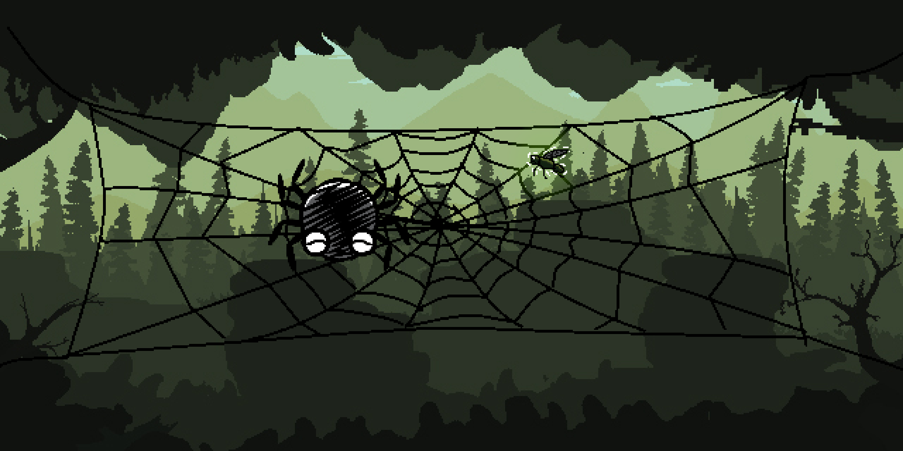

import { Accordion, AccordionItem } from 'accessible-astro-components'
import { Steps } from '@astrojs/starlight/components';
import NoCopy from '/src/components/NoCopy.astro'
import TemplateInjector from '/src/components/TemplateInjector.astro'
import MultipleChoice from '/src/components/MultipleChoice.astro';
import ITO from '/src/components/InlineTextOption.astro'
import Aside from '/src/components/Aside.astro'
import Carousel from '/src/components/Carousel.astro'
import Option from '/src/components/Option.astro';
import CodeScroll from '/src/components/CodeScroll.astro';

Finally, it's time to catch and eat the fly :)

Compared to the last part, this will be surprisingly straightforward:

<Steps>

1. ### Colliding `entity`s
    Let's add a function to test if two entities are colliding - we can use this to check if the spider is colliding with the fly.

    We only detect them as "colliding" if both are `enabled` - an `entity` that isn't `enabled` can't collide with anything.

    <div class="table-first-column-expand">
    |   |   |
    |---|---|
    | **Function** | *Entities Collide* |
    | **Description** | Takes two `entity` as constant references. If they are _both_ `enabled`, and their circles are intersecting, then it returns `true`.|
    | **Return** | A `boolean` |
    </div>

    For this, we can use the SplashKit function [`Circles Intersect`](https://splashkit.io/api/geometry/#circles-intersect-functions).

    <Accordion>
    <AccordionItem header="Entities Collide">
        Again I wrote a fairly terse function - feel free to write a more expanded one.
        ```c++
        bool entities_collide(const entity &ent1, const entity &ent2)
        {
            return ent1.enabled && ent2.enabled && circles_intersect(
                ent1.pos.x, ent1.pos.y, ent1.radius,
                ent2.pos.x, ent2.pos.y, ent2.radius
            );
        }
        ```
    </AccordionItem>
    </Accordion>

2. ### Eating the Fly

    Hopefully you can already see some ways of handling eating the fly. The core logic is just:
     - Test "is the fly and spider colliding"?
     - If so, we can just create a new fly.

    We never added a score counter or anything, so for now this will do :) Note that rather than modelling 'eating' as a separate state, we treat it as simply scheduling the next fly.

    Have a go at writing that logic now, and see if you can make the fly vanish when the spider collides with it!

    <Accordion>
    <AccordionItem header="Eating the Fly">
        ```c++ {5-9}
        void update_game(game_data &game, long current_time)
        {
            move_with_keyboard(game.spider.ent, SPEED);

            if (entities_collide(game.spider.ent, game.fly.ent))
            {
                // new_fly schedules its next appearance in the future
                game.fly = new_fly(current_time);
            }

            update_fly(game.fly, current_time);
        }
        ```

        There were a lot of ways to approach this - I chose the simplest, but perhaps not the best one...

        - Should collision be tested inside `update_fly` instead?
        - Should the _result_ of `entities_collide` be passed into `update_fly` (e.g `update_fly(..., bool caught)`)?

        Hopefully you are starting to ask these sorts of questions! These are all valid options, and each one has its own positives and negatives :)
    </AccordionItem>
    </Accordion>
</Steps>

At this point, the game itself is done! We've covered a huge amount here, and if you've followed along you should be proud of what you've made. Hopefully this has helped you understand some more advanced ways of developing and composing structs when building programs.

_I highly recommend doing the next part :)_

---

### (Optional) Making it look nice

Since you've gone this far, you may as well finish off these last couple of steps!

First off, download the following images, and place them in the same folder as your `.cpp` and binary.

<table>
<tr>
<td style="width: 33%;"></td>
<td></td>
<td></td>
</tr>
<tr>
<td style="width: 33%;">
[Download](/resources/code-examples/part-2/2-structuring-data/background.png)

_License: [CC BY 3.0](https://creativecommons.org/licenses/by/3.0/)_

_By jkjkke: [link](https://opengameart.org/content/background-5)
Composited with: Public Domain Web by Christina Lee (https://electronsandsuch.com) [link](https://opengameart.org/content/2d-spider-webs)_
</td>
<td style="width: 33%;">
[Download](/resources/code-examples/part-2/2-structuring-data/spider.png)

_License: Public Domain_

_Derivative work of the public domain spider by bevouliin.com and modified by Christina Lee: [link](https://opengameart.org/content/happy-spider)_
</td>
<td>
[Download](/resources/code-examples/part-2/2-structuring-data/fly.png)

_License: Public Domain_
</td>
</tr>
</table>

First, let's get our entities using bitmaps :)
<Steps>
1. Inside `entity`, remove the color field, and add a new `bitmap bmp` field - `bitmap` is a type from SplashKit which can store an image. _(You can also leave the color field if you want.)_
2. Now inside `new_fly` and `new_spider`, replace the colour with a call to [`Load Bitmap`](https://splashkit.io/api/graphics/#load-bitmap). For example `load_bitmap("fly", "fly.png")`

    This way, whenever a fly or spider is created, you're loading the relevant bitmap, and storing it inside the entity!
    :::tip
    SplashKit won't re-load bitmaps that have the same "name" - for instance if you load your fly bitmap under the name "fly" once, it will cache that, and re-use it later. So don't worry that we're calling load_bitmap over and over again :)
    :::
3. As you may have guessed, the last thing is to adjust `draw_entity` to draw the bitmap instead of the circle. You can use [`Draw Bitmap`](https://splashkit.io/api/graphics/#draw-bitmap) for this.
    :::note
    SplashKit draws circles starting from the center, but bitmaps starting from the top-left. You'll need to calculate the position to draw the bitmap at, by subtracting half the width and height of the bitmap. You can use [`Bitmap Width`](https://splashkit.io/api/graphics/#bitmap-width) and [`Bitmap Height`](https://splashkit.io/api/graphics/#bitmap-height) to help.
    :::
</Steps>

Make sure that part's working now - you should be able to see the fly and spider with the bitmap now. Next up is the background! There are a few approaches you could take here:
 - (Maybe) **the background is unrelated to anything else**. So we can add a `bitmap background` field into `game_data`. We can load the background image into it in `main`, and then draw it in `draw_game`.
 - (Or) **the background is an `entity`** . We can add an `entity background` field into `game_data`, initialize it in `main`, and then draw it in `draw_game` using `draw_entity`
 - (Or) Something else...

Have a think about how you want to represent the background. Is it being an entity helpful? Will we want to be able to move it around? Enable/disable it? Should it be something else entirely?

#### Good Luck!


## (Optional) Extensions
Here are some ideas if you want to practice further:
 - **Multiplayer** - You could adjust the game so that the spider is controlled via WASD, while the fly is controlled via the arrow keys. Try creating a struct for the keyboard controls, that you pass into `move_with_keyboard`.
 - **Score** - Try adding a score to the game. This should involve changing the `game_data` struct, along with `draw_game` and `update_game`
 - **Proper Web Boundaries** - The fly and spider can leave the web in the background image currently - try fixing this! I'd recommend using the `rectangle` struct from SplashKit to represent where the web is, and passing this into the relevant functions and procedures.

 Thanks to the architecture we have, these should only take around ~10 lines of code each! Good luck :)
