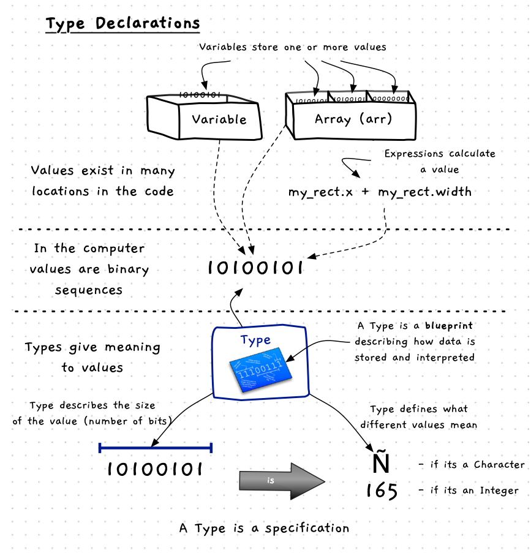

## Concept

This chapter is all about types, so its is important to have a good understanding of what a type is. A type is a specification for a class of data, describing how it is stored and interpreted.

Figure x.y: Type defines the size and interpretation if values in your code
 

:::note

- A Type is a kind of `artefact`, describing the format and interpretation of values.
- Types specify the following:
  - The size (number of bits) needed to store values of this type.
  - How the bits of the type are interpreted.
  - The operations that can be performed on values of this type.
- You can think of a Type as a blueprint, specifying data layout.
- The interpretation of a value depends on its Type, for example `10100101` is `Ñ` if the value is a Character type, but the same value would be `165` if it is an Integer type.
- You can create your own types...

::: 