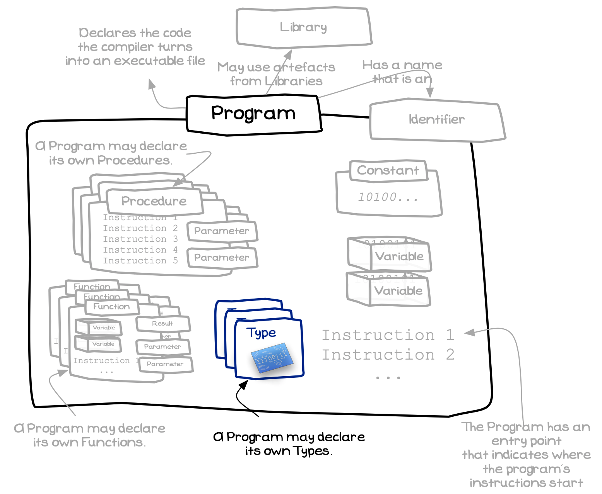

The program remains our overarching building block, containing the code that defines the other building blocks that we have been creating. When you want to declare your own types, you do so in your program's code. This makes it possible to model the data, in the same way as you model the actions in your code using functions and procedures.

A Program can contain Type Declarations
 

## Program - Why, When, and How

The role of the program has not changed, but now you can start to think about the types that you want to exist within your code. Organising your data will help make it easier to work with these values throughout your program.

## In C/C++

:::tip[Syntax]

A C/C++ program can contain type definitions alongside your function, procedure, and constant declarations.

Type declarations are often created in header files so that they can easily be shared between the code files in the project.

:::

:::note

- A program is a **building block**, it is the container within which you code your functions, procedures, constants, and now types.
- The types you declare in your program will be available for use within the program’s code, within your functions and procedures.
- You will be able to create [variables](../../../../part-1-instructions/1-sequence-and-data/1-concepts/07-variable) of the types you create. They will store the values in the format you specified. This includes [parameters](../../../2-organising-code/1-concepts/04-parameter) and [local variables](../../../2-organising-code/1-concepts/03-local-variable).

:::
