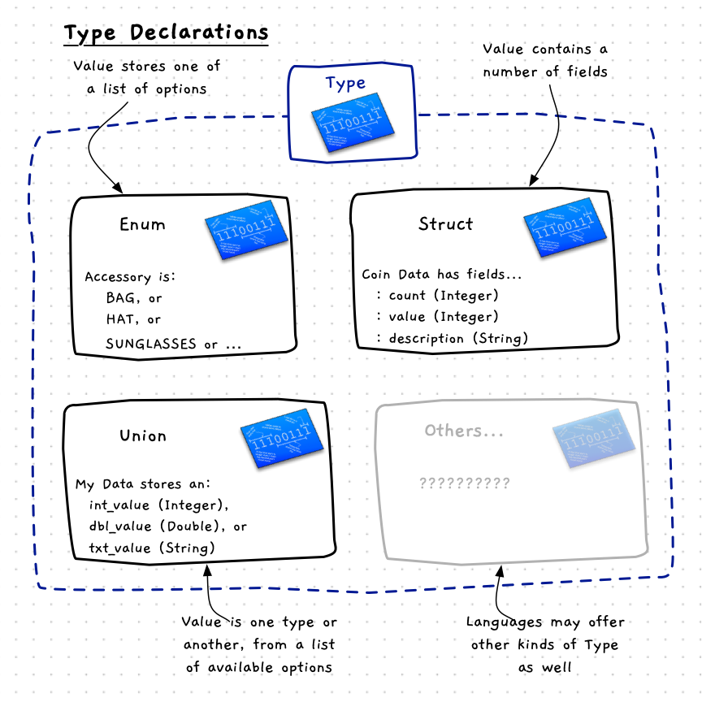

Type declarations allow you to create types. Programming languages offer a range of different code structures you can use to build your types.

<a id="FigureCustomTypeDeclaration"></a>


<div class="caption">You can declare your own Data Types</div><br/>

## Type - Why, When, and How

Modelling types helps you see the different things that are within your program. When thinking about your data, you need to determine which kind of type you will create.

Most entities in your program will be structured data (structs in C/C++). Using structured data, you can create a type that contains a list of fields where each field contains a value. In this way you can capture all the data associated with the entity in a single value in your code. For example, a bank account could be made up of the account number, name, balance, and kind. All of this data can be captured in an account struct, allowing you to declare and work with account variables in your code.

At other times, you will want to capture data where a value needs to be restricted to a list of options. For example, the account kind in our bank account should be either a savings account, credit account, loan account, etc. In these cases you can create an enumeration to capture these options. This then means you can see these options within your code.

Very rarely, you want to be able to have a variable where it can store different types under different conditions. For example, you may have a variable that needs to be an integer sometimes, a double at other times, and an account at other times. In these cases you can use a union.

As you model your data you need to use these different type options to structure your solutions. When you think about your program, try to see how these different types could come together to structure your data in a way that will make it easy to code your functions and procedures. Ideally your data model will capture aspects from your program's domain, making it easy to connect the types in your digital reality with the concepts within the domain.

:::note

- A type declaration allows you to create your own types in code.
- Programming languages provide syntax for declaring a couple of different kinds of types.
- To start with we will see how to declare the following:
  - **Struct**: A structured record, where each value of this type is made up of a number of fields.
  - **Enum**: An enumeration creates a type where the value will be one of a list of available options.
  - **Union**: Makes it possible to create a type where the value could be one of a number of other types.
- You use these different kind of types to design the structure for the values you will work with in your code.
- Remember that variables are used to store values - when you declare a type you are defining the structure for data that exists within variables. The type itself has no data associated with it.

:::

## In C/C++

:::tip[Syntax]

C syntax is a little clunky in relation to type declarations, which we will discuss in each of the different kinds of types as we go. To get around this C has syntax to create a type alias. This makes it easy to name your types, and access these throughout your code.


The C syntax looks a little like you are declaring a list of variables, though it starts with the keyword `typedef`. To set up an alias, you start with `typedef`, the details of the type you want to alias, and then the new name(s) you want to use to refer to these as.

C++ has made things a little easier, avoiding the need to use `typedef` in most places. It also provides the ability to alias types using simpler syntax. The syntax for this is shown below. It indicates that you can use `using new_type = old_type;` to create a `new_type` name for the existing `old_type`.


:::

## Example

The following C code shows an example that creates an `integer` type that is an alias of `int`. We can use this anywhere we would have used `int` previously. Generally you would not do this, but it does show how this syntax works.

```c
// Access our utilities like read_integer
#include "utilities.h"

// Create an integer type, that is an alias of int
typedef int integer;

integer main()
{
  integer x;

  x = read_integer("Enter a whole number: ");
  return 0;
}

```

:::note
This code assumes you have created the utilities header and code file as described in the [shared utilities](/book/part-2-organised-code/2-organising-code/2-put-together/04-00-utilities) section. If not, you will need to remove the `#include` and copy in an implementation of the `read_integer` function for the example to work.
:::

In C++ we can achieve the same thing with `using` to create an alias.

```cpp
// Access our utilities like read_integer
#include "utilities.h"

// Create an integer type, that is an alias of int
using integer = int;

integer main()
{
  integer x;

  x = read_integer("");
  return 0;
}

```

In most cases we will use the C version, as this works both for C and C++.
