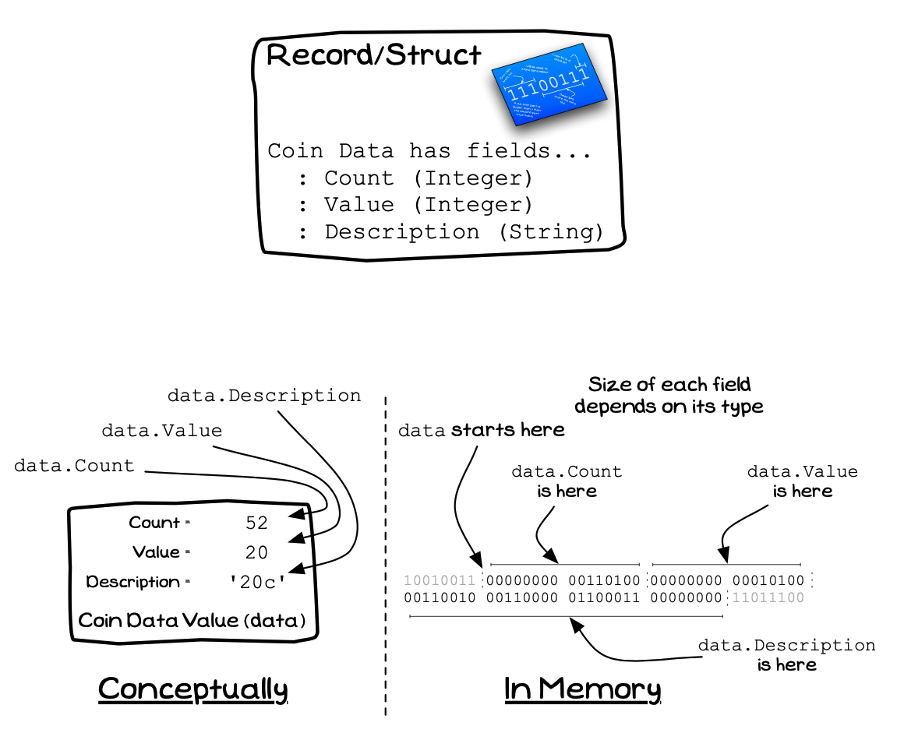

In C/C++ the **struct**, short for **structure**, is a composite type whose value is made up of a number of **fields**. Each field stores a value of a certain type. A value of the struct's type stores data for each field described in the structure.

In your code, structs can be used to model data associated with the *things*, the *entities*, associated with your program. For example, a financial application can have structs to organise the data for `account`, `customer`, and `transaction` types. A murder mystery game may have `player`, `clue`, and `scene` types, whereas a space invaders game would have `player`, `alien`, and `bullet` types. Each of these can be modelled in code using structured data.

<a id="FigureCustomTypeRecord"></a>


<div class="caption">A Record or Structure contains Fields</div><br/>

:::note

- A struct type is a kind of **building block** you can declare.
- You can create your own struct types, these can then be used to define the data stored in [variables](../../../../part-1-instructions/1-sequence-and-data/1-concepts/07-variable) in your code.
- Remember that a type declaration is declaring a new data format, not declaring a new data value. You use a variable to store values, and types to define the format of these values.
- The **size** of a record is based on the sum of the sizes of its fields

:::

## Structs - Why, When, and How

Structs are your go-to tool for modelling the **things** (entities) within your digital reality. You can now put together all the data related to that entity in the one type. Then, when you want one of these entities in your code, you use your type. This can be in a local variable, or in parameters. Anywhere you have data can now be used to work with your entities.

Each struct should model an identifiable entity in your digital reality. These are one of your key building blocks, allowing you to clearly show the things associated with your program. As you think about the program, these entities should clearly relate to the program. For example, in a banking system you would expect to see accounts, and transactions. These are clearly entities associated with this domain.

As you build up these structs, think about the data associated with the entity. This can be simple data like the numbers and text, but can also be other structures or enumerations. For example, a bank account would have a name (text) and a number. A customer struct may then have an account as one of its fields.

Globally declaring structs has some great additional benefits. As you grow your program by building it iteratively, you can add additional fields to your structs. This will add the additional fields throughout your program - everywhere you have a variable of that type will now have these additional details. This is such a cool feature, so watch out for this as you start working with structs in your code.

## In C/C++

:::tip[Syntax]

This is the syntax for declaring your own custom struct in C/C++.


- The declaration starts with **struct** indicating the declaration of a structured record.
- Next comes the **struct name**. This identifier can be used to refer to the struct.
- In C, you are required to add the keyword `struct` keyword as well as the name of the struct to identify this type. In the below example, we declare a `struct person_struct`, to create a variable from this struct in C you use `struct person_struct variable_name;`.
- C++ does not need you to add the `struct` keyword in its identifier when using these types. This removes the need to use the `typedef`, but then limits your code to only work with C++.
- Following this is a **list of fields** between braces (i.e. `{...}`). Each field is a variable within the struct, they each have their own type that may be of any type, including other structures, standard types, enumerations, and unions for example.
- You can embed a struct definition within a **typedef**. This allows you to alias the type during its declaration.

:::

## Example

The following code shows an example of a struct in C/C++. The `person` struct contains a `name`, and an integer called `age`. Remember that the type declaration is creating a new type. After declaring the struct, you can now create variables of the person_struct type.

```cpp
/* Program: test-struct.cpp */
#include "splashkit.h"

// I've coded read_integer in utilities.h
// and a read_string which works in a similar way
#include "utilities.h"

using std::to_string;

/**
 * A person is used to capture the data we want to track
 * about people in our program.
 *
 * @field name  the name of the person
 * @field age   the person's age
 */
struct person_struct
{
    string name;
    int age;
};

/**
 * A person is used to capture the data we want to track
 * about people in our program.
 *
 * This is an alias of the struct person_struct type.
 */
typedef struct person_struct person;

/**
 * Output details of a person to the terminal
 *
 * @param p the person to output
 */
void print_person(person p)
{
    write_line(p.name + " (aged " + to_string(p.age) + ")");
}

/**
 * Read in the details of
 *
 * @param prompt a message to show the user when they start
 *               to enter the user's name
 * @return a person populated with the data the user provided
 */
person read_person(string prompt)
{
    person result = {"", 0};

    write_line(prompt);

    result.name = read_string("Enter name: ");
    result.age = read_integer("Enter age: ");

    return result;
}

int main()
{
    person me = {"Fred Smith", 20};
    person friend_0;
    person friend_1;

    friend_0 = read_person("Enter details for a friend.");
    friend_1 = read_person("Enter details for another friend.");

    print_person(me);
    print_person(friend_0);
    print_person(friend_1);

    return 0;
}
```

:::tip

You can combine the typedef and the struct declaration in a single line. The following code shows how to do this for the `person` typedef. Notice how it wraps the struct definition within the typedef.

```cpp
typedef struct person_struct
{
    string name;
    int    age;
} person;
```

:::
