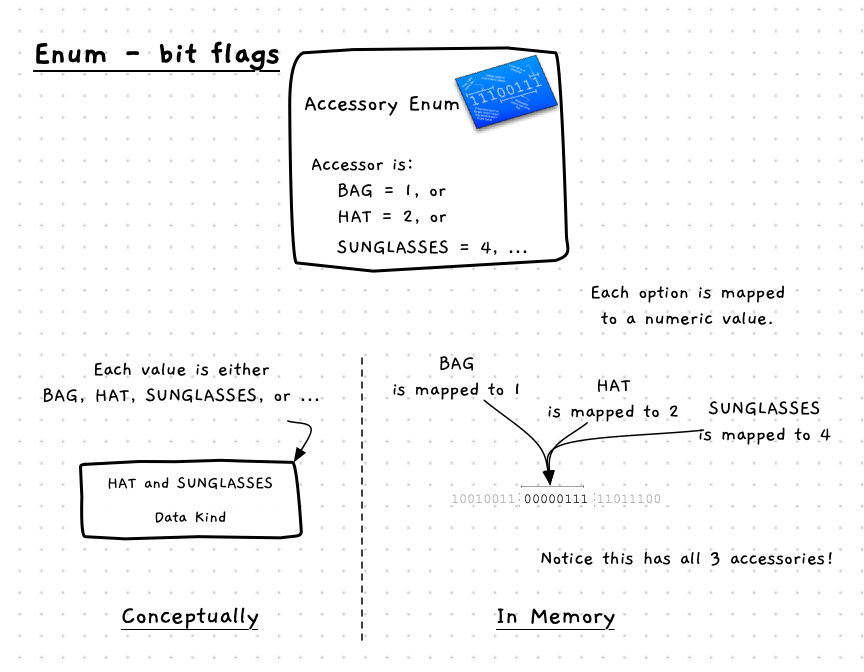

With enumerations, you can also take advantage of the underlying type to allow a variable to store multiple flags (options that can be set on or off). In these cases you need to give each option a value that is a power of 2 (first at `1`, then `2`, `4`, `8`, `16`, and so on). In this way, you can add the flags together and have one value that indicates which are turned on and which are off.



By using powers of 2, each value represents an individual bit within the integer. This means that a 64bit integer could store up to 64 flag values. The following text shows the value for a 4bit unsigned integer. Notice how each of the powers of 2 is represented as a unique bit within the binary number.

```
0 = 0000
1 = 0001
2 = 0010
4 = 0100
8 = 1000

5 = 0101 (4 and 1 set)
```

Combining these powers of 2 results in a value with those associated bits set to 1. As shown above, 1 + 4 is 5 the binary value 0101 in which both the 1 and 4 bit have the value 1.

## Bitwise and (&)

Once you have a value, you can test if that value contains a given bit using the bitwise **and** operator (`&` in C/C++). The following calculations demonstrate this. Here we are testing if the 1 bit is set in the value 5. This does a bitwise and operation, comparing each bit position one by one. As with the boolean and operator, both bits must have the value 1 for the result to be 1 at that bit position.

```
5 & 1 = 0101 & 0001 = 0001 = 1
```

:::tip

Bitwise operators **&** and **|** operate on integers, whereas boolean operators **&&** and **||** operate on boolean values.

:::

We can lay out the binary values to make this comparison easier to see. Notice how only the last binary digit has 1 in both values. This means that the result contains that bit. So 5 & 1 has the result 1 as that bit is set in both values.

```
0101 &
0001
----
0001
```

You can use this in your code to test if a value is present in an enumeration setup to work as binary flags. The following example shows how you can do this. The `accessories_flag` type has binary unique values, so we can add a bag and sunglasses and store the result in the accessories variable. To test, we can use `accessories & BAG` to test if the `BAG` bit is set in the accessories value.

```cpp
typedef enum
{
  BAG = 1,
  HAT = 2,
  SUNGLASSES = 4,
  NECKLACE = 8,
  BRACELET = 16,
  RING = 32,
  EARRINGS = 64
} accessories_flag;

int main()
{
  accessories_flag accessories = accessories_flag(BAG | SUNGLASSES);

  if ( (accessories & BAG) == BAG )
  {
    //...
  }
}
```

:::tip

In C/C++, 0 is false, and any other value is true. So you could remove the comparison in the if statement and use just `accessories & BAG`.

:::

When the value is not present, the result of the bitwise and operator will be false. The following illustrates this. The value 6 has the 4 and 2 bits set (having the value 1), so 6 & 1 is 0 as the 1 bit is 0 in 6. We can see the workings of this below.

```
6 & 1 = 0110 & 0001 = 0000 = 0

0110 &
0001
----
0000
```

You can also test combinations, or multiple flags in one go. The following example tests if the 1 and/or the 2 bit are set in 6 using `6 & 3`. The result of this is 2, as only the 2 bit is set.

```
6 & 3 = 0110 & 0011 = 0010 = 2

0110 &
0011
----
0010
```

:::tip[Masking]

Notice how you can use the & operator to extract certain bits from a value. You can use this to identify which bits, from a subset of all bits, are actually set. If the result does not equal zero, then at least one bit was set. This is called masking. You will use bit masks any time you want to limit an operation to certain bits within a binary value (remember everything is represented as binary values in a computer).

:::

## Bitwise or (|)

You can use a bitwise or to set a flag to be true. As with boolean or, the result of a bitwise or only requires one of the bit to be set to 1 to have 1 in the result at that position. The following equations demonstrate this in use. Here we are using the or operator to set a bit to the true in the result. In this case 6 | 1 is 7, which now has the 1, 2, and 4 bits set.

```
6 | 1 = 0110 | 0001 = 0111 = 7

0110 |
0001
----
0111
```

Notice that this will also work when the bit is already set, in which case the or operator has no effect on the result. The example below demonstrates this, 6 has the 2 and 4 bits set, so or-ing it with 2 has no effect as that bit is already set.

```
6 | 2 = 0110 | 0010 = 0110 = 6

0110 |
0010
----
0110
```

In code, you would use this to set a flag in a variable. The following code adds a ring to the accessories set in the accessories variable.

```cpp
int main()
{
  accessories_flag accessories = accessories_flag(BAG | SUNGLASSES);

  // add a ring
  accessories = accessories_flag(accessories | RING);
  //...
}
```

:::tip

Bit flags are not something you will often use, but it can be a useful way to easily represent a number of flags or options that can be turned on and off.

:::
