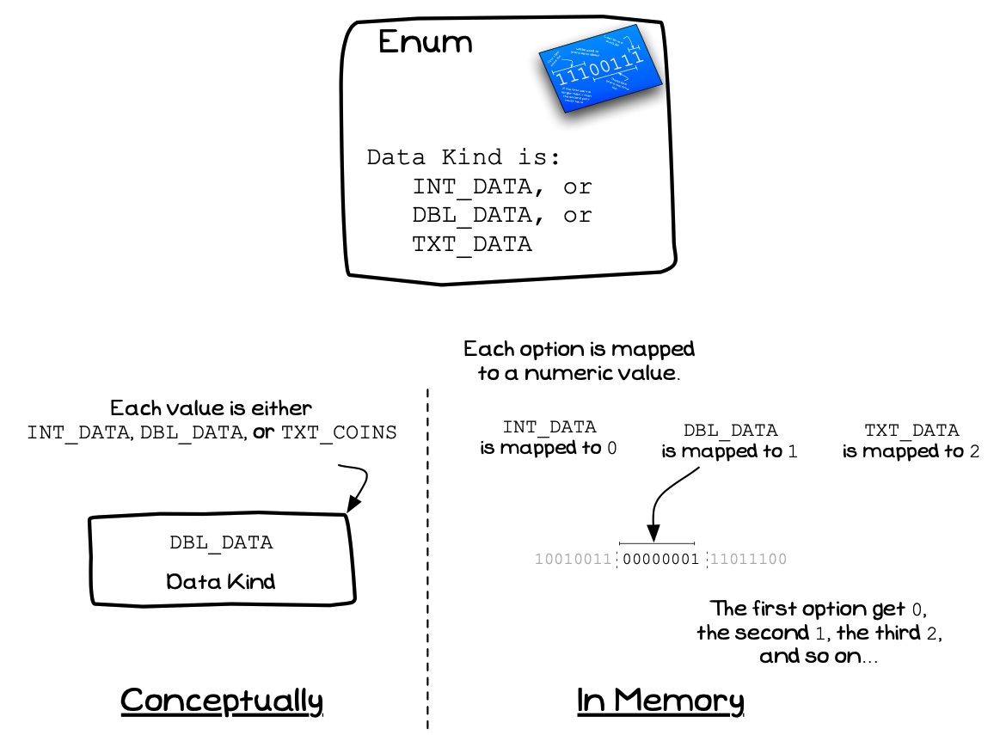

## Concept

Type declarations allow you to define your own types. Programming Languages offer a range of different code structures you can use to build your own types.

Figure x.y: You can declare your own Data Types
 

:::note

- A type declaration is the **term** given for declaring your own type artefact in code. Programming Languages offer a range of different kinds of types that you can create. 
- Each kind of type declaration allows you to create a type for different kinds of values: •
  - **Enum**: An enumeration is creates a type where the value will be one of a list of available options.
  - **Record** or **Struct**: A structured record, where each value of this type is made up of a number of fields
  - **Union** or **Variant Record**: Makes it possible to create a type where the value could be one of a number of other types.
- Languages may also offer other kinds of type you can declare.
- You use these different kind of types to design the structure for the values you will work with in your code.
- There is no data associated with a type declaration, you are declaring a new format, not another value.

:::

## Record

A Record (Structure in C) is a composite type whose value is made up of a number of **fields**. Each field stores a value of a certain type. A value of the record's type stores data for each field described in the Record/Structure.

In your code, records can be used to model data associated with the *things*, the *entities*, associated with your program. For example, a financial application can have records to store `Account`, `Customer`,
and `Transaction` values. A murder mystery game may have `Player`, `Clue`, and `Scene` values, where as a Space Invaders game would have `Player`, `Alien`, and `Bullet` values. Each of these would be modelled in code using a Record/Structure.

Figure x.y: A Record or Structure contains Fields
 

:::note

- A Record/Structure is a kind of **artefact** you can declare.
- You can create your own Record/Structure types, these can then be used to define the data stored in [Variables](../../../../part-1-instructions/1-sequence-and-data/1-concepts/08-variable) in your code. 
- Remember that this is declaring a new data format, it is not declaring a new data value: for that you need to declare a [Variables](../../../../part-1-instructions/1-sequence-and-data/1-concepts/08-variable).
- The **size** of a record is based on the sum of the sizes of its fields

:::

## Enumeration

An Enumeration allows you to create a type where the value is one of a list of available options. When you declare an enumeration you are listing the values that are available for data of this type. The example
in [Figure x.y](#FigureCustomTypeEnum) declares a type that can have the value `ADD_COINS` or `REMOVE_COINS`.

Figure x.y: An Enumeration allows you to define related constants
 

:::note

- An Enumeration is a kind of **artefact** that you can declare.
- Using an enumeration you can declare a kind of value that must come from a list of available options.
- When you declare the enumeration you list the *values* that it may have.
- This is like a list of constants, where values of this type will match one of these constants.
- Internally the compiler will map your values to numeric values. The first option is represented by the value `0`, the second is represented by the value `1`, and so on.
- You can specify the values for each option in the enumeration, this can be useful if you want to be able to combine options in a single value. In these cases you give each option a bit unique value (first at `1`, then `2`, `4`, `8`, `16`, etc).
- The **size** of an enumeration is based on the size of the integer type used to represent
its values.

:::

## Union

A Union (Variant Record in Pascal) allows you to declare a type where the values may be one of a range of alternative types. In effect, you can declare a type where the value may be one of a number of different
types. This is useful if you want to store different types of values at a location in your program.

A Union often works best by accompanying it with a **tag** value. This value then records the kind of data currently being stored at the location in memory. A good option is to use an [Enumeration](#Enumeration) for the tag's type, giving you a range of value, that describe the range of types stored.

Figure x.y: A Union is one type that can store one of a range of other types
 

:::note

- A Union is a kind of **artefact** that you can declare.
- The Union allows you to use one location in memory to store one of a number of types of value.
- At any one time this data can be used to store **one** of these values.
- It is the developers responsibility to ensure they access the right kind of value when it is being used. 
- A **tag** value can be used to store a marker that indicates the type of data being stored in the union.
- The **size** of a union is the size of its *largest* option. For example a union of a `Character`
(1 byte), an `Integer` (4 bytes), and a `Double` (4 bytes) is 4 bytes, the size of the largest kind of value it needs to store.

::: 
