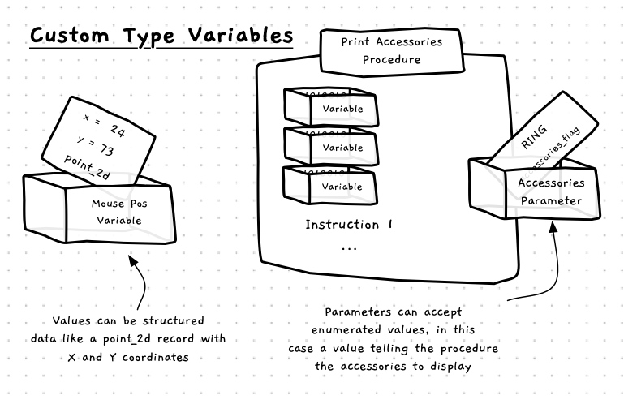

The custom types allow you to specify new data formats. To make use of this format you must declare variables that use the types you have created. You can use your new types when you declare [local variables](../../../2-organising-code/1-concepts/03-local-variable) and [parameters](../../../2-organising-code/1-concepts/04-parameter), allowing you to store values in this format and pass the around between your functions and procedures.

<a id="FigureDeclaringVariablesWithCustomTypes"></a>


<div class="caption">Some examples of how you can use your types to declare the kind of data stored in variables</div><br/>

:::note

- Variable declaration is the **term** given to the code that creates a variable.
- The variables you create store data, based on their type.
- You can use your custom type when you declare a variable.
- In [Figure x.y](#FigureDeclaringVariablesWithCustomTypes) there are the following examples:
  - `Mouse Pos`: A Variable that stores a `point_2d` structured data value containing an x and y value.
  - `Accessory`: Parameter that passes in an [enumeration](../03-02-enum) value of the `accessories_flag` type.
- You can combine these types in a huge variety of ways. The best idea is to try and model the entities related to your program.

:::

## Variables - Why, When, and How

Variables haven't changed, but now you have more control over what they can store. Once you have created your own type, you can use this type when you create a variable - where ever that variable is coded.

## In C/C++

:::tip[Syntax]

In C/C++ you can declare variables from any of the types that you have declared. Use your types as the *type name* in the variable's declaration.


:::

:::note

- This shows the syntax for declaring variables that use the types you have created.
- In C/C++ the type declaration must appear before you can use the type to declare variables.
:::

In C/C++ it is possible to initialise a struct when you declare the variable. To do this, you use braces to wrap the values for the fields as (i.e. `{...}` ). Within the braces you place one value for each field, in the order you declared them in the struct. These values are then used to initialise the fields of the variable. See the declaration of `var2` in the example below.

Unions can also have their values initialised. This also uses the brace notation, but this time you name the field you want to initialise. This sets the value of the union to store the indicated type. See the declaration of `var5` in the code below.

## Example

The following example demonstrates declaring and using values from the different kinds of types you can create.

```cpp
#include "splashkit.h"

using std::to_string;

typedef struct
{
  int     field1;
  double  field2;
  string  field3;
} my_struct;

typedef enum 
{
  OPT_1,
  OPT_2
} my_enum;

typedef union
{
  int         int_val;
  long long   long_val;
  double      dbl_val;
} my_number;

int main()
{
  // Declare variables, strucutres, enums, and unions.
  my_struct var1;
  my_struct var2 = {1, 3.1415, "Fred"};
  my_struct var3 = var2;
  
  my_enum var4 = OPT_1;
  
  my_number var5 = { .int_val = 98  };
  
  // Play with record/structures 
  var1.field1 = 2;
  var1.field2 = 6.5;
  var1.field3 = "Wilma";
  
  write_line( "var1 " + 
              to_string(var1.field1) + " " +
              to_string(var1.field2) + " " + 
              var1.field3 );

  write_line( "var2 " + 
              to_string(var2.field1) + " " +
              to_string(var2.field2) + " " + 
              var2.field3 );


  // Play with enums
  write_line("Int value of var4 is " + to_string(var4));
  var4 = OPT_2;
  write_line("Int value of var4 is " + to_string(var4));
  
  // Play with unions
  write_line("Int value of var5 is " + to_string(var5.int_val));

  var5.long_val = 123456;
  write_line("Long value of var5 is " + to_string(var5.long_val));
  
  var5.dbl_val = 3.1415;
  write_line("Double value of var5 is " + to_string(var5.dbl_val));
  
  return 0;
}
```

:::note

Remember you can also use your new struct, enum, and union types to declare parameters and return values from functions. In these cases you cannot initialise their values, but you can get these values to use your new types.

:::
