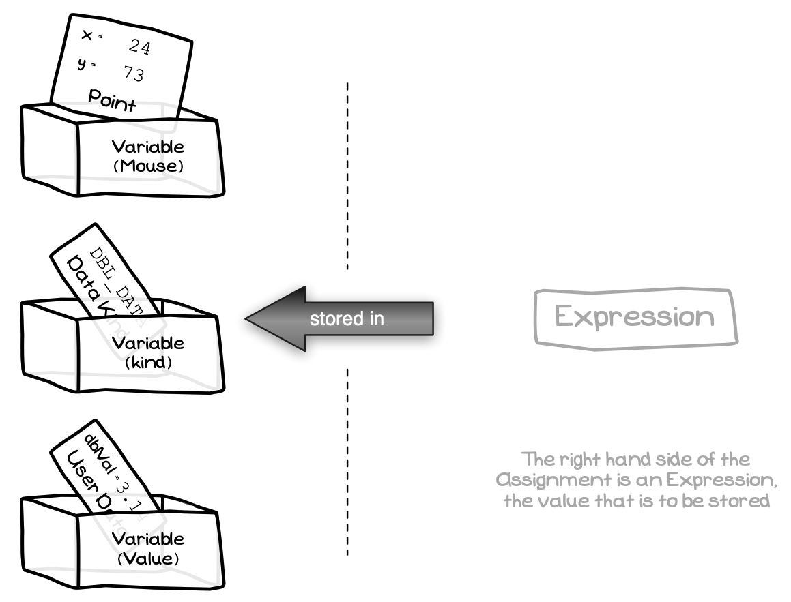
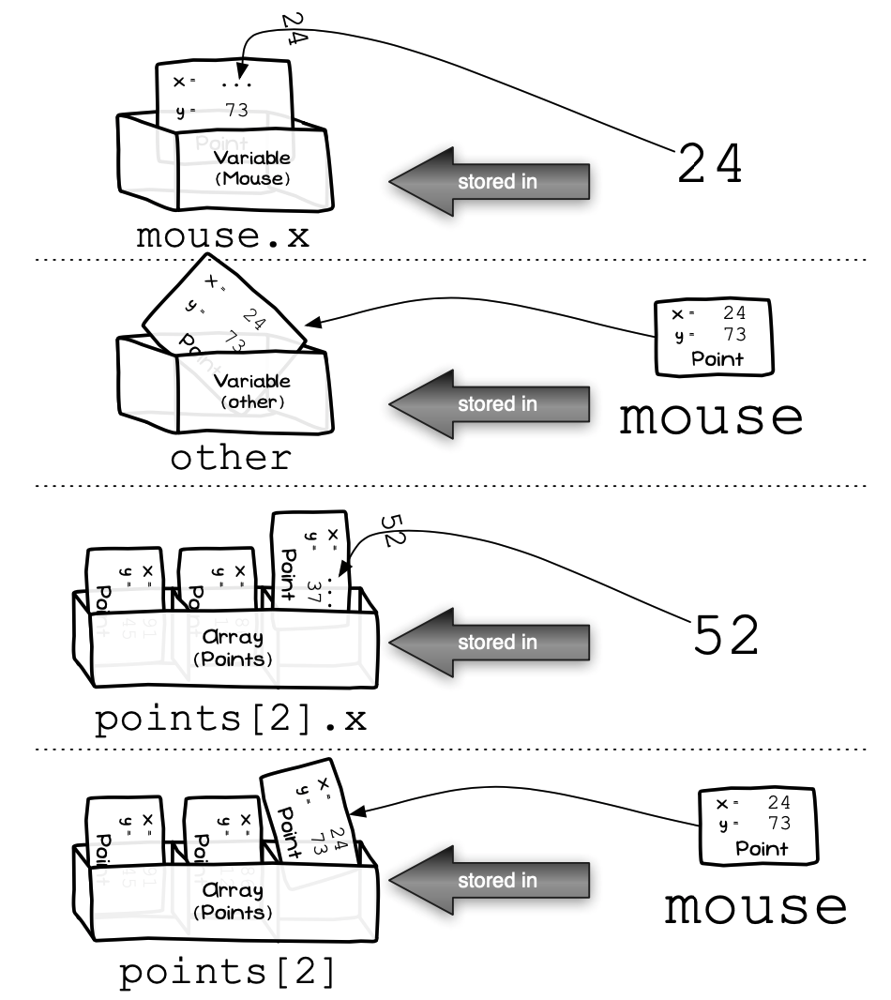

The assignment statement allows you to store a value in a variable. The right-hand side of the assignment is an expression that calculates the value to be stored. The left-hand side is a variable, indicating where the value is to be stored.

With the addition of the custom types you can now also store values in **fields** of a record or union, or copy across an entire struct in one go.

Figure x.y: You can assign values to a struct or union’s fields
 

:::note

- The assignment statement is an **instruction**, you can command the computer to store a value in a variable, record’s field, or union’s field.
- Enumeration values store a single value, so they work in the same way as described in the original [assignment statement](../../../../part-1-instructions/1-sequence-and-data/1-concepts/08-assignment-statement).
- With a struct, you can assign values to its fields individually, or you can assign all the values from another matching struct.
- A union can have its value set via its fields, or you can copy the value from another matching union.

:::

## Struct Assignment

The assignment statement can be used to assign a value to a struct's fields, or to copy all fields from an existing struct's value.

Figure x.y: You can assign an individual field or the entire struct in one assignment statement
 

:::note

- The two examples from Figure x.y show the following:
  1. You can assign a value to a field of a record. In this case 24 is assigned to `mouse.x`.
  2. A `point_2d` expression can be assigned to a `point_2d` variable. This copies the **entire**
struct into the variable (including passing these to parameters).

:::

### In C/C++

To access a field, you use the dot operator (`.`) between the variable name and the field name. For example, `var1.field1`. This accesses `field1` within the `var1` variable. The value on the left-hand side of the dot needs to be a struct. The identifier on the right-hand side is the name of the field to access.

You can chain multiple field accesses together if you have nested structs. For example, `var6.field.name` would work if `field` referred to another struct type that contained a `name` field.

## Union Assignment

The **Union** is similar to a Record in that you can assign values to a union via its fields or by copying another union value into the variable or array element. The difference with the Union is that it has only a single
value, with the different fields giving you different interpretations of that data.

Figure x.y: You can assign an individual field or the entire union in one assignment statement
 

:::note

- The four examples from [Figure x.y](#FigureAssignmentUnion) show the following:
  1. You can assign a value to the fields of a [Union](../03-type-declaration#union). This overrides any value currently
stored in the Variable.
  2. It is possible to copy an entire Union value in the assignment.
  3. This works in the same way with arrays, you can write a value to a [Union](../03-type-declaration#union). 
  4. You can also copy an existing union value into an element.
- When accessing the data in a Union you are responsible for ensuring you read back the value you stored as it does not remember the kind of value you stored in the union.- 

:::

### In C/C++

As with structs, you can access individual fields within a union using the dot operator. In this case the left-hand side of the dot needs to be a union value, the right-hand side is the identifier of the field you want to access.

## Assignment - Why, When, and How

The role of assignment does not change, but now you can use this to assign entire struct values or assign values to individual fields within your structs and unions. This gives you the ability to work with the whole struct, while also having the tools to access parts of it. You can then move between these two levels of detail as you need. In one place you can store a value in a field of the struct, and in another you can pass the whole struct to a parameter in a function or procedure call.
