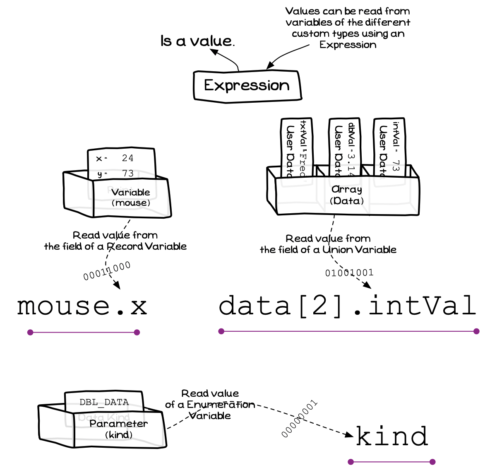
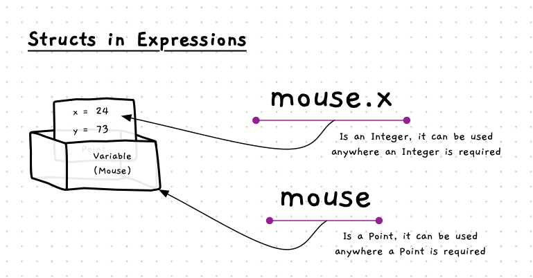
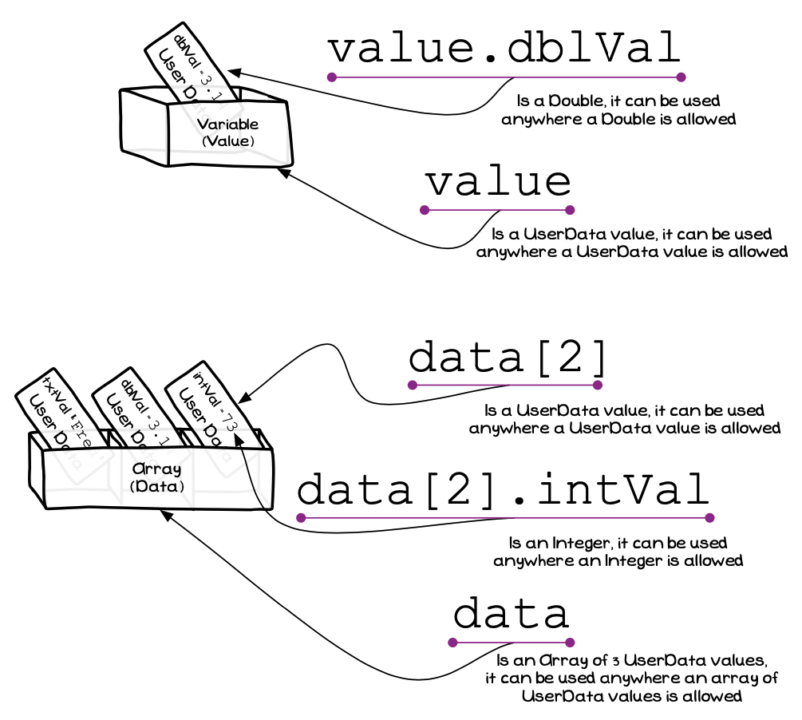

The types you define allow you to specify how data values can be formatted, allowing you to declare variables that contain data in this new format. You can then read data back from your variables in expressions.

An expression can read the value of a struct’s field, a union’s field, and from an enumeration
 

:::note

- Expression is the **term** given to the code that calculates values within your Statements.
- Within an expression you can read the value from... 
  - a field of a struct.
  - a field of a union.
  - an enumeration.
- The dot (`.`) notation is used to indicate which field you want to access from a struct or union.

:::

## Reading Structs In Expressions

A [struct](../03-01-struct) is a type that contains a number of fields. When using a struct value, you can read either an individual field from the struct, or read all the fields. In the illustration, you can access the struct via `mouse`, or you can access one of the fields (`x` for example) using the dot operator.

A field of a struct can be used, or the struct can be used in its entirety
 

:::note

- [Figure x.y](#FigureRecordExpression) shows some examples of expressions on a struct variable.
- The `point_2d` struct in the illustration has an `x` field that stores an integer value.
- You can access a field of the struct from its variable using dot notation. So `mouse.x` reads the `x` value form the struct stored in the `mouse` variable. This value is then an integer, and can be used anywhere an integer is allowed. For example, you could have this in an equation where the value was subsequently stored in an integer variable or passed to an integer parameter.
- You can access the entire struct using just `mouse`. This expression has the `point_2d` type. It can be used anywhere a `point_2d` can be used. For example, it could be stored in another `point_2d` variable, or passed to a `point_2d` parameter.

:::

## Union Expressions

A **Union** has multiple fields that all give access to the same piece of memory. In effect, the union stores only *one* of the values from its available fields. This allows you to create a type that can be used to store one of a selection of available values.

A field of a union can be used, or the union can be used in its entirety
 

:::note

- A union is very similar to a struct in the way that you access its values, the difference is that the union only stores one of the field values.
- [Figure x.y](#FigureUnionExpression) shows an example of a union variable.
- The expression `value` gives access to the union's value in the variable. This has a `my_numbwer` type and can be used anywhere a `my_numbwer` value can be accepted.
- The expression `value.dbl_val` is a `double` value, and can be used anywhere a `double` is allowed.
- When accessing the data in a union you are responsible for ensuring you read it using the correct field. For example, it is possible to read the data stored in `value` using `value.int_val`. This will not cause any errors during compiling or running, but the value read will be the integer interpretation of the `double` value stored in the variable.

:::

## Enumeration Expression

The [enumeration](../03-type-declaration#enumeration) is the simplest of the custom types to make use of. It defines a list of available options for values of this type. This means that enumerations are just like standard values.

")

You interact with an enumeration just like other simple data types (Integers, and Doubles for example)
 

:::note

- Accessing a value of an enumeration type is just like accessing an integer value.
- In [Figure x.y](#FigureEnumerationExpression) the `accessories` variable is storing an `accessories_flag` value. This value can be read from the variable using the variable’s name (its [identifier](../../../../part-1-instructions/2-communicating-syntax/1-concepts/04-identifier)).

:::

## Expressions - Why, When, and How

Expressions have not changed. With structs and unions you now need the additional tools to access the fields within these as part of your expression. The dot operator (`.`) is used here as it was in the [assignment statement](../05-assignment-statement-with-fields-and-elements) to access the fields of a struct or union.

When accessing a value in a struct or union, you start with the variable that contains the data. Where this is a struct or union, you can follow the variable name with a dot (`.`) and you can then access the fields of the struct or union. When you access a field, the expression now has the same type as the field. So `mouse` in the illustration is a `point_2d` type, and `mouse.x` is an integer.
