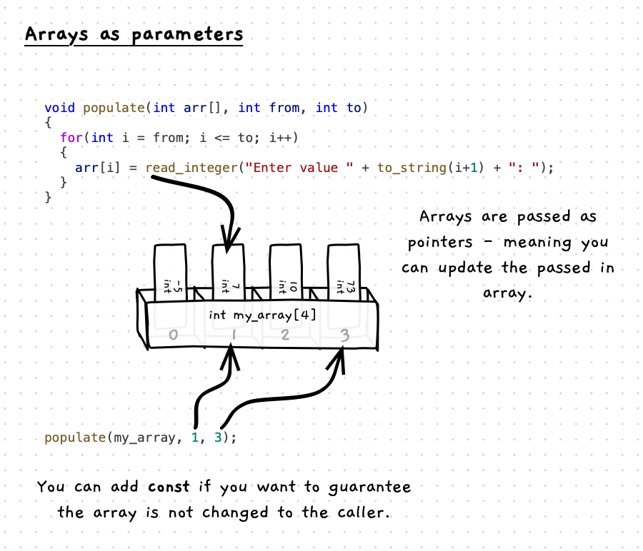

In C and C++, arrays are passed as pointers. This means that array parameters can be used to update the values in the passed in arrays, as we saw with pass-by-reference in [indirect access](/book/part-2-organised-code/4-indirect-access/0-overview).

The following image illustrates how array parameters work.



:::note

- Array parameters are passed as pointers in C/C++.
- When you access values, they are within the referred array.
- As arrays do not know their size, you have to make sure to also include parameters to indicate which indexes the function or procedure can access.

:::

## Example

```cpp
#include "splashkit.h"
#include "utilities.h"

using std::to_string;

const int SIZE = 10;

void print_array(int arr[], int size)
{
  for(int i = 0; i < size; i++)
  {
    int value = arr[i];
    write_line("Value " + to_string(i + 1) + " is " + to_string(value));
  }
}

void populate(int arr[], int from, int to)
{
  for(int i = from; i <= to; i++)
  {
    arr[i] = read_integer("Enter value " + to_string(i+1) + ": ");
  }
}

void populate(int arr[], int size)
{
  populate(arr, 0, size - 1);
}

int main()
{
  int my_array[SIZE];
  int other[3] = {-5, 7, 10};

  my_array[0] = 7;
  my_array[1] = 10;

  populate(my_array, 2, SIZE - 1);

  for(int i = 0; i < SIZE; i++)
  {
    int value = my_array[i];
    write_line("The value of my_array[" + to_string(i) + "] = " + to_string(value));
  }

  print_array(my_array, SIZE);
}
```
