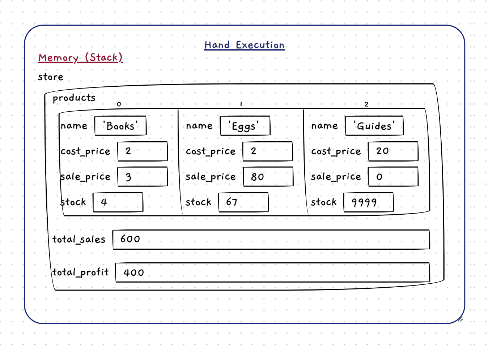

import { Accordion, AccordionItem } from 'accessible-astro-components'
import { Steps } from '@astrojs/starlight/components';
import NoCopy from '/src/components/NoCopy.astro'
import TemplateInjector from '/src/components/TemplateInjector.astro'
import MultipleChoice from '/src/components/MultipleChoice.astro';
import ITO from '/src/components/InlineTextOption.astro'
import Aside from '/src/components/Aside.astro'
import Carousel from '/src/components/Carousel.astro'
import Option from '/src/components/Option.astro';

In the last tour, we worked with arrays to manipulate simple numbers. Now let's try applying the same concepts to more complex structures! This time, we will build a program that lets us create and modify a list of "products", by storing _structs_ inside arrays.

Before we write any code, let's start modelling our data. Have a read over the description of the program below, and identify **three key components**: the _two entities_ that should exist in our digital reality, along with a _container_ that connects them.

<NoCopy>
<MultipleChoice id="PreTest" checkOnClick checkingMode="groupLatched">
|   |   |
|---|---|
| **Name** | *Product Database* |
| **Description** | Stores a <ITO seamless isCorrect group="list">list</ITO> of <ITO seamless isCorrect group="product">products</ITO>, that contain a name, a cost price, a sale price, and the number in stock. The <ITO seamless group="user">user</ITO> is given a command line <ITO seamless group="menu">menu</ITO> where they can **add <ITO seamless isCorrect group="product">products</ITO>**, **update <ITO seamless isCorrect group="product">products</ITO>**, **delete <ITO seamless isCorrect group="product">products</ITO>**, **sell <ITO seamless isCorrect group="product">products</ITO>**, and print the status of the <ITO seamless isCorrect group="store">store</ITO> (including the amount sold, total profits, and number of products with low stock (< 10)).|


<mistake-reason group="user">
:::note[Not Quite]
    This could definitely be a piece of data if we had multiple users! In our case we'll have a single user, so we won't need to store the user as data.
:::
</mistake-reason>
<mistake-reason group="menu">
:::note[Not Quite]
    The menu could be represented as data (an array of options), but we won't be doing that for this task. For this, try thinking more about the data specific to the product database itself.

    _We'll explore representing our menu as data in a later chapter :)_
:::
</mistake-reason>
<answer-reason group="store">
:::note[Exactly!]
    Indeed, we'll need a struct for our store that can hold the rest of our information, including total sales and profits.
:::
</answer-reason>
<answer-reason group="list">
:::note[Exactly!]
    Yep, we need a list! We can use an array for this. Now, a list of...?
:::
</answer-reason>
<answer-reason group="product">
:::tip[Exactly!]
    Indeed, we'll need a struct to represent our products.
:::
</answer-reason>


<answer-reason group="product">
    <answer-reason group="list">
        <answer-reason group="store">

Great work, we now have the three layers of our data:

1. Product: The inner entity.
2. An array: A container for our product(s).
3. Store: The outer container.

We will have a struct for our store, which contains an array of products. Understanding this _nested_ structure is key to this tour. I recommend sketching the structure out on paper as we define it further.

        </answer-reason>
    </answer-reason>
</answer-reason>

</MultipleChoice>
</NoCopy>

----------------------
Now that we've identified our three main pieces, let's define them more clearly. Let's start with the two entities:

### Product

Our product database will store...products, so we should model this as an entity. From the description, we know we need to store "a name, a cost price, a sale price, and the number in stock".

We can map these directly to fields, like so:

```
Struct: Product Data
Fields:
- name: the name of the product
- cost price: the price the product was purchased for
- sale price: the price the product was sold at (usually higher than the cost price...)
- stock: the number of items in stock
```

### Store
The store will be our outermost struct. It will hold our array of products, along with information on total sales, and total profits (the difference between cost price and sale price).
```
Struct: Store Data
Fields:
- products: an array of Product Data
- total sales: the total amount sold
- total profits: the total amount of profit made
```

### Multiple Products

Our `Store Data` will have a variable length list of products - we still need to consider what building block we will use to represent it.

Just like in the Statistics Calculator, we can use a `dynamic_array`. This time, rather than storing a simple type such as `int` or `double`, each element will be one of our `Product Data` instead!

### Writing the code

You should now have a solid understanding of the design. Let's transform this design into code now - we'll go through this briefly since it should be a fairly mechanical transformation:

<Steps>
1. Begin by creating a new file `.cpp` for your project, and ensure you have your `utilities.h` included, along with `splashkit-arrays.h` (so you can use the `dynamic_array`).
2. Write out the `Product Data` struct, then the `Store Data` struct, according to the designs above.
3. Add an empty `main()` to verify your code compiles.
</Steps>

At this point you should have a `.cpp` file with the two structs above written out, and an empty `main`. And it should be compiling :) On the next page we'll begin filling in this data.

<Accordion>
<AccordionItem header="Our implementation for reference">
Are you sure you need to look at this? :) Have a read over the descriptions of `Product Data` and `Store Data`, and try and just write out a struct for each.

Ideally you can do this without any help now - if you're unsure, have another look over the guided tours [here](/book/part-2-organised-code/2-structuring-data/3-guided-tour/0-2-explore-struct/), and see if you can apply the same concepts.


If you really need to check, here's our code for reference :)
```c++
/*
 * Program: Product Database
 * A simple product management system.
 */

#include "utilities.h"
#include "splashkit.h"
#include "splashkit-arrays.h"

/**
 * A single product in the database.
 *
 * @field name       The name of the product
 * @field cost_price The price the product is purchased for
 * @field sale_price The price the product is sold at
 * @field stock      The quantity of the product currently in stock
 */
struct product_data
{
    string name;
    double cost_price;
    double sale_price;
    int stock;
};

/**
 * The store that contains all the products
 *
 * @field products      The array of product records
 * @field total_sales   The total amount sold (in dollars)
 * @field total_profits The total amount of profit (in dollars)
 */
struct store_data
{
    dynamic_array<product_data> products;
    double total_sales;
    double total_profits;
};

int main()
{

}
```

:::tip
I've chosen to represent the money as `double` type (in dollars) purely due to simplicity. In the real world, `double` is actually not a good choice for money due to its precision limitations (see [Real Number Types](/book/part-1-instructions/1-sequence/5-reference/15-type/#real-number-types)). If you want to try working with integers instead, definitely feel free to!
:::
</AccordionItem>
</Accordion>


<Accordion>
<AccordionItem header="Here's my drawing for reference">

</AccordionItem>
</Accordion>
