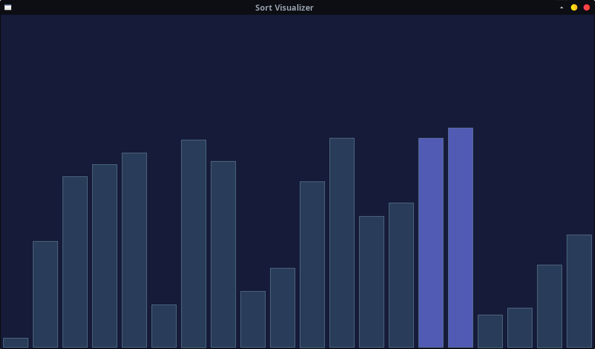
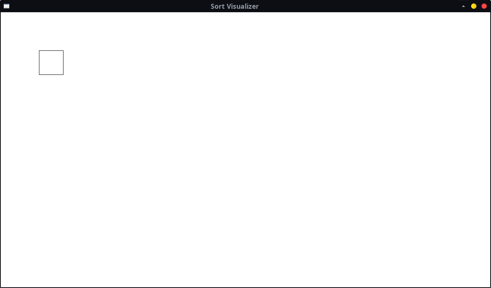
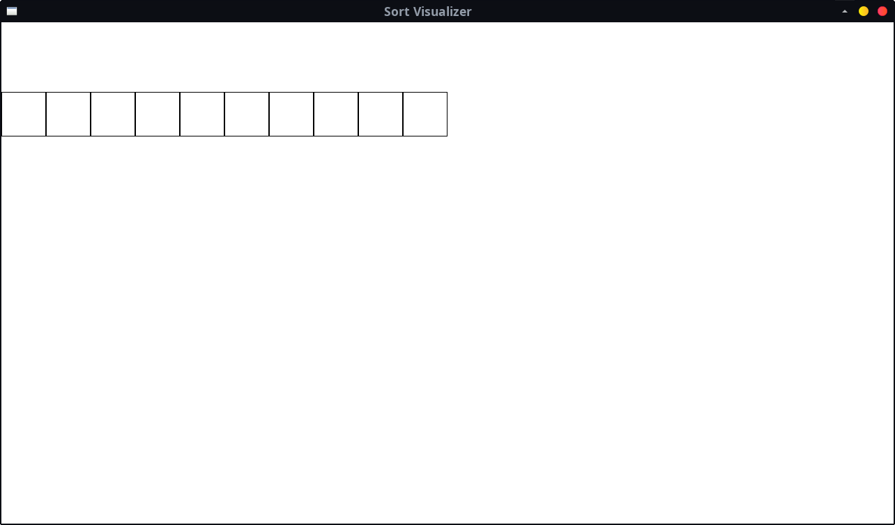
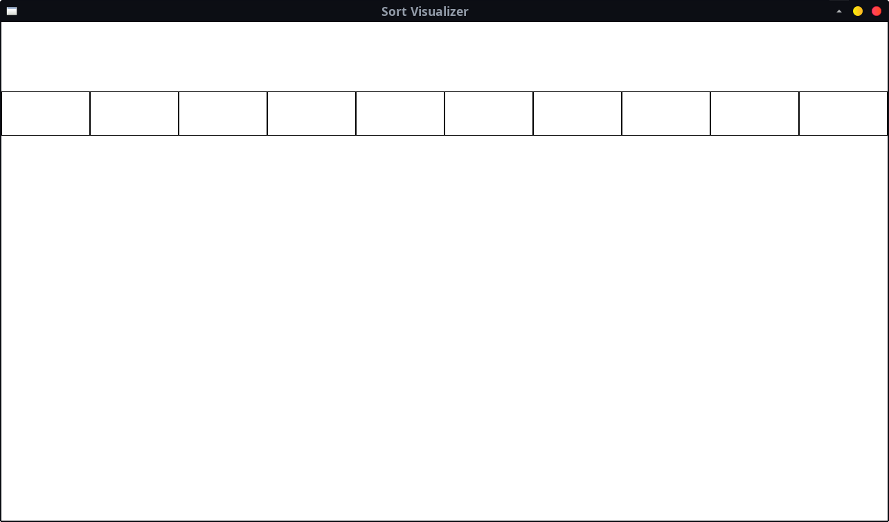
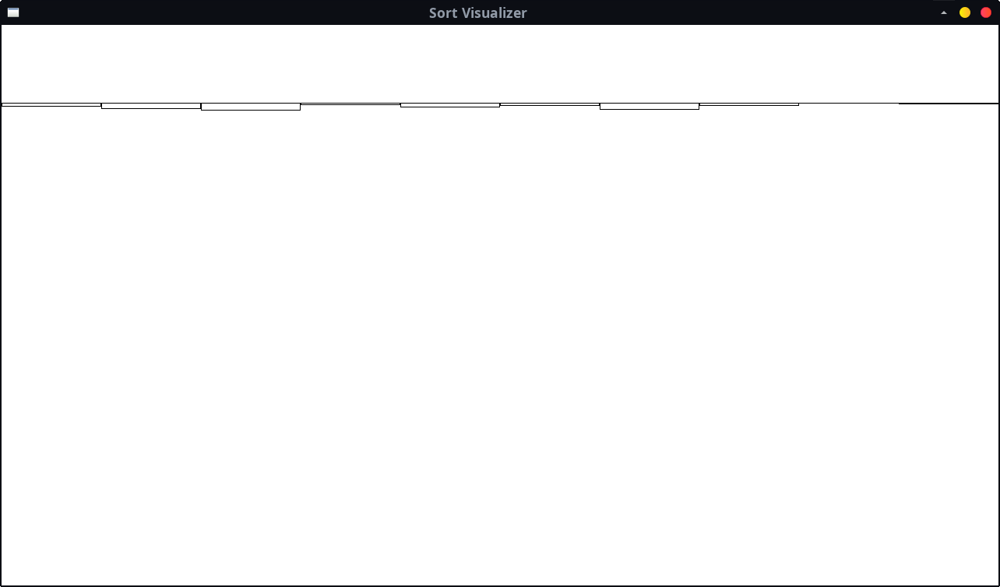
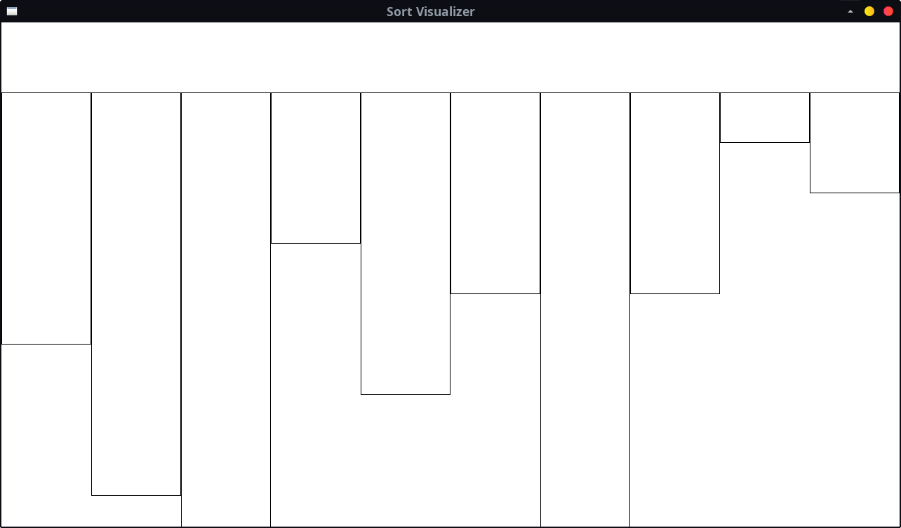
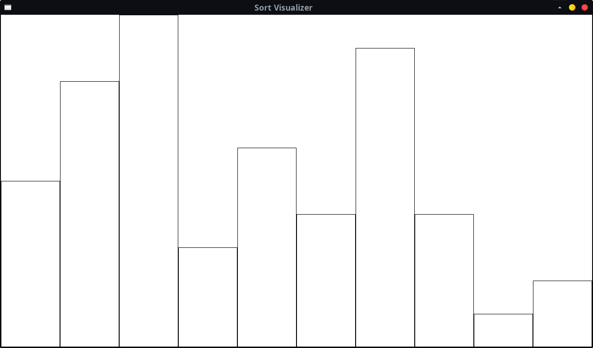
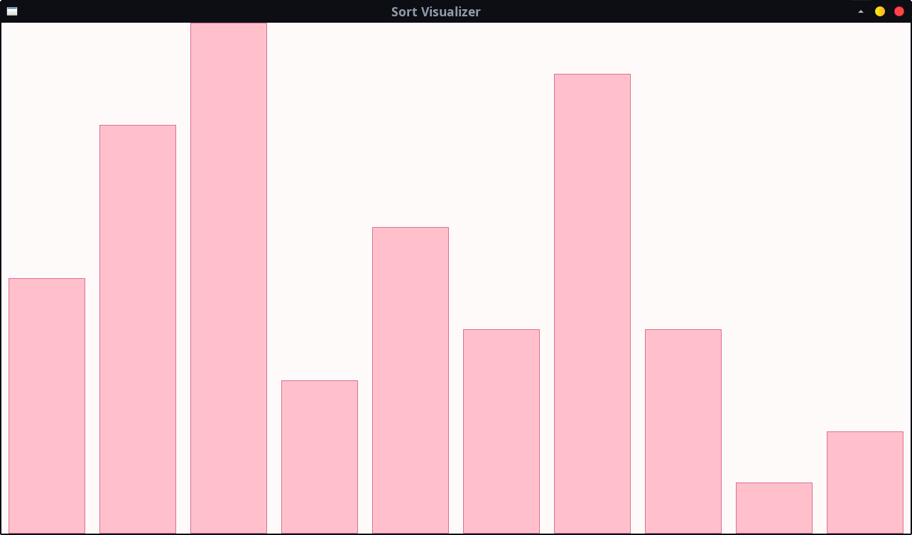

import { Accordion, AccordionItem } from 'accessible-astro-components'
import { Icon, Steps } from '@astrojs/starlight/components';
import Carousel from '/src/components/Carousel.astro'
import Aside from '/src/components/Aside.astro'

Now we'll have a go at sorting arrays, and we'll write a program that visualises this process graphically. Our final program will look something like this:

_You'll be able to customise the colours :)_

## Sorting arrays

Quite often we might have an array of elements like so:


| 0 | 8 | 6 | 2 | 9 | 4 |
|---|---|---|---|---|---|

And we want to sort them, for instance from smallest to largest:

| 0 | 2 | 4 | 6 | 8 | 9 |
|---|---|---|---|---|---|


Generally the programming language we are using will have in-built functionality for this! However for the purpose of learning, we will have a go at implementing a simple sorting algorithm, and visualize how it works.

### Bubble sort

The sorting algorithm we'll implement is called a "bubble sort". Here's how it works in brief:
 - It runs multiple _passes_ over the array
 - Each pass shifts the next largest element in the array into its correct spot
 - It does this by looping over each element, and moves it forward if it's larger than its neighbour.

It's alright if that isn't immediately clear - we can visualize one pass to understand how it works:

<style>{`
x {
  color: lime;
}
z {
  color: hotpink;
}
`}</style>
<Aside type="thinking" title="Bubble Sort Pass"><Carousel animation="fade" panelAlignment="top">
  <div>
    | 0 | 8 | 6 | 2 | 9 | 4 |
    |---|---|---|---|---|---|

    We'll start with our unsorted array. This first pass will ensure that the largest number is moved into the correct spot (where the `4` is currently.)
  </div>
  <div>
    | <x>0</x> | 8 | 6 | 2 | 9 | 4 |
    |----------|---|---|---|---|---|

    The pass will just compare every element to its neighbour, and shift the element forward if it's larger.
  </div>
  <div>
    | <x>0</x> | <z>8</z> | 6 | 2 | 9 | 4 |
    |----------|----------|---|---|---|---|

    So first we compare these two elements. `0` isn't larger than `8`, so we leave it where it is.
  </div>
  <div>
    | 0 | <z>8</z> | <x>6</x> | 2 | 9 | 4 |
    |---|---|---|---|---|---|

    Next we compare `8` and `6`. `8` _is_ larger than `6`, and so we...
  </div>
  <div>
    | 0 | <x>6</x> | <z>8</z> | 2 | 9 | 4 |
    |---|---|---|---|---|---|

    Swap them!
  </div>
  <div>
    | 0 | 6 | <z>8</z> | <x>2</x> | 9 | 4 |
    |---|---|---|---|---|---|

    Next we compare `8` and `2`.
  </div>
  <div>
    | 0 | 6 | <x>2</x> | <z>8</z> | 9 | 4 |
    |---|---|---|---|---|---|

    Same story, `8` is `>` than `2`, so we swap them.
  </div>
  <div>
    | 0 | 6 | 2 | <z>8</z> | <x>9</x> | 4 |
    |---|---|---|---|---|---|

    Next is `8` and `9`. `8` is _not_ larger than `9`, so we leave it.
  </div>
  <div>
    | 0 | 6 | 2 | 8 | <x>9</x> | <z>4</z> |
    |---|---|---|---|---|---|

    Finally we have `9` and `4`. As you can hopefully guess...
  </div>
  <div>
    | 0 | 6 | 2 | 8 | <z>4</z> | <x>9</x> |
    |---|---|---|---|---|---|

    we swap them!
  </div>
  <div>
    | 0 | 6 | 2 | 8 | 4 | <x>9</x> |
    |---|---|---|---|---|---|

    We have now completed one pass of our bubble sort. See how the largest numbers have moved towards the end, and the very last element is in the right spot?
  </div>
  <div>
    | 0 | 2 | 6 | 4 | <x>8</x> | 9 |
    |---|---|---|---|---|---|

    If we did another pass, we'd find the elements shift like this - now our second last element is also correct.
  </div>
  <div>
    | 0 | 2 | 4 | <x>6</x> | 8 | 9 |
    |---|---|---|---|---|---|

    One more pass, and our third last element is sorted. At this point the array is already sorted, but for completion...
  </div>
  <div>
    | 0 | 2 | <x>4</x> | 6 | 8 | 9 |
    |---|---|---|---|---|---|

    We would still do passes...
  </div>
  <div>
    | 0 | <x>2</x> | 4 | 6 | 8 | 9 |
    |---|---|---|---|---|---|

    For these remaining elements as well.
  </div>
  <div>
    | 0 | 2 | 4 | 6 | 8 | 9 |
    |---|---|---|---|---|---|

    And finally we have a fully sorted array!
  </div>
</Carousel></Aside>
_We'll be making a more interesting visualisation than this..._

## Programming the sort visualiser
<Steps>
1. ### Set up our array
   Let's start by creating our `main` and declaring an array that we'll sort.
   1. Declare an array using `fixed_array<int, DATA_SIZE>` of 10 elements. Make the number of elements a constant inside `main` - that way we can change it later easily.
   2. Next, set values in the array using `array[index] = value`. Just put in some random numbers between 0 and 10 for now.

    <Accordion>
      <AccordionItem
        header="Code declaring and initializing the array"
      >

      ```c++
      #include "splashkit.h"
      #include "splashkit-arrays.h"

      int main()
      {
          const int DATA_SIZE = 10;
          fixed_array<int, DATA_SIZE> data;
          data[0] = 2;
          data[1] = 7;
          data[2] = 9;
          data[3] = 2;
          data[4] = 7;
          data[5] = 3;
          data[6] = 10;
          data[7] = 3;
          data[8] = 2;
          data[9] = 1;

          return 0;
      }

      ```

      </AccordionItem>
    </Accordion>

2. ### Visualising our array
    Next, we'll visualize our array as a bar chart!

    First let's get the usual graphical program _boilerplate_ out of the way. Write the following:
    1. Open a window - create constants for the width (1280) and height (720).
    2. Create a `visualize_array` procedure with two parameters - one for our array (`const fixed_array<int>& data`), and one for the _size_ of the array (`int size`). Inside it, just clear the screen to white, and refresh the screen.
    3. In `main`, call `visualize_array` ( passing in the array and size constant ), then delay for two seconds.

    At this point we should have a blank window show up when we run the program, that closes after two seconds. Now let's get to the interesting part.

    #### Drawing the bar chart
    Now let's draw it! We'll work iteratively, building up the visualisation step by step. Try following along by coding as we go - get each part working first before moving on:

    <Aside type="thinking" title="Drawing a bar chart">
    <Carousel animation="fade" panelAlignment="top">
    <div>
    <div style="flex-grow:1"/>
    First off, we will need to loop over each our array's elements, and draw a rectangle for each one.

    Try implementing the following pseudocode - this just draws a box for every element in our array, but all in the same spot:
    ```text
    For each element in the array:
        Draw a rectangle at 100 by 100, with a width of 64 by 64
    ```

    ---
    <div style="flex-grow:1"/>

    
    </div>
    <div>
    <div style="flex-grow:1"/>
    Now let's start changing the coordinates of each box. We need to move each box horizontally.

    Try creating variables for the box's width (set it to `64` for now), and its `x`. We can calculate the `x` inside the `for` loop, by multiplying the index (`i`) and the `width` together.

    ---
    <div style="flex-grow:1"/>

    
    </div>
    <div>
    <div style="flex-grow:1"/>
    It would be good if our bar chart filled the screen properly, so we'll need to adjust the width from a fixed `64`. We can calculate the width of the bars, by dividing the width of the screen by the number of elements.

    ---
    <div style="flex-grow:1"/>

    
    </div>
    <div>
    <div style="flex-grow:1"/>
    Next, we need to adjust the height of the bars based on the value of the element. Let's try just setting the box's height to the element's value, inside the loop.

    ---
    <div style="flex-grow:1"/>

    
    </div>
    <div>
    <div style="flex-grow:1"/>
    Our values are only between 0-10 currently, so the bars end up very short. Let's _remap_ our values from "0 to 10", to "0 to SCREEN_HEIGHT".

    Create a `double MAX_VALUE` constant, with a value of 10. Now our bar height can be calculated as follows: `ElementValue / MAX_VALUE * SCREEN_HEIGHT`.

    <details style="margin-top:0;">
    <summary style="margin-top:0;">Why make `MAX_VALUE` a `double`?</summary>
    This is purely so that we can avoid worrying about C++ doing _integer division_. If both sides of a division are `int`s, then C++ throws away the fractional part - so we made one side a `double`. We could also cast one of them to `double` _during_ the division instead, e.g. `(double)ElementValue / MAX_VALUE * SCREEN_HEIGHT`.
    </details>

    ---
    <div style="flex-grow:1"/>

    
    </div>
    <div>
    <div style="flex-grow:1"/>
    We now need to align our bars along the bottom of the screen -- our `y` will need to vary based on the height.

    Consider: if the `y` was SCREEN_HEIGHT, then the _top_ of each bar would align with the bottom of the screen. We can then just subtract the `height` of the bar, to push it upwards so that the bottoms are aligned instead.

    This gives us a `y` of `SCREEN_HEIGHT - Bar Height`.

    ---
    <div style="flex-grow:1"/>

    
    </div>
    <div>
    <div style="flex-grow:1"/>
    We can also make it look a little nicer by:
    - adding a fill _and_ outline - try calling `fill_rectangle`, _then_ `draw_rectangle` for the outline.
    - adjusting the colours - add some constants for the bar's fill and the outline.
    - adding some gaps/margins between the bars - again, add a constant for the margin. You'll need to adjust the bar's `x` and width by it.

    ---
    <div style="flex-grow:1"/>

    
    </div>
    </Carousel>
    </Aside>

    It should be possible to get this working iteratively - try completing one change before moving onto the next. If you get stuck, you can refer to the complete pseudocode below.

    <Accordion>
      <AccordionItem
        header="Pseudocode for drawing a bar chart"
      >
        ```text
        MAX_VALUE = 10

        MARGIN = 10
        OUTLINE_COLOR = ...
        FILL_COLOR = ...

        Bar Distance = SCREEN_WIDTH / element count (size)
        Bar Width = Bar Distance - MARGIN * 2

        For each element:
            Bar Height = element value/MAX_VALUE * SCREEN_HEIGHT
            x = element index * Bar Distance + MARGIN
            y = SCREEN_HEIGHT - Bar Height

            Fill Rectangle(FILL_COLOR, x, y, Bar Width, Bar Height)
            Draw Rectangle(OUTLINE_COLOR, x, y, Bar Width, Bar Height)
        ```

      </AccordionItem>
    </Accordion>

3. ### Bubble Sort - A Single Pass
    Now that we can visualize our array, let's begin sorting it. As mentioned before, the Bubble Sort works by going over the array many times - each _pass_ ensures that the _next_ largest number is shifted into the correct spot.

    We can start by writing a procedure that does a single pass over the array. _Inside_ that procedure, we can call `visualize_array`, so we can see the changes it makes as it runs!

    |   |   |
    |---|---|
    | **Procedure** | *Bubble Sort Pass* |
    | **Parameters** | `data`: The `fixed_array<int, DATA_SIZE>` to sort. |
    |                | `size`: The size of the array (number of elements). |
    |                | `range`: The range within which to sort. |
    | **Description** | Completes one Bubble Sort pass between the first `range` elements.|

    Notice how we're passing in the `size`, _and_ a `range`?

    The bubble sort pass itself doesn't always have to loop over the entire array. For instance, if we've already completed three passes, then we know the last three elements in the array are already sorted! So we will use the `range` parameter to only loop over the necessary elements - no need to pass over the entire array.

    **However**, we still need the full `size` of the array, so that we can call `visualize_array` and see the entire array changing.

    :::caution
    Ideally, sorting logic should not depend on rendering at all - we are mixing together two entirely different tasks. Normally this would be bad design! We are only doing this for the purpose of learning, try to avoid this sort of design in your own code :)
    :::

    ---

    Try implementing this procedure now based on the following pseudocode:
    ```
    For each element except the last within the `range`:
        If the element is larger than the next element (index + 1), then:
            Swap the two elements
        Visualize Array
    ```

    For swapping the elements, I'd recommend making another procedure for this - check [here](/book/part-2-organised-code/1-structuring-code/3-guided-tour/00-3-explore-pass-by-reference/) for a good reference.

    <details>
    <summary>Why "except the last within the `range`"?</summary>
    We are always comparing `data[i]` with the next element, `data[i+1]`. If we went all the way up to `range`, there would be no next element! So we want the comparison in our `for` loop to be ` i < range - 1`; note the `- 1`.
    </details>

    Try calling `bubble_sort_pass` inside `main` (pass the same size to `size` and `range`), and you should now be able to see the array changing as the larger columns move to the right! The largest element should end up all the way on the right side - make sure this is working right before continuing.

    :::tip
    If the animation is too fast, add a `delay(50);` at the end of `visualize_array`!
    :::

    <Accordion>
      <AccordionItem
        header="Implementing Bubble Sort Pass"
      >
        ```c++
        void bubble_sort_pass(fixed_array<int> &data, int size, int range)
        {
            for(int i = 0; i < range - 1; i ++)
            {
                if (data[i] > data[i + 1])
                {
                    swap(data[i], data[i + 1]);
                }
                visualize_array(data, size);
            }
        }
        ```
      </AccordionItem>
    </Accordion>

4. ### Bubble Sort - Multiple Passes
    Now that we have a single pass working, we're almost done! We just need to run this procedure over and over until the entire array is sorted. Here's the procedure we'll write:

    |   |   |
    |---|---|
    | **Procedure** | *Bubble Sort* |
    | **Parameters** | `data`: The `fixed_array<int, DATA_SIZE>` to sort. |
    |                | `size`: The size of the array. |
    | **Description** | Sorts the elements in the array from smallest to largest.|

    Have a look at the visualisation below to see how it will work:
    <style>{`
    th:has(y) {
        background-color: #c7f9a721;
        padding-top: 0rem!important;
        padding-bottom: 0rem!important;
    }
    th:has(j) {
        padding-top: 0rem!important;
        padding-bottom: 0rem!important;
    }
    j {
        color: gray;
    }
    `}</style>
    <Aside type="thinking" title="Bubble Sort Pass"><Carousel animation="fade" panelAlignment="top">
      <div>
        | 0 | 8 | 6 | 2 | 9 | 4 |
        |---|---|---|---|---|---|

        Starting again with our unsorted array with `6` elements...
      </div>
      <div>
        | <y>0</y> | <y>6</y> | <y>2</y> | <y>8</y> | <y>4</y> | <y><x>9</x></y> |
        |---|---|---|---|---|---|

        We run one pass over the entire array using `bubble_sort_pass` - our `range` in this case is `6`.
      </div>
      <div>
        | <y>0</y> | <y>2</y> | <y>6</y> | <y>4</y> | <y><x>8</x></y> | <j>9</j> |
        |---|---|---|---|---|---|

        We then run another pass. We know the last element is already sorted, so we can lower our range to `5`.
      </div>
      <div>
        | <y>0</y> | <y>2</y> | <y>4</y> | <y><x>6</x></y> | <j>8</j> | <j>9</j> |
        |---|---|---|---|---|---|

        Same thing again, we can lower our range to `4`.
      </div>
      <div>
        | <y>0</y> | <y>2</y> | <y><x>4</x></y> | <j>6</j> | <j>8</j> | <j>9</j> |
        |---|---|---|---|---|---|

        Then `3`...
      </div>
      <div>
        | <y>0</y> | <y><x>2</x></y> | <j>4</j> | <j>6</j> | <j>8</j> | <j>9</j> |
        |---|---|---|---|---|---|

        And finally `2`. We can stop here, since the first element has to be in the right spot if every other element is.
      </div>
      <div>
        | <j>0</j> | <j>2</j> | <j>4</j> | <j>6</j> | <j>8</j> | <j>9</j> |
        |---|---|---|---|---|---|

        And so we've completed our sort! We called `bubble_sort_pass` many times, with the `range` we pass in going _backwards_ from the size of the array until it reaches 2. We can implement this loop using another `for` loop.
      </div>
    </Carousel></Aside>

    Have a go at implementing that logic now, based on the description above. While developing, replace the `bubble_sort_pass` call inside `main` with `bubble_sort` instead - this way you can test it as you write it.

    :::tip
    Looping backwards can be a bit tricky at first - start by just writing the loop, with `write_line(i)` inside. It should look like this:
    ```text
    10
    9
    8
    ...
    3
    2
    ```
    Once that's working, then you can add the call to `bubble_sort_pass`.
    :::

    <Accordion>
      <AccordionItem
        header="Implementing Bubble Sort"
      >
        ```c++
        void bubble_sort(fixed_array<int> &data, int size)
        {
            for(int i = size; i > 1; i --)
            {
                bubble_sort_pass(data, size, i);
            }
        }
        ```
      </AccordionItem>
    </Accordion>
</Steps>

### Done!
    Nice work! By implementing this, you will have gained a deeper understanding of how to work with arrays, and hopefully the visualisation itself is interesting too. Feel free to move on now, or if you're interested making a few extra tweaks, try following the extensions below.


## Optional: Extensions

There are two simple changes we can make to extend this further. By the end we'll have a more dynamic visualisation that works with larger amounts of data.

<Steps>

1. ### Dynamic highlighting
    Let's start by making our `visualize_array` procedure _highlight_ the elements that are currently being compared/swapped. We can do this by adding an additional parameter: `int highlight_index`.

    Inside `visualize_array`, we can now test the `highlight_index` when calling `fill_rectangle`, and change the colour.

    :::tip
    You could try using the _ternary operator_, which looks like this:
    ```c++
    // [expression to test] ? [if true, return this] : [otherwise, return this]

    bool test = true;

    int this_is_5 = test ? 5 : 10;
    int this_is_10 = (!test) ? 5 : 10;

    fill_rectangle(test ? COLOR_RED : COLOR_BLUE, ...);
    ```
    :::

    Now, just change the calls to `visualize_array(...)` to also pass in the index of the parameter being compared inside `bubble_sort_pass`, and enjoy watching the visualisation light up as it sorts.

2. ### Larger array
    Next, lets try increasing the size of our array. Try changing the `DATA_SIZE` to 100 :)

    Now, instead of populating it manually, we'll use a `for` loop to fill it with random numbers. Have a go at writing the following procedure:

    |   |   |
    |---|---|
    | **Procedure** | *Fill Array Random* |
    | **Parameters** | `data`: The `fixed_array<int, DATA_SIZE>` to fill. |
    |                | `size`: The size of the array. |
    |                | `min`: The minimum value. |
    |                | `max`: The maximum value. |
    | **Description** | Fills the array with random integers between `min` and `max`.|

    You can use the SplashKit function `int rnd(int min, int max);` to help with this. Once you get this working, you should be able to try out visualising the bubble sort with hundreds of elements!
</Steps>

Nice work on these last steps!

If you found the graphical aspects of this tutorial interesting, feel free to continue experimenting with how you can improve the visualisation.

There are also many other sorting algorithms that you could try implementing - personally I like [Merge Sorts](https://en.wikipedia.org/wiki/Merge_sort).

To finish up, [here's a fun visualisation of 15 different sorting algorithms :)](https://www.youtube.com/watch?v=kPRA0W1kECg).
