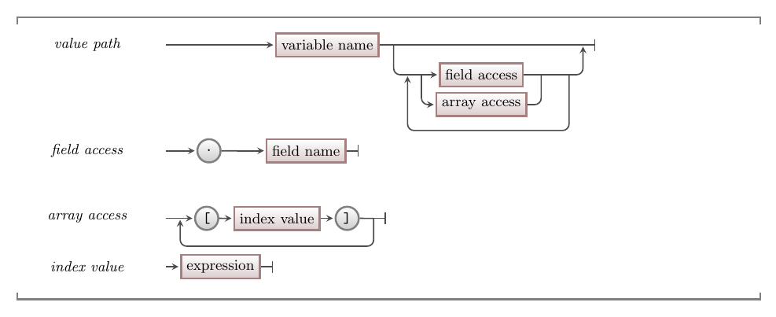

To work with arrays, the main thing you need to know is how to get access to the data. We always start with a variable, but we need to know how to get from the variables you have, to the location of the value you want to access. We have seen this before when accessing fields in a struct, and when you accessed values through pointers. Now we need to expand our toolkit with the syntax to access a value within an array. This will need to take into consideration our use of structs and pointers, as arrays may be accessible via these mechanics as well.

## Accessing Values - Why, When, and How

We can access values in memory using out variables, either to store new data there or to read the value that is currently stored there. Let's think through some different ways we may need to access data in an array element.

You may have:

- an array of primitive value (like an integer).
- an array of structured data (like a `point_2d`).
- structured data, that has a field which is an array of primitive data.
- structured data, that has a field which is an array of structured data.
- a pointer to an array of ...
- a pointer to structured data, that has a field which is an array of ...

To work with this you need to be able to picture your data as a model in your mind. You can then walk through the model, one step at a time, from the variable where you start to the value you want to access.

We have already been doing this with our structured data. In these cases you would have had something like `game_data game`, but you wanted to get the fly's x location. To do this you walk through the data model, starting with `game`. The `game` is a `game_data` value, when you add a `.` you can then step through into one of the fields. For example, `game.fly` has taken you into the `fly_data`. This is a fly in the game, and we are one step closer to the `x` value we want to access. We can make this step in the same way using `.x` to give us `game.fly.x`, a number that represents the fly's location on the screen. Notice how we stepped through the data model - engaging with the digital reality we have created.

With arrays, we need to do the same thing. When walking through your data, you will encounter arrays where ever you have multiple values in the reality you are creating. You can, obviously, stop at the array itself if you want all the value, but if you are after an individual value, then we need to know what syntax we use to make that next step. This is captured in the above image. Here we have an array of three point_2d values called `points`. We can access the array using `points` - this is the variable, giving us an array of `point_2d` values. We can use `points` anywhere we want an array of points. If you want a specific point, you can use `points[2]` for example. This accesses the 3rd point (the one at index 2). So, `points[2]` is a `point_2d` value. It can be used anywhere we want a `point_2d`. As `point_2d` is a struct, we can go one step further and access the `x` field using `points[2].x`.

The key to this is not to think too far ahead. Break this down so that you only need to take one step at a time. For example:

- Start by typing `points` at which time you can think "I have `points` - an array of `point_2d` values".
- "I want the one of them", so you type `[`.
- "Which one? The one at index 2", so you type `2]`
- "I now have a `point_2d`, but I need it's `x` value", so you type `.x`
- and you are done, and have the code `points[2].x`

If you find you are having to traverse the same path again and again in a function or procedure, it probably means you could create a new function or procedure and pass it just that data.

:::tip

Most computing problems are solved by focusing on small steps.

:::

## In C/C++

:::tip[Syntax]

The following image shows the syntax for accessing values within your code. This starts with the variable you have access to, which can be dereferenced if it is a pointer. Following the variable, you can have a number of field or array accesses in sequence. Fields can be accessed using `->` if you have a pointer to the struct, or `.` if you have the struct value at this point. Array accesses use `[]` with the index between them to indicate the element of the array you want to access.

:::

Notice that with this syntax you can combine array and field access. If you have a variable that stores a struct, you can access the fields of that struct. Then, if one of these fields is an array, you can then use the array syntax to access an element of that array. This can continue. So, if the element is itself a new struct, then you can access fields of that struct, and so on.

For example, we could add flies to our fly catch game. If you have the game data struct, you can access the flies. This would be an array of fly data. If we get the fly at index 0, using an array access, then you have a fly. You could then access the fields of the fly to read its location. This could look something like `game.flies[0].appear_at`. As we have clear ideas of the things in our digital reality, reading this chain of data accesses makes logical sense. You are getting the `appear_at` data for the first fly in the game.
