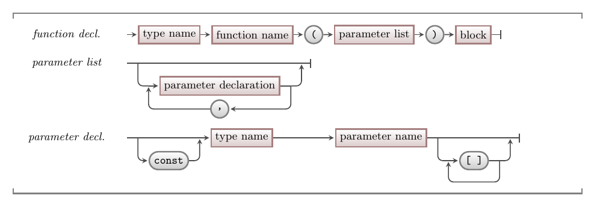

As with other variables, you can have array parameters to allow arrays to be passed to functions and procedures. The only real difference is that the array can potentially store significantly more data than other variables. When the array is passed by value, each of its elements must be copied into the parameter. Passing the parameter in this way means that there will be two copies of the data in memory, which takes more time and more memory.

You should avoid passing arrays by value, and instead pass them by reference. When passed by reference, we can think of the array itself being passed across. This gives the called function or procedure access to the data, but does not require that the values be copied across. As we saw before, you can use a `const` reference if you do not want the array's data to be changed.

<a id="FigureArrayPassByRef"></a>

<div class="caption">Arrays should always be passed by reference</div><br/>

:::note

- Pass by Reference and Pass by Value are **terms** that explain how data is passed to a Parameter.
- With arrays you should always use *Pass by Reference*. This will be faster and take less memory.
- The **const** keyword can be used to indicate that the parameter should not be able to be changed by the called code.
:::

## In C/C++

Ok, this is one of the places where C/C++ does something *"interesting"*. Because passing an array by value is a bad idea, the language does not allow you to pass arrays by value at all. Instead, when you pass an array to a parameter it will pass the address of the array - in practice this is similar to passing by reference. This then introduces some inconsistencies in the syntax and the way it treats arrays.

:::tip[Syntax]



In C/C++, you use the `[ ]` syntax to indicate that you will be passed an array. You do **not** specify the size of the array, as the parameter can accept arrays of varying size. Though, you may recall that C does not have any way to know the size of the array, so you usually have to add a size parameter to tell the function or procedure the number of elements in the array.

:::

:::tip

If you can, put your arrays in a struct in C/C++. Then you can avoid all the nasty syntax that comes about as a result of trying to work directly with the array. With the struct, you can pass it by reference using standard syntax. You can pass by value, if you really want to (it's a bad idea). You can also use the struct to keep track of the number of elements you have in the array, meaning you have everything you need in the one place.

:::

## Example

The following sample code demonstrates passing arrays using the array syntax for the parameter.

```cpp
/* Program: test-array-passing.c */
#include "splashkit.h"

void test_pass_in_only(const int data[], int size)
{
    write_line("Can only read from data -> " + to_string(data[0]) + "..." + to_string(data[size - 1]));
}

void test_pass_in_and_out(int data[], int size)
{
    write_line("Can read and change data");
    data[0] = data[0] + 1;                  //increment first
    data[size - 1] = data[size - 1] * 2;    //double last
}

//----------------------------------------------------------------

int main()
{
    int my_data[] = {1, 2, 3};
    
    test_pass_in_and_out(my_data, 3);
    
    test_pass_in_only(my_data, 3);
    
    return 0;
}
```
