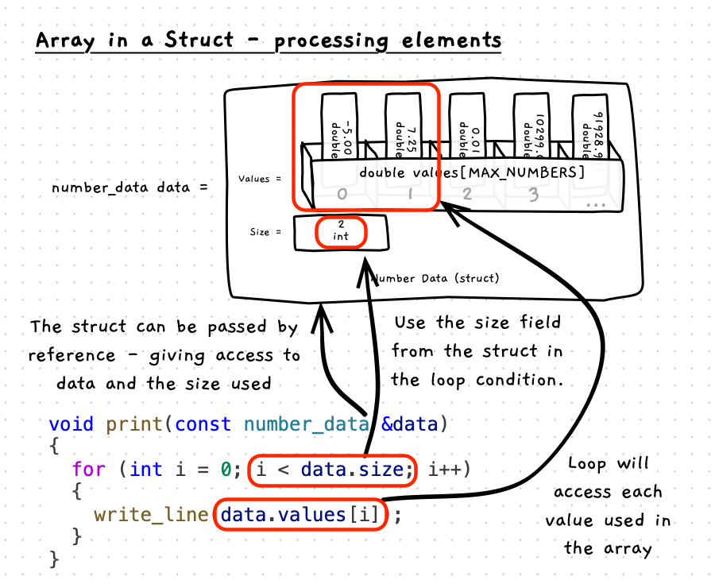

When using the struct with the array and size, you use the size value to determine which indexes of the array have a value you can read.



:::note

- While the array may contain space for 20 elements, in this example, you only access the first two as that is the size of the used space currently.
- In this illustration, only indexes 0 and 1 have values you should read. There is space for another eighteen values. You could read those values safely, but they have not been assigned a meaningful value so should be ignored.
- The loop will be consistent - using the size field to determine the range of the indexes to use.

:::

## Example

```cpp
#include "splashkit.h"
#include "utilities.h"

// The maximum number of values we can store
const int MAX_NUMBERS = 20;

/**
 * The data structure to store the numbers
 *
 * @field values the array of values
 * @field size the number of values in the array - up to MAX_NUMBERS
 */
struct number_data
{
  double values[MAX_NUMBERS];
  int size;
};

/**
 * Populate the array with values entered by the user
 *
 * @param data the array of values (passed by reference)
 */
void populate_array(number_data &data)
{
  int size = read_integer("How many values do you want to enter? ");
  if (size > MAX_NUMBERS)
  {
    write_line("Sorry, you can only enter " + to_string(MAX_NUMBERS) + " values.");
    size = MAX_NUMBERS;
  }
  else if (size < 0)
  {
    size = 0;
  }

  data.size = size;

  // Populate each element - up to data.size
  for (int i = 0; i < data.size; i++)
  {
    data.values[i] = read_double("Enter value: ");
  }
}

int main()
{
  // Initialise struct with an empty array and a size of 0.
  number_data data = {{},0};

  // You can pass to a procedure by reference, and have it update
  populate_array(data);

  // Loop through as normal - using .size and .values
  for (int i = 0; i < data.size; i++)
  {
    // Access elements of the values array within the struct.
    write_line(data.values[i]);
  }

  return 0;
}
```
