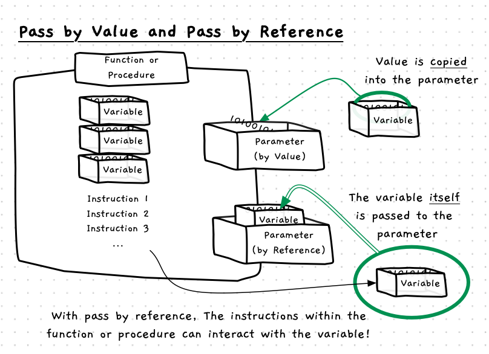

There are actually two ways that values can be passed to parameters: **pass by value** and **pass by reference**.

So far we have been using pass by value for all of our parameters. With pass by value, the parameter receives a copy of the **value** passed in the argument. In this case, any expression is evaluated first, and the value copied across.

With pass by reference you have to pass a variable, a location to store a value. Pass by reference allows you to pass across a location where a value can be stored, and from which a value can be read.




## By Reference - Why, When, and How

You can use pass by reference for a couple of purposes:

- To allow the called function or procedure to update the value passed.
- To improve performance when passing large data structures.

### Updating passed values

Breaking up our code into smaller functions and procedures is really important to help us build and manage the code in larger programs. So far, parameters have allowed us to pass values into these functions/procedures but we in some cases we also want that code to update variables that we pass it.

With pass by reference, you can create functions and procedures that can update the variables passed to it. In most cases these will be procedures, where the action performed has a side effect on the parameter passed in. For example, in our fly game we could create a `handle_input` procedure that is passed the `spider` to update. In `handle_input`, the code can read and change the data passed to it, allowing it to update the position of the spider in response to user input.

### Improve performance

When we started using parameters we were passing simple data values like individual numbers, but with structs these parameters can now be passed potentially large volumes of data. Copying this data in by value takes time, as the computer has to duplicate all the information in the struct to copy it by value.

References are achieved by passing the address of the variable passed to it. This is always the same size, and can be passed efficiently to the parameter. For example, in `draw_game` we need to pass all the data associated with the game. You can pass this by reference to save time duplicating the game.

In these instances you can indicate that you want to pass these as constant references, ensuring that the caller does not change the value passed to it.

## In C++

:::tip[Syntax]


Pass by reference is achieved by adding an ampersand `&` before the parameter name. This indicates that the parameter is to be passed the **address of** a variable. This syntax mimics the syntax used to get the address of a variable in C.

You can also add a `const` before the type name to indicate that you do not want to allow this parameter to be able to change the value passed to it.

:::

## Example

```cpp
/* Program: test-byref.cpp */
#include <splashkit.h>

using std::to_string;

void double_it(int &data)
{
  write_line("Data passed in was " + to_string(data) + ", about to double it...");
  data = data * 2;
  write_line("In double_it data is now " + to_string(data));
}

int main()
{
  int val = 3;
  int other = 1;
    
  write_line("In main val is " + to_string(val));
  double_it(val);
  write_line("Back in main val is now " + to_string(val));
  double_it(other);
}
```

This will output the following when run. Notice that the value in the `val` variable in main is updated, as will the value in the `other` variable. Also notice that there is no special syntax needed in the function call, though you have to pass it a variable. Trying to pass this an expression like `other + 1` would fail with a compiler error, as a parameter passed by reference requires a variable not just a value passed to it.

```
In main val is 3
Data passed in was 3, about to double it...
In double_it data is now 6
Backin main val is now 6
Data passed in was 1, about to double it...
In double_it data is now 2
```

## By Reference Up Close

**TODO add slider**

- Pass by reference and pass by value are **terms** that explain how data is passed to a parameter.
- Most parameters are passed by value.
- Pass by value copies the value to the parameter. This means pass by value can work with any expression, as the value can be calculated and passed to the parameter.
- You can think of pass by reference as passing the variable itself to the parameter.
- The main use for pass by reference is to allow the procedure or function to store a value in the variable passed to the parameter.
- It is called pass by reference due to the way it is implemented, with the parameter receiving a *reference* to the variable.
