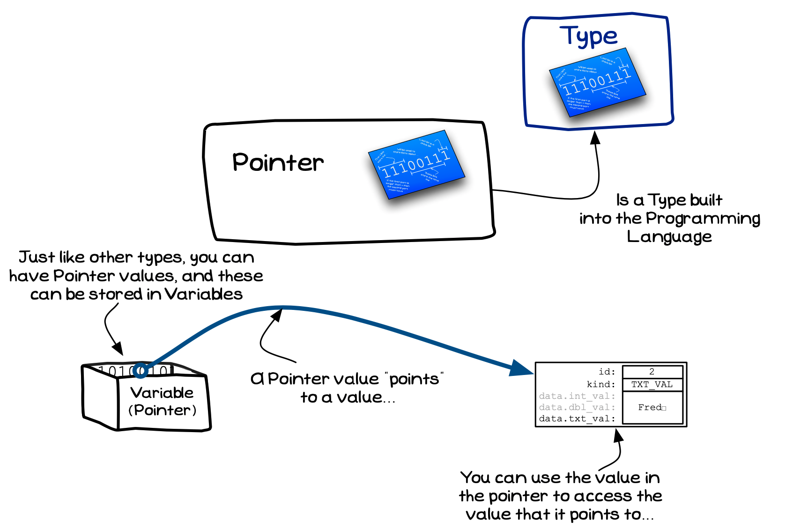
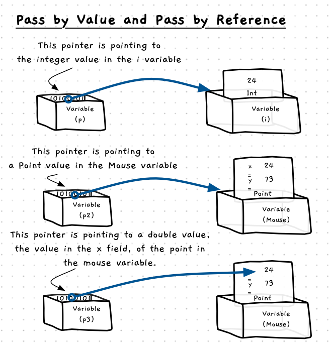
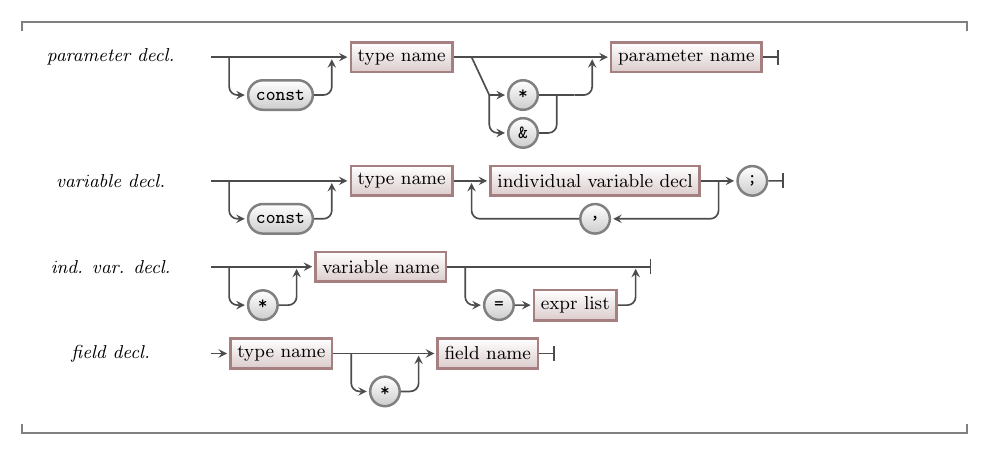

References are language features that build upon the lower level concept of pointers. A pointer is a new kind of data type, just like a struct, enum, integer, double, or boolean. A pointer value is an address, a location in memory where a value can be found. Understanding pointers will help you see how features like references work.

:::tip[Pointers?]

Pointers give you low level access to things happening within the computer. You can change where it reads from, or where it writes values. Issues with these can result in the program crashing or unexpected behaviours.

Things like references, reduce what you can do, but make this safer and easier to work with. Many modern languages will provide reference like features without giving you low level access to pointers.

:::

The name *pointer* is a metaphor, describing the way to picture pointer values. You can think of each pointer value as an arrow pointing to data elsewhere, with each value saying "the data I refer to is over there...".

If you think about this, notice that each pointer has two values: the pointer's address value, and the value at that address. Within the pointer there is an address, the place in memory that the pointer if referring to. You can then read this value, and go to that address to find the value that the pointer refers to. This means that the language needs means of interacting with these two values.

<a id="FigurePointerDefinition"></a>


<div class="caption">A Pointer Value is the address of a value, in effect it <em>points</em> to a value</div><br/>

:::note

- A pointer is a data type built into the programming language.
- A pointer has a value, that stores the location of another value.
- It is a good idea to picture a pointer as a value that *points* to something.
- The pointer’s value is the memory address of the value it *points* to.
- The CPU architecture tells you the size of its pointers. A 32-bit machine has 32-bit pointers. A 64-bit machine has 64-bit pointers.

:::

## Pointers - Why, When, and How

In C, you do not have references, so you have to use pointers to achieve similar effects. Similarly, in C++ there are limits to working with references, so you need to use a mixture of pointers and references to achieve your goals. Generally we try to avoid having to use pointers, as this will require you to have clear ways of working with memory to make sure that things don't break. Other languages have focused more on the use of references, with different ways of helping make these more generally useful. Learning to work with pointers will help you see how references work, and help you to be aware of some of the issues that can occur when you work with references and pointers.

Pointers can be used to achieve the same mechanics as pass by reference, but would only be used for this when the language does not support pass-by-reference. In these cases you need to use a pointer to accept the address of the value you are to update, in the function or procedure you can then dereference the pointer and manipulate the value at the indicated address.

The other use for pointers is to create relationships between elements in your code. This allows you to say "I am related to that thing over there" by nesting a pointer within a struct. For example, social media platforms would set up relationships between users. Each user would be able to refer to the other users they are connected to. Here you do not want a copy of the related user, so a pointer or similar reference can establish this relationship.

### What can a pointer point to?

Pointers store a value that is an address of the value that it points to. This means that you can point to any value in memory, regardless of where it is. You can have pointer values that point to [local variables](../../../2-organising-code/1-concepts/03-local-variable), [global variables](../../../2-organising-code/1-concepts/06-global-variables), [parameters](../../../2-organising-code/1-concepts/04-parameter), fields of [structs](../../../3-structuring-data/1-concepts/03-01-struct) or [unions](../../../3-structuring-data/1-concepts/03-05-union).

<a id="FigurePointerAccessHeap"></a>


<div class="caption">A pointer can point to any value, at any location in memory</div><br/>

:::note

Languages usually require you to declare the kind of data that a pointer value will refer to. So rather than just having a generic *pointer*, you will have things like a *pointer to an integer*, or a *pointer to a spider* value. This makes it easier to work out what you can do with the value the pointer points to.

:::

### Where can pointer values be stored?

A pointer value is the same as any other value. It can be stored in [local variables](../../../2-organising-code/1-concepts/03-local-variable), [global variables](../../../2-organising-code/1-concepts/06-global-variables), it can be passed to a function in a [parameter](../../../2-organising-code/1-concepts/04-parameter), and it can be returned from a [function](../../../2-organising-code/1-concepts/04-function-decl).

:::note

- A pointer value is no different from any other value, and can be stored anywhere you have a variable or value.
- Languages provide a special value for pointers that do not point to a value. In C/C++ this is the `NULL` or `nullptr` value, in both cases it is a value that is designed to point to nothing.

:::

## In C/C++

:::tip[Syntax]

This syntax allows you to declare your own pointer variables in C and C++.



Both C and C++ support the use of pointers. When declaring a variable, the `*` symbol can be added before the variable name to indicate that it is a pointer to the variable's type. This can be applied to parameters, constants, fields, and variable declarations.

:::

## Example

The following code illustrates how to declare and use pointers. This includes pointing to local variables, and using parameters.

```cpp
#include "splashkit.h"

using std::to_string;

/**
 * Print the address in an int pointer, and the value it points to.
 */
void print_intp(int *ptr)
{
  write_line( to_string( (unsigned long long) ptr) + " -> " + to_string(*ptr));

  *ptr *= 2;
}

int main()
{
  int i = 123, j = 321; // two integers
  int *p; // a pointer to an integer

  p = &i; // p points to i, p --> i
  print_intp(p); // print and update i via p
  print_intp(&i); // print and update i via address of i
  print_intp(&j); // print and update j via address of i

  // Verify that the values if i and j are updated
  write_line("i is now " + to_string(i));
  write_line("j is now " + to_string(j));

  return 0;
}
```

This outputs the following. Notice the different addresses for the `i` and `j` variables. Notice that we are able to update the value in this variable via the `p` pointer, and by passing the address of `i` (`&i`) to the `ptr` parameter.

```
6134542824 -> 123
6134542824 -> 246
6134542820 -> 321
i is now 492
j is now 642
```
