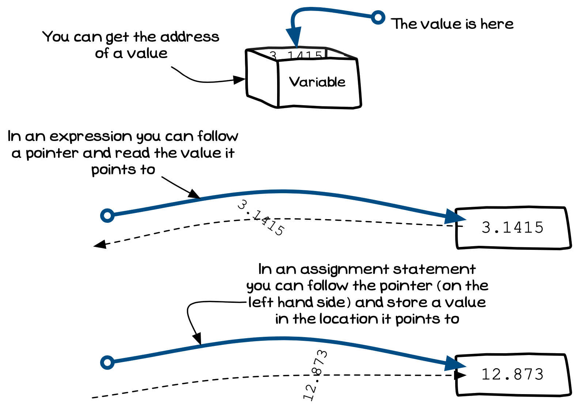
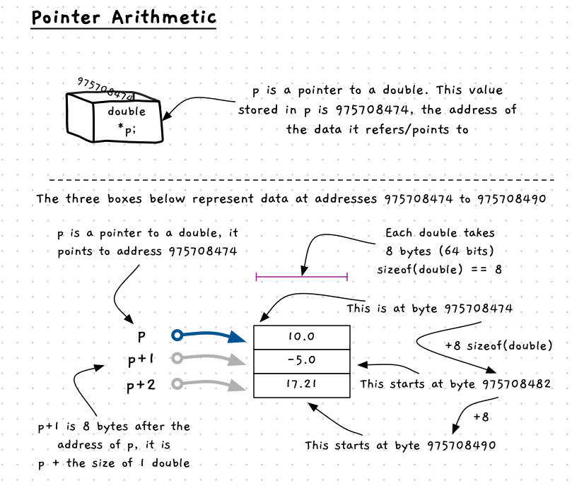

You need to be able to perform certain actions to make pointers useful. These include:

- You must be able to get a pointer to a value. For example, you should be able to get a pointer to a value stored in a variable.
- Once you have a pointer value, you must be able to follow that pointer to its value so that you can:
  - Read the value it points to.
  - Store a value at the location pointed to.

<a id="FigurePointerUsage"></a>


<div class="caption"><span class="caption-figure-nbr">Figure x.y: </span>You can get pointers to values, and you can follow pointers to values</div><br/>

:::note

- You can get the address of values in [Local Variables](#), [Global Variables](#), [Parameters](#), fields of [Records](#) and [Unions](#). Basically, you can get the address of any value you can read.
- Once you have the address (the Pointer value), you can store, or you can use it.
- You need to follow the pointer, called **dereferencing** the pointer, to read its value or to assign a new value to the location it refers to.
- Remember there are two values with pointers:
  1. There is the value of the pointer itself. This is the address that is pointed to. The circle at the start of the line in the illustrations.
  2. There is the value that pointed to. The one at the end of the arrow in the illustrations.
- You can interact with both of these values, depending on whether you *follow* the pointer or use the pointer’s value directly.

:::

## What is the pointer value?

Memory is laid out as a sequence of bytes, into which values can be stored. The bytes can be thought of as being in a long line, with each being given numbered based on its position in that line. So the first byte would be byte 0, the next is byte 1, the next byte 2, and so on. This number is then the **address** of that byte. So byte 975708474 is next to byte 975708475, which is next to byte 975708476, etc. This number is also unique, so there is only one byte 975708474. It is this number that is used in a pointer's value, the number of the byte that it is pointing to.

[Figure x.y](#FigurePointerValue) shows an example of memory used by an array of three values. Each value is a double, so each one occupies 8 bytes. If the first is at address 975708474, then the second starts at address 975708482 (975708474 + 8 bytes). This figure also shows a pointer, `p`, that points to this value. That means that `p` has the value 975708474, the address of this value, stored within it.

C and C++ have a feature called **pointer arithmetic**. When you add, or subtract, a value from a pointer the compiler will work in terms of the pointer type. So in [Figure x.y](#FigurePointerValue) `p` is a pointer to a double, this means that when you add one to p you get the value 975708482, which is 1 **double** past `p`. Therefore, `p + 2` would be 2 *doubles* past `p`, at 975708490, and so on.

<a id="FigurePointerValue"></a>


<div class="caption"><span class="caption-figure-nbr">Figure x.y: </span>The pointer value is the <em>address</em> of the value it points to</div><br/>

:::note

Pointer arithmetic is something you need to know exists, but **not** something that you should work with. This is one of those things that the designers of C/C++ thought was a good idea, but newer languages have chosen not to include. It is just too easy to make mistakes when you start playing around with pointer values.

:::

## In C/C++

C and C++ provides a number of pointer operators that allow you to get and use pointers.

<br/>
<a id="TableCpointerOperators"></a>


  | Name | Operator | Example        | Description |
  ------ | -------- | -------------- | ----------- |
  | Address Of  | `&` | `&x` | Gets a pointer to the variable/field etc. |
  | Dereference | `*` | `*ptr` | Follow the pointer, and read the value it points to.| 
  |             | `->` | `ptr -> field_name` | Follow a pointer to a struct or union, and read a field value. | 

<div class="caption"><span class="caption-figure-nbr">Table x.y: </span>C/C++ pointer Operators</div>

You can get a pointer to a value using the ampersand operator (`&`). This operator lets you get the address of a variable, field, etc.

To follow the pointer, and read its value, you use the `*` operator. With structs, and unions, you can access a field using `(*ptr).field` but C/C++ introduced a special `->` operator to simplify this. I think this is one of the nice parts of the C/C++ syntax. To access the field you would use `ptr->field`, which looks nice and connects with the visual pointer metaphor.

## Example

<br/>
<a id="ListingCcodePointerOperatorUsage"></a>

```c
#include <stdio.h>

typedef struct 
{
  double x;
  double y;
} point_2d;

int main()
{
  double my_x = 0.0;
  point_2d pt = { 1.0, 2.0 };

  double *d_ptr;
  point_2d *pt_ptr;

  d_ptr = &my_x;          // get pointer to my_x variable
  printf("%f\n", *d_ptr); // print the value pointer to by fptr

  d_ptr = &pt.x;
  printf("%f\n", *d_ptr);                 // print the value pointed to by fptr
  printf("%f,%f\n", d_ptr[0], d_ptr[1]);  // prints pt.x, pt.y (bad practice)

  pt_ptr = &pt;
  // follow pointer, and get x and y fields from what it points to...
  printf("%f,%f\n", pt_ptr->x, pt_ptr->y);
  printf("%f,%f\n", (*pt_ptr).x, (*pt_ptr).y);    // same as above
  return 0;
}

```

<div class="caption"><span class="caption-figure-nbr">Listing x.y: </span>C code showing pointer operator usage</div>

:::note

- The address of operator gets a pointer to the value in the expression that follows it. The expression must end with a field or variable that can be pointed to (anything that can be on the left-hand side of the assignment operator).
- **Dereference** means '*follow the pointer, and read what it points to*'.
- Use the asterisks (`*`) to dereference the pointer and get the value it points to.
- You can use `->` to dereference a pointer to a struct value, and then to read one of the fields from within the structure.
- [Listing x.y](#ListingCcodePointerOperatorUsage) shows how you can get addresses of different variables, and how you can access the value pointed to using `*` and `->`.

:::

## Pointer notation in C

As final word on the usage of pointers in C, we should note that reading the notation for pointers can sometimes be a bit confusing at first, since similar looking syntax can mean different things depending on how we format the code and the context in which it occurs..

Consider the following sample code:

<br/>
<a id="ListingPointerNotation"></a>

```c
#include <stdio.h>

int main()
{
  int p1 = 8, p2 = 9;
  int val;
  int *pointer1;
  int *pointer2;

  pointer1 = &p1;
  pointer2 = &p2;

  val = *pointer1 * *pointer2;

  printf("The value of val is: [%d]\n", val);
}
```

<div class="caption"><span class="caption-figure-nbr">Listing x.y: </span>C code showing pointer notation</div>

The ``*pointer1`` and ``*pointer2`` notation looks exactly the same in lines 6 and 7 (``int *pointer1`` and ``int *pointer2``) as it is in line 10 (``val = *pointer1 * *pointer2;``). However the former are declarations of integer pointer variables, and the latter are the dereferencing of these two variables. Further complicating matters, is that the ``*`` is also used as a multiplication operator in the ``val = *pointer1 * *pointer2;`` statement.

To avoid confusion, we can reformat our code to reposition the ``*`` in the declaration to make it clear that it is not acting as a dereferencing operator, and use braces to group the pointer variables in the arithmetic statement as follows: (refer to comments in the code below)

```c
#include <stdio.h>

int main()
{
  int p1 = 8, p2 = 9;
  int val;
  int* pointer1; // reformat to int* to show that the * is associated with the declaration of an integer pointer
  int* pointer2; // reformat to int* to show that the * is associated with the declaration of an integer pointer

  pointer1 = &p1;
  pointer2 = &p2;

  val = (*pointer1) * (*pointer2); // use braces to group each pointer variable, showing the * is being used as a dereference operator for each pointer, and making the multiplication sign * distinct as the multiplication operator

  printf("The value of val is: [%d]\n", val);
}
```

<div class="caption"><span class="caption-figure-nbr">Listing x.y: </span>C code showing pointer notation</div>

The output of the code in both cases is:

```bash
The value of val is: [72]
```
