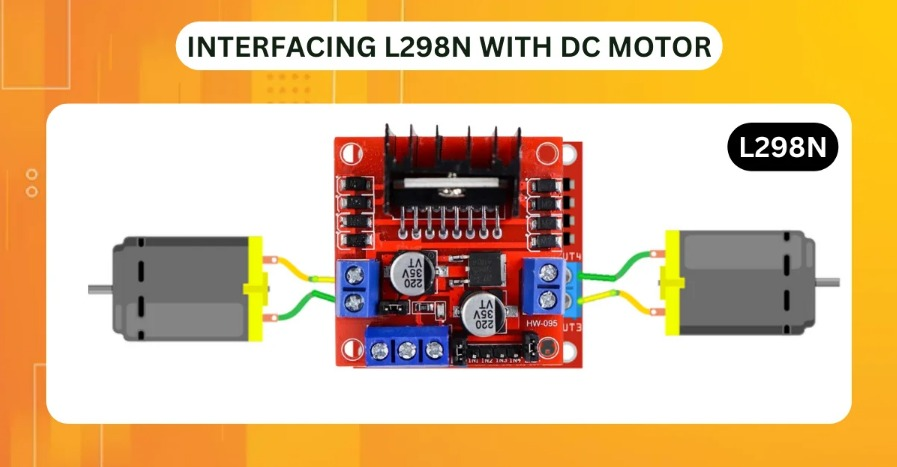
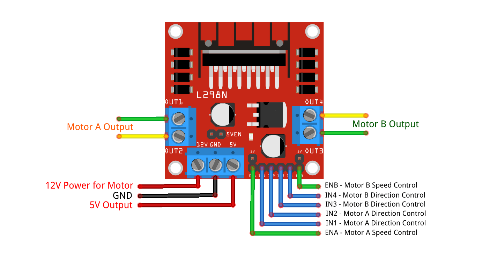

import { Accordion, AccordionItem } from "accessible-astro-components";

import { Steps } from "@astrojs/starlight/components";



# Overview

In this guide, you’ll learn how to drive a simple DC motor using an L298N driver on your Raspberry Pi through SplashKit’s C++ API. SplashKit handles all of the PWM setup—just tell it forward or reverse and give it a speed (0.0–1.0).

# Hardware Setup

You will need:

- **DC motor**
- **L298N motor driver**
- **Breadboard & jumper wires**
- **External motor power** (5–12 V)
- **Raspberry Pi 5 V and GND**

### Wiring



1. **Motor power** (driver `V_MOTOR`) → your 5–12 V supply
2. **Driver GND** → Raspberry Pi GND
3. **Driver IN1** → Pi GPIO 24 (BOARD PIN 18)
4. **Driver IN2** → Pi GPIO 23 (BOARD PIN 16)
5. **Driver ENA** → Pi GPIO 25 (BOARD PIN 22)

:::caution
Make sure your motor power share a common ground with the Pi.
:::

<Steps>

1. **Initialization**

    ```cpp
    #include "splashkit.h"

    int main()
    {
        // 1) Initialize the GPIO subsystem
        raspi_init();
    ```

2. **Open the Motor**

    ```cpp
        // 2) Attach your motor via L298N
        motor_device wheel = open_motor("wheel", L298N, PIN_16, PIN_18, PIN_22);
    ```

3. **Run the Motor**

    We’ll spin **forward** at 50% speed for 3 seconds, then **reverse** at 75% speed for 3 seconds.

    ```cpp
        write_line("Running forward at 50% speed for 3 s…");
        set_motor_direction(wheel, MOTOR_FORWARD);
        set_motor_speed(wheel, 0.5f);
        delay(3000);

        write_line("Reversing at 75% speed for 3 s…");
        set_motor_direction(wheel, MOTOR_REVERSE);
        set_motor_speed(wheel, 0.75f);
        delay(3000);
    ```


4. **Clean Up**

    ```cpp
        write_line("Stopping motor and cleaning up…");
        stop_motor(wheel);
        close_motor(wheel);
        raspi_cleanup();
        return 0;
    }
    ```

</Steps>


# Full Code Example

<Accordion>
  <AccordionItem header="Full Code (C++)">

```cpp
#include "splashkit.h"

int main()
{
    // Initialize GPIO
    raspi_init();

    // Open motor on L298N with the IN1 = PIN_16, IN2 = PIN_18 and ENA = PIN_22 pins
    motor_device wheel = open_motor("wheel", L298N, PIN_16, PIN_18, PIN_22);

    // Forward 50% for 3 s
    write_line("Running forward at 50% speed for 3 s…");
    set_motor_direction(wheel, MOTOR_FORWARD);
    set_motor_speed(wheel, 0.5f);
    delay(3000);

    // Reverse 75% for 3 s
    write_line("Reversing at 75% speed for 3 s…");
    set_motor_direction(wheel, MOTOR_REVERSE);
    set_motor_speed(wheel, 0.75f);
    delay(3000);

    // Stop and cleanup
    write_line("Stopping motor and cleaning up…");
    stop_motor(wheel);
    close_motor(wheel);
    raspi_cleanup();
    return 0;
}
```

  </AccordionItem>
</Accordion>

---

# Build and Run

<Steps>

1. **Create your project folder** 
    ```
    bash mkdir MotorControl 
    cd MotorControl
    ```

2. **Add your source file** 
    
    Save the code above as `motor_control.cpp`.

3. **Compile**
    
    ```bash
    g++ motor_control.cpp -o motor_control -l splashkit 
    ```

4. **Run**
    
    ```bash
    sudo ./motor_control 
    ```

</Steps>

## Expected Outcome

1. Console prints “Running forward at 50% speed for 3 s…”, and the motor spins forward.
2. After 3 s, prints “Reversing at 75% speed for 3 s…”, and the motor spins backward.
3. Finally prints “Stopping motor and cleaning up…”, and the motor stops.
