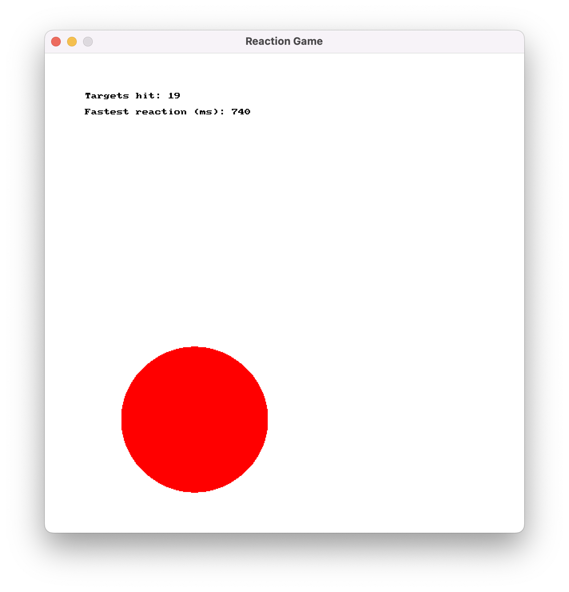

Create a small target clicking game that works on reaction time to scale difficulty. When the game starts, fill a circle on the screen in a random location. The objective is to click this as quickly as possible.

When the target is clicked, move it to a new position and adjust the radius to be proportional to the time taken. If the user takes more than 1 second (1000ms) make the circle slowly grow larger.

Show the number of targets hit, and the number of milliseconds of the fastest reaction - this could look similar to the example below:

:::tip[Hints:]

Make sure to create a game struct, which should contain the details for the target (its position and radius), the timer, and score details. Pass this to procedures that `draw game` (pass it the game, and have it do all the drawing) `update game` (pass it the game and have it grow the circle), and `handle input` (to check if the user has clicked the circle).

Use pass-by-reference so that update game and handle input can update the game based on user interactions. Test out what happens when you remove the `&`. Make sure to use pass by reference in draw game - think about why this would be useful.

:::

:::note[Useful SplashKit functions and types:]

You could consider using the [`circle`](https://splashkit.io/api/types/#point-2d) struct from SplashKit to store position and radius of the target circle. Then you can use functions like [Random Screen Point](https://splashkit.io/api/geometry/#random-screen-point) for the target circle's position, and [Point In Circle](https://splashkit.io/api/geometry/#point-in-circle) to test if the mouse is in the circle. See [Mouse Position](https://splashkit.io/api/input/#mouse-position) to get the location of the mouse.

Use a [Timer](https://splashkit.io/api/timers/#timer) to determine how long the user takes to click the target. You can use [Create Timer](https://splashkit.io/api/timers/#create-timer) to create and store it in the game at the start, then you can read the [Timer Ticks](https://splashkit.io/api/timers/#timer-ticks) when the target is hit, and call [Reset Timer](https://splashkit.io/api/timers/#reset-timer) to get the time for the next target.

Determine a suitable *pixels per second* scale for the radius of the next target. For example, if you use 200 pixels per second then if the timer ticks show 750ms, then you have a radius of 750/1000 * 200 = 150 pixels.

:::
