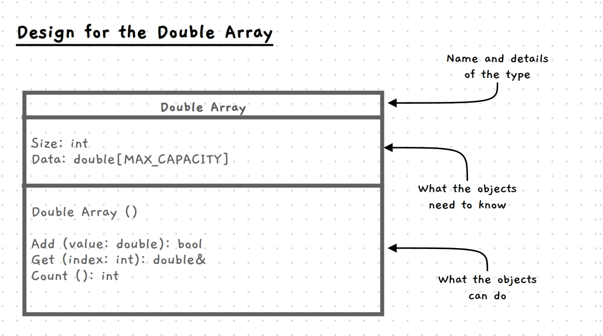

import { Accordion, AccordionItem } from 'accessible-astro-components'
import { Steps } from '@astrojs/starlight/components';

<style type="text/css">{`
    .alpha-list > ol {
        list-style-type: lower-alpha;
    }
    .starlight-aside__title > code {
        position: relative;
        top: 0.17em;
        padding: 0;
    }
`}</style>

Now that we're more familiar with working with member functions, let's try improving how we handle arrays, by encapsulating them into a re-usable class.

In the [previous chapter](/book/part-2-organised-code/3-working-with-multiples/3-guided-tour/01-00-designing-statistics-calculator/) we:
 - Used arrays to store a fixed number of elements
 - Used a second variable to keep track of the number of _active_ elements within that array, to allow us to have a variable count.
 - Stored the array and count together inside a struct, to keep the data together.

However, we had to re-write a new "array" struct for each of our projects, despite the overall code being very similar. We also tended to mix together our program specific logic, with the logic for adding/removing items from the array, which makes it harder to re-use the code.

As a part of this chapter and going foward, we'll begin building a _generic_ array class, that allows us to store a variable number of elements, of any homogenous (single) type - it will be re-usable in any project. This will give us a deep understanding of how languages implement their dynamic arrays (for instance `list` in Python, or `vector<T>` in C++).


We will take our first step here, by writing a Double Array class we can use whenever we need to store lists of numbers. We'll use member functions to package everything for the array inside the class.


## Design Overview
Have a read of the code below - for our first iteration, we'll aim to write a `double_array` class that allows us to write code like this:
```c++
#include "splashkit.h"

// Your double_array class goes here!

int main()
{
    double_array numbers;

    // add some numbers
    numbers.add(10); // 10
    numbers.add(23.7); // 10, 23.7
    numbers.add(30); // 10, 23.7, 30

    // print out the numbers
    for(int i = 0; i < numbers.count(); i ++)
    {
        write_line(numbers.get(i));
    }
}
```

:::tip
Think back to the structs you created to hold your arrays in the previous chapter.
 - What member functions should they have?
 - Can you see those in the example above?
 - Can you think of any others that might be helpful?
:::

We can visually capture the design for our `double_array` class, making it easier to communicate how the code should work. The following is a basic **UML class diagram**, which we can use to capture the details of our class.



The diagram shows the details of our class in a rectangle that is divided into three sections. At the top we have its name. The middle section indicates the things objects of this type will know - the fields of the class. The bottom third lists the constructors, destructor, and methods that capture what the objects can do.

In this case we have:

1. At the top:
    - The name of the type: Integer Array - which we will code as `double_array`
2. In the middle, fields for:
    - Size, which is an `int` - coded as `int size;`
    - Data, an array of `double` - coded as `double data[MAX_CAPACITY];`
3. At the bottom, methods for:
    - Constructor with no parameters (for an empty array).
    - Add - which adds an element to the data in the double array.
    - Get - retrieves an element from the array, as a reference.
    - Count - returns the current number of elements in the array.

The great thing is that we've already written a struct like this before, with a MAX_CAPACITY constant, size, and data, back in [Handling Multiples](/book/part-2-organised-code/3-working-with-multiples/move-0-panorama/4-0-array-struct/) - we'll just be taking this logic, _generalising_ it, and adding some member functions.

:::tip
We'll make our class's fields _private_, and our class's methods _public_. You can check [here](/book/part-2-organised-code/4-member-functions/5-reference/2-0-class) for the syntax.
:::

## Let's get started!
<Steps>

1. ### Setting up the Data
   First, let's just set up the data for the class - this should be very similar to the structs you wrote in the previous chapter, especially the [Statistics Calculator](/book/part-2-organised-code/3-working-with-multiples/3-guided-tour/01-00-designing-statistics-calculator/).

   Start by creating a `MAX_CAPACITY` global constant (I'll make mine equal `50`). Then, create a `class` (rather than a `struct`), and write in the fields we need - `size`, and `data`. No need to do anything with them yet.

   Unlike previously, the `size` and `data` will be _private_ fields, since class fields are private by default. Instead, we will provide public methods for adding/getting elements. This will make it easier to ensure the class is used correctly.

   :::tip
   We'll also keep the names more general this time - the array _could_ be storing dice rolls, scores, sales, or anything else that can be represented with a series of `double`s. We want to be able to re-use the code, so it's good to keep the names more generic.
   :::

   <Accordion>
     <AccordionItem header="I'm stuck!">

    Here's something to help get you un-stuck, see if you can finish it off from here:

    ```c++

    const int MAX_...

    class double_array
    {
        int size;
        ...
    };

    int main()
    {
        double_...
    }
    ```

     </AccordionItem>
   </Accordion>

2. ### Adding a Constructor
   Now we have the skeleton of our class ready - we know what it _stores_, now we can define what it _does_. Let's start by adding a simple [constructor](/book/part-2-organised-code/4-member-functions/5-reference/1-1-constructor/), that takes no parameters, and sets the `size` field to 0 (since we start with 0 elements). We want our constructor and methods to be _public_, so make sure to add the `public:` [access specififer](/book/part-2-organised-code/4-member-functions/5-reference/2-0-class).

    <Accordion>
    <AccordionItem
        header="Double array simple constructor"
    >

    Inside the `double_array` class I added the following method:

    ```c++ {5-9}
    class double_array
    {
        ...

        public:
        double_array()
        {
            size = 0;
        }
    }
    ```

    This [constructor](/book/part-2-organised-code/4-member-functions/5-reference/1-1-constructor/) is just setting the object's `size` field to 0. Remember, if we don't set it to 0, it could start off with anything!

    </AccordionItem>
    </Accordion>

   Now that we've done this, we can safely declare `double_array` variables and know that they are starting in a valid state. However, since all the fields are private, we can't do much with the class yet! Let's add some public methods next.

   :::tip
   Remember to build this program in an iterative manner. Right now you should already have a program that compiles, with a `main` that declares a `double_array`. For reference, mine looks like this:

    <Accordion>
    <AccordionItem header="double_array class with constructor">
    ```c++
    #include "splashkit.h"

    const int MAX_CAPACITY = 50;

    class double_array
    {
        int size;
        double data[MAX_CAPACITY];

        public:
        double_array()
        {
            size = 0;
        }
    };

    int main()
    {
        double_array numbers;
    }

    ```
    </AccordionItem>
    </Accordion>

   As you add more methods, add some simple code to test them in `main`!
   :::

3. ### Add a method
   Next we'll create the Count method, since it's fairly straightforward. All this method needs to do, is return the current `size`.

   :::tip[Why not just use `.size`?]
   By making the `size` field private and adding a `count()` function instead, we ensure that code outside the class can never change the `size` directly, which will protect us from a variety of bugs and errors.
   :::

   Have a go at adding this method, and also add a `write_line` in `main` to check that it's working right. If you see `0` on the terminal, you'll know you're on the right track!

   Make sure to have a go at this yourself. If you get stuck, here is our attempt at this. Use it to check how we achieved these changes.
   <Accordion>
    <AccordionItem header="Double array member function">

    Inside the `double_array` class I added the following method:

    ```cpp {9-12, 18-19}
    class double_array
    {
        ...

        public:

        ...

        int count()
        {
            return size;
        }
    }

    int main()
    {
        double_array numbers;
        // Is the count 0?
        write_line(numbers.count());
    }

    ```

    `return size;` is just returning the value of the object's `size` field - this way we can _read_ the value from outside the class, but we cannot change it directly (which would generally be a bug).
    </AccordionItem>
   </Accordion>

4. ### Add the `add` method
   Now that we're warmed up, let's try adding a slightly more interesting method, the `add` method. This method adds a new element to the array - it should take a `double` as its parameter, and return `void`.

   We should also check if there's enough space left in the array, before adding an element. If there isn't, we'll throw an [exception](/book/part-2-organised-code/1-structuring-code/5-reference/10-exceptions/). Make sure to only add the element if there's space!

   :::tip[Exceptions?]
   We haven't used exceptions much so far because we've relied on other patterns instead -- for instance, checking first _before_ trying something that could fail, like with our input validation.

   However, when developing reusable components like this class, exceptions can provide more flexibility in how errors are returned and handled. We can directly say "This wasn't used right!", and the programmer using the component can decide when and where they want to handle that exception.

   If you need a refresher on them, feel free to check the reference [here](/book/part-2-organised-code/1-structuring-code/5-reference/10-exceptions/).
   :::

   For the exception, let's throw a C++ `string`. We need to be careful here, since writing `throw "The array is full!";` will throw a _C_ string, which is actually a different type. We can use the C++ `string` type's constructor to ensure we create a C++ string: `throw string("The array is full!");`

   Try adding this method, and then add some tests in `main` to see if it's working. We don't have a way to access elements once they're in the array, so for now try just adding a few elements and checking if the `count()` looks right.

   <Accordion>
    <AccordionItem header="Double array add function" >

    Inside the `double_array` class I added the following method, along with tests in `main`:

    ```cpp {6-13, 20-30}
    class double_array
    {

        ...

        void add(double value)
        {
            if (size >= MAX_CAPACITY )
            {
                throw string("Failed to add element - the array is full!");
            }
            ... // the rest should be basically identical to last chapter :)
        }
    }

    int main()
    {
        double_array numbers;

        write("This should be 0: ");
        write_line(numbers.count());

        numbers.add(7.5);
        numbers.add(3);
        numbers.add(24);

        write("This should be 3: ");
        write_line(numbers.count());

        // You could add a test for what happens when the array is filled to MAX_CAPACITY as well - it should throw an exception which you could catch.
    }

    ```
    </AccordionItem>
   </Accordion>
   :::tip[Multiple `double_array`]
   Hopefully you can already see our array class taking shape! Feel free to try declaring multiple `double_array`s as well, and seeing how each one can hold a different set of elements.
   :::

   :::caution[`terminate called after throwing an instance of...`]
        If we throw an exception but fail to catch it, we'll receive an error like this on the terminal:
        ```sh title=Terminal wrap
        terminate called after throwing an instance of 'std::__cxx11::basic_string<char, std::char_traits<char>, std::allocator<char> >'
        ```

        `std::__cxx11::basic_string<char, std::char_traits<char>, std::allocator<char> >` just means our `string`, so it translates to:

        ```sh title=Terminal wrap
        terminate called after throwing an instance of 'string'
        ```

        which makes sense since we threw a `string` but didn't catch it.
   :::

4. ### Finally, add the `get` method
   Now let's add the ability to access our data! We'll add a `get` method, that takes one argument - the `index` of the element to access. We _could_ just return the element as a `double` directly, but instead we'll return a [reference](/book/part-2-organised-code/6-indirect-access/5-reference/02-02-pointers-ref/) to the `double`. This...
   <div class="alpha-list">
   1. Avoids copying the element to return it (doesn't matter for a `double`, but will when we store larger types)
   2. Allows the user to _modify_ the value of the element returned!
   </div>

   If we design this right, the user of our `double_array` (probably us...), will be able to write code like:
    ```c++
    my_number_array.get(2) = 24;
    ```
   which is getting very close to being able to do
    ```c++
    my_number_array[2] = 24;
    ```
    again. We'll see how to do _that_ next chapter, but keep it in mind :)

    ##### What if the index given is invalid?
    Indeed, let's check if the index is invalid, and if so we can handle it similar to `add` - we'll throw an exception. This way if we write some code that accidentally accesses an invalid index, we'll find out right away from the exception.

   <Accordion>
    <AccordionItem header="Double array get function" >

    Inside the `double_array` class I added the following method. I also added more tests in `main`:

    ```cpp {6-13, 31-48}
    class double_array
    {

        ...

        double& get(int index)
        {
            if (index < 0 || index >= size)
            {
                throw string("Accessed invalid array index " + to_string(index));
            }
            return data[index];
        }
    }

    int main()
    {
        double_array numbers;

        write("This should be 0: ");
        write_line(numbers.count());

        numbers.add(7);
        numbers.add(3);
        numbers.add(24);
        numbers.get(2) = -8.5; // Change the 24 to -8.5

        write("This should be 3: ");
        write_line(numbers.count());

        write_line("Printing elements:");
        for(int i = 0; i < numbers.count(); i ++)
        {
            write_line(to_string(i) + ". " + to_string(numbers.get(i)));
        }

        // Test if accessing an invalid index (-4) throws an exception correctly
        try
        {
            numbers.get(-4);
            // If we get here, it means the `get` method didn't throw an exception,
            // which means we have a bug to fix.
            write_line("Accessing index -4 didn't error!");
        }
        catch (const string& str)
        {
            /* we expected an error, so this is success! So no output */
        }
    }

    ```
    </AccordionItem>
   </Accordion>
</Steps>

At this point we have a usable `double_array` class! You should be able to see how we _encapsulated_ the behaviour of our arrays in a class, so that we can treat them as an object we can interact with, rather than pure data to be managed directly. The `double_array` manages _its own_ data, and instead provides us with an _interface_ that we can use to interact with it.

Our class is still a bit limited however. There are some things we can improve already - like adding the ability to remove elements. For others, we will need to learn further. Here are some interesting extension ideas:

- **`Remove Element` method** - should just take an index, and remove the element using any of the techniques from the previous chapter. You could even have multiple methods, one for each technique!

    Like `Add` and `Get`, it should throw an exception if an invalid index is passed in.

- **`Fill` method** - Takes a `count` and `value`, and adds `count` elements to the array. Should be usable like `my_array.fill(24, 0.9);`, to add 24 `0.9`s to the array.

    Consider: imagine we want to add 20 elements, but the array only has space for 10.
     - Should `fill` check if there's enough space first, and throw an exception immediately if there isn't?
     - Or should it just repeatedly call `add`, allowing `add` to throw an exception once the array is full, leaving the array partially changed?

    There is no single correct answer - think about what behaviour you want the method to guarantee.

Here's some test code if you want to try things out more thoroughly:
<Accordion>
<AccordionItem header="Final test code" >

```cpp

// convenience procedure for testing
void test_value(double value, double expected, string fail_message)
{
    if (value != expected)
    {
        write_line(to_string(value) + " != " + to_string(expected) + " | " + fail_message);
    }
}

int main()
{
    double_array numbers;

    write_line("Running tests - no output means no errors :)");
    write_line("===Tests Start===");

    test_value(numbers.count(), 0, "0 Count failed");

    numbers.add(7);
    test_value(numbers.get(0), 7, "1st Add or Get failed");

    numbers.add(3);
    test_value(numbers.get(1), 3, "2nd Add or Get failed");

    numbers.add(24);
    test_value(numbers.get(2), 24, "3rd Add or Get failed");

    numbers.get(2) = -8.5; // Change the 24 to -8.5
    test_value(numbers.get(2), -8.5, "Change value via Get failed");

    test_value(numbers.count(), 3, "3 Count failed");

    // ===== Test a variety of exceptions ===== //

    // ------------ fill up the array to test capacity handling
    try
    {
        while(numbers.count() < MAX_CAPACITY)
        {
            numbers.add(0);
        }
    }
    catch (const string& str)
    {
        write_line("Add stopped adding elements before reaching capacity: " + str);
    }

    // ------------ test adding an element to a full array
    try
    {
        numbers.add(0);
        write_line("Add continued adding elements past max capacity");
    }
    catch (const string& str)
    {
        /* we expected an error, so this is success! So no output */
    }

    // ------------ test accessing negative indexes
    try
    {
        numbers.get(-4);
        write_line("Accessing index -4 didn't error!");
    }
    catch (const string& str)
    {
        /* we expected an error, so this is success! So no output */
    }

    // ------------ test accessing indexes larger than the maximum capacity
    try
    {
        numbers.get(MAX_CAPACITY);
        write_line("Accessing index MAX_CAPACITY didn't error!");
    }
    catch (const string& str)
    {
        /* we expected an error, so this is success! So no output */
    }

    // Uncomment if you added remove(int index) - assuming using the "shift" approach
    /*
    numbers.remove(1);
    test_value(numbers.count(), MAX_CAPACITY - 1, "3 Remove failed (count didn't decrease)");
    test_value(numbers.get(1), -8.5, "Remove failed (element didn't shift)");
    */

    write_line("===Tests End===");
}

```
_I found three bugs in my `double_array` while writing these tests... Always test your code!_
</AccordionItem>
</Accordion>


:::tip[What if I want a `book` or `int` array?]
Great question! Right now with our current knowledge, the answer is basically just copy/paste, unfortunately :/

We'd copy the class, rename it, and then change all the `double` to, for instance, `book`.

In the [next chapter](/book/part-2-organised-code/5-operators-generics/0-overview/) however, we'll learn a way to write the code _once_, and make it usable with _any_ type.
:::

-----------------------------

## Optional: Better Exceptions
##### _This section is optional - feel free to explore it when you have time and interest._

So far, all of our exceptions have been of the same type: `string`. By using the same type for every exception:
 - we have no easy way to differentiate between them when catching them
 - the errors messages printed on the terminal when exceptions aren't caught are less useful

Think back to what we see on the terminal when a string exception is not caught:
```sh title=Terminal wrap
terminate called after throwing an instance of 'std::__cxx11::basic_string<char, std::char_traits<char>, std::allocator<char> >'
```

See how it tells us the _type_ of the object that was thrown? Right now, this isn't very helpful.

However, this also shows us something important: we can encode information about the error in its _type_, by using _different_ exception types for different kinds of errors! Once we do this, we can also use multiple `catch` blocks to handle different errors in different ways.

### What types should we use?

While C++ provides some in-built exception types, we are also free to define our own! For instance, we could declare some types specifically for usage with our `double_array` class, such as:
 - `array_full`
 - `array_invalid_index`

### Your turn
Have a go at declaring some classes with those names. Once they are declare try throwing exceptions using those classes instead of `string` (e.g `throw array_full();`);

:::tip[What fields should they have?]
Up to you! Strictly speaking they don't need any fields at all - we can declare a completely empty class, and use that type in exceptions all the same.
:::

Once you have this working, you should be able to catch those types instead of `string`. And if the exception is uncaught, we'll get errors like this on the terminal instead:

```sh title=Terminal wrap
terminate called after throwing an instance of 'array_full'
```

Much clearer!

<Accordion>
<AccordionItem header="Example" >

First I created an empty `array_full` class:
```c++
class array_full
{

};
```

Now inside `add`, I constructed an `array_full` and threw that instead:

```cpp {10}
class double_array
{

    ...

    void add(double value)
    {
        if (size >= MAX_CAPACITY )
        {
            throw array_full();
        }
        ...
    }
}
```

Finally inside my tests, I switched what I was catching from `string` to `array_full`:

```c++ {11}
int main()
{
    ...

    // ------------ test adding an element to a full array
    try
    {
        numbers.add(0);
        write_line("Add continued adding elements past max capacity");
    }
    catch (const array_full& str)
    {
        /* we expected an error, so this is success! So no output */
    }

    ...

}

```
</AccordionItem>
</Accordion>


:::note
C++ provides several built in exception types - in production code, we should use these, or types that are _based_ off them. Using these requires some more advanced knowledge however - once we cover _inheritance_, then these will be a better option than making our own entirely error classes from scratch.
:::
