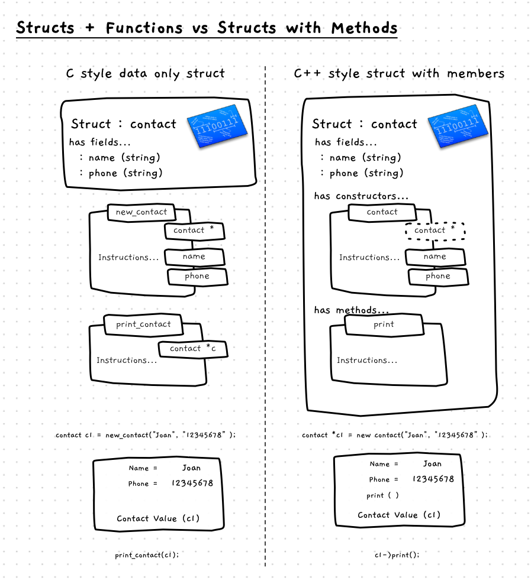

So far, structs have only contained data fields. This made it easy to collect together the pieces of data associated with an entity. The usefulness of the idea of consolidating things within an entity eventually resulted in the idea of also embedding the functionality alongside the data *within* the entity. This became the *object-oriented paradigm*, which is the focus of [Part 3](/book/part-3-programs-as-concepts/00-part-3-programs-as-concepts).

C++ extended the C language and introduced this idea of embedding functions and procedures within structs. We will look at the basics of this idea here, with a focus on how this is used to organise our code.

Let's consider simple example of a contact, where each contact has a name and phone number and can be printed. The following image shows the two different ways we can conceive of this solution. First we can see the struct as only having the data, alongside which we need to have functions and procedures that work on this data. On the other side, we have the struct with the functions and data declared within it. This makes a more complete package, were you have the data and the things that work on it all in the one place.



Here is what this looks like in code. We will


:::note[A struct:]

 - can contain fields (data members) as we have seen before.
 - can also contain **methods** - the term we use for functions/procedures within a struct.
 - may have **constructors** - special methods called when a value of the struct is created.

When using a struct with member functions:

- a constructor is called when you declare the variables.
- you can access the data fields.
- you can call methods on the struct values.

We will explore each of these additions over the following pages.

:::

## Data only struct example

Let's start with the data only struct, as we have already been working with this approach so far. To implement this, we create a struct with the data, a function to create a contact and initialize its fields, and a procedure to output the contact's details.

The code for this would appear as follows:

```cpp
#include "splashkit.h"

struct contact
{
    string name;
    string phone;
};

contact new_contact(string name, string phone)
{
    contact result;
    result.name = name;
    result.phone = phone;
    return result;
}

void print_contact(const contact &c)
{
    write_line(c.name + " " + c.phone);
}

int main()
{
    contact c = new_contact("Joan", "12345678");
    print_contact(c);
    return 0;
}

```

## Struct with functional members example

With C++ you can combine this by embedding the functions and procedures within the struct itself. You can create a number of different types of members:

- The data appears as fields. This is the same as we have already seen.
- Functions and procedures can be coded as **methods**. These exist within the struct, and have direct access to the struct's fields.
- You can also add **constructors**, this is a special function that is only called when the struct is initialised (for instance, when a new variable is declared).

The new code for the contact example is as follows. Notice how this is essentially the same as the above code, just with the function and procedure coded into the struct itself.

```cpp
#include "splashkit.h"

struct contact
{
    string name;
    string phone;

    contact(string init_name, string init_phone)
    {
        // We can access the name and phone in the struct directly
        // The parameters need different identifiers, so we renamed them
        name = init_name;
        phone = init_phone;
    }

    void print()
    {
        // Print is within the struct so it can
        // access the name and phone fields directly!
        write_line(name + " " + phone);
    }
}; // this is the end of the struct!

int main()
{
    contact c("Joan", "12345678");
    c.print();

    // struct fields are still accessible (public) by default
    // and can be modified
    c.name = "Jenny";
    c.print();

    return 0;
}
```

### Referring to struct values as objects

When you start programming in this way, you will quickly encounter the need to talk about values created from a struct type. In the past, this was just data, whereas now these are becoming larger entities that embody the concepts associated with our programs. The term we use to refer to these values is **object**, as in "*C1 refers to a contact object*". The object is the memory allocated for the fields of the struct, along with the functionality we embedded within it. This term, and the fact that this style of programming leads to new ways of thinking about our code, lead to the term **object-oriented programming**. For now, we will focus on the mechanics of this while in [Part 3](/book/part-3-programs-as-concepts/00-part-3-programs-as-concepts) we will look how to approach developing programs using this mentality.

:::tip[Classes?]

We will explore the role of classes in [Part 3](/book/part-3-programs-as-concepts/00-part-3-programs-as-concepts). Generally, object-oriented programs involve creating classes which capture similar aspects to what we are looking at with structs here. For now, as we focus on the mechanics of this we will use structs and when we fully transition to object-oriented programming we will switch to C# and classes. In C++, structs and classes are very similar so what you are learning now will help you transition when we make the jump.

:::

## Struct Members - Why, When, and How

The difference is small, and relatively simple. We have just embedded functionality within the struct, but this can change how we think about our code. We can now more clearly start to see the entities in our digital reality, and we can picture the things that these entities know and the things they can do. This is the focus of [Part 3](/book/part-3-programs-as-concepts/00-part-3-programs-as-concepts), so for now we can focus on the mechanics of how this works before we review how to use these ideas to start designing and building larger more complex programs.

The mechanics of this is a simple compiler translation, where it includes the struct along with the other parameters when the method is called. In general, you don't need to think about this most of the time. You can instead, think about the code being within the struct itself.

When you use a struct in this way, you can initialise it by calling a constructor when the value is created, and you can then access its fields and methods as you need. You can access the fields as you did before, to read and change values within the object, but you can also call its methods.

## In C++

Adding constructor and method members to a struct is something you can do within C++, it is not available in C. The syntax is the same as for declaring a function or procedure normally. We will look at the details in the following sections.

:::tip[Syntax]


Notice that the change here is that the struct can contain members that are constructors as well as methods and operators. These all exist within the context of the struct, allowing them to access the fields and other methods and operators within this context.

:::
