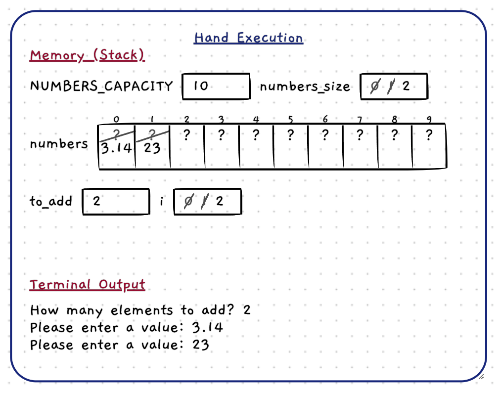
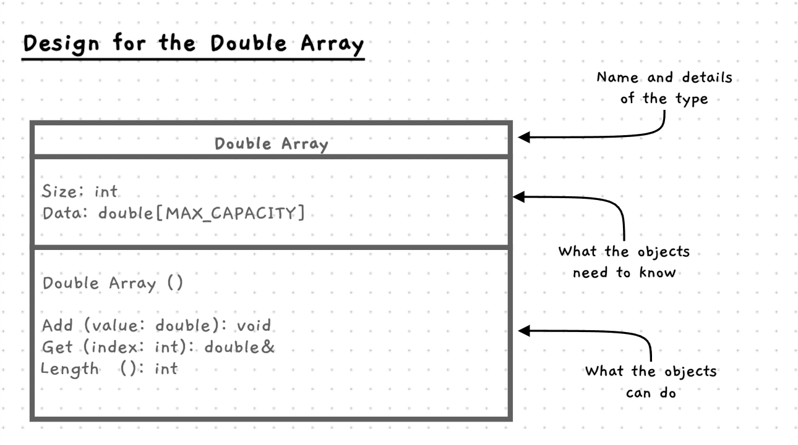

import { Accordion, AccordionItem } from 'accessible-astro-components'
import { Steps } from '@astrojs/starlight/components';
import CodeActivity from '/src/components/CodeActivity.astro'
import { Tabs, TabItem } from "@astrojs/starlight/components";

<style type="text/css">{`
    .alpha-list > ol {
        list-style-type: lower-alpha;
    }
    .starlight-aside__title > code {
        position: relative;
        top: 0.17em;
        padding: 0;
    }
`}</style>

In [Handling Multiples](/book/part-2-organised-code/3-working-with-multiples/0-overview/) we primarily worked with SplashKit's array classes - we won't be needing those here!

Instead, for this section let's start by briefly refreshing our understanding of C/C++ arrays, and seeing some practices that we can incorporate into our class. Feel free to revise from the video on the [Arrays](/book/part-2-organised-code/3-working-with-multiples/2-intro-tour/00-arrays/) page as well :)

### C/C++ Arrays
First, have a read over the code below. Take note of how the array is declared, and how the _size_ of the array is kept track of:
```c++
#include "splashkit.h"

int main()
{
    const int NUMBERS_CAPACITY = 3;

    double numbers[NUMBERS_CAPACITY];

    numbers[0] = 3.1;
    numbers[1] = 4.1;
    numbers[2] = 5.9;

    for(int i = 0; i < NUMBERS_CAPACITY; i ++)
    {
        write(i);
        write(": ");
        write_line(numbers[i]);
    }
}
```

<CodeActivity projectName="Operators and Generics/Guide/Basic Arrays" singleStep handExecution fastStepCoarse="true">
:::tip
  Use this to the flow of execution, and visualize how the simple array looks.
:::
```c++ {5, 7, 12}
#include "splashkit.h"

int main()
{
    const int NUMBERS_CAPACITY = 3;

    double numbers[NUMBERS_CAPACITY];

    numbers[0] = 3.1;
    numbers[1] = 4.1;
    numbers[2] = 5.9;


    for(int i = 0; i < NUMBERS_CAPACITY; i ++)
    {
        write(i);
        write(": ");
        write_line(numbers[i]);
    }
}

```
</CodeActivity>

Reading the  code above, we can see the following:
- We declare a constant, `NUMBERS_CAPACITY`.
- We declare an array of `double` called `numbers`, with a number of elements equal to the constant, `NUMBERS_CAPACITY`.
- We assign a value to each element, and then loop over the elements and print them out.

Notice:
 - The number of elements is completely fixed.
 - There's no way to "ask the array" how many elements it has.

This is why we made the constant (`NUMBERS_CAPACITY`), to helps us keep track of the size.

### Changing the Length?

If the array is a fixed size, how can we change the length? How do we add and remove elements? One method, is to seperate out the _capacity_ from the _size_:
 - We keep our array size fixed, with a specific maximum capacity.
 - Then, we have another variable, `numbers_size`, which keeps track of how many elements we have _added_ to it.

Take a look at an example below:
```c++
#include "splashkit.h"
#include "utilities.h"

int main()
{
    const int NUMBERS_CAPACITY = 10;
    int numbers_size = 0;

    double numbers[NUMBERS_CAPACITY];

    int to_add = read_integer_range("How many elements to add? ", 0, NUMBERS_CAPACITY);

    for(int i = 0; i < to_add; i ++)
    {
        numbers[numbers_size] = read_double("Please enter a value: ");
        numbers_size += 1;
    }

    for(int i = 0; i < numbers_size; i ++)
    {
        write(i);
        write(": ");
        write_line(numbers[i]);
    }
}
```

<Tabs syncKey="sko-activity-viz-switch">
<TabItem label="Try it Out">

<CodeActivity projectName="Operators and Generics/Guide/Adding To Array" singleStep handExecution fastStepCoarse="true" resources="/resources/code-activities/utilities.zip" outputHeight="450" handExecutionWidth="500">
:::tip
  Try adding a couple of elements to the array. Notice how the array itself hasn't changed size. Instead, we just keep track of how many elements have been added manually.
:::
```c++ {6, 11, 15}
#include "splashkit.h"
#include "utilities.h"

int main()
{
    const int NUMBERS_CAPACITY = 10;
    int numbers_size = 0;

    double numbers[NUMBERS_CAPACITY];

    int to_add = read_integer_range("How many elements to add? ", 0, NUMBERS_CAPACITY);

    for(int i = 0; i < to_add; i ++)
    {
        numbers[numbers_size] = read_double("Please enter a value: ");
        numbers_size += 1;
    }

    for(int i = 0; i < numbers_size; i ++)
    {
        write(i);
        write(": ");
        write_line(numbers[i]);
    }
}

```
</CodeActivity>

</TabItem>
<TabItem label="See Visualization">
:::tip
  In this example, the user added two elements to the array. Notice how the array itself hasn't changed size. Instead, we just keep track of how many elements have been added manually, inside `numbers_size`.
:::

</TabItem>
</Tabs>

:::tip
This method of separating _capacity_ and _size_ forms the backbone of even SplashKit's `dynamic_array<T>`. Later on we will also learn how to adjust the _capacity_ at runtime as well.
:::

At this point, you should be starting to see how we can use arrays to store a varying number of elements. You'll also notice that our array is a bit scattered - the data is in `numbers`, while the capacity is in `NUMBERS_CAPACITY`, and the number of added elements is in `numbers_size`. Which brings us to...

### Array in a Class

If we want to make a nice array _class_, we need to bring these pieces of data together!

in short, we will:
 - use arrays to store a fixed number of elements
 - store the capacity as a constant. For now we'll store this as a global constant, and improve this later.
 - use a second variable to keep track of the number of _active_ elements within that array, to allow us to have a variable length.
 - store the array and length together inside a struct, to keep the data together.

### Methods
Now, have a think back to the methods you've used when working with a `dynamic_array`:
 - What member functions should they have?
 - Can you see fragments of them in the examples above?
 - Can you think of any others that might be helpful?

For now let's just focus on the most important ones - the ability to add elements, get the "length" (number of elements added), and of course get/set elements.

### Class Design

For our first iteration, we will create a `double_array` class - it will store an array of doubles, and allow us to add new elements using the technique above.

We can visually capture the design for our `double_array` class, making it easier to communicate how the code should work. The following is a basic **UML class diagram**, which we can use to capture the details of our class.



The diagram shows the details of our class in a rectangle that is divided into three sections. At the top we have its name. The middle section indicates the things objects of this type will know - the fields of the class. The bottom third lists the constructors, destructor, and methods that capture what the objects can do.

In this case we have:

1. At the top:
    - The name of the type: Double Array - which we will code as `double_array`
2. In the middle, fields for:
    - Size, which is an `int` - coded as `int size;`
    - Data, an array of `double` - coded as `double data[MAX_CAPACITY];`
3. At the bottom, methods for:
    - Constructor with no parameters (for an empty array).
    - Add - which adds an element to the data in the double array.
    - Get - retrieves an element from the array, as a reference.
    - Length - returns the current number of elements in the array.

On the next page, we'll start implementing this as code.
