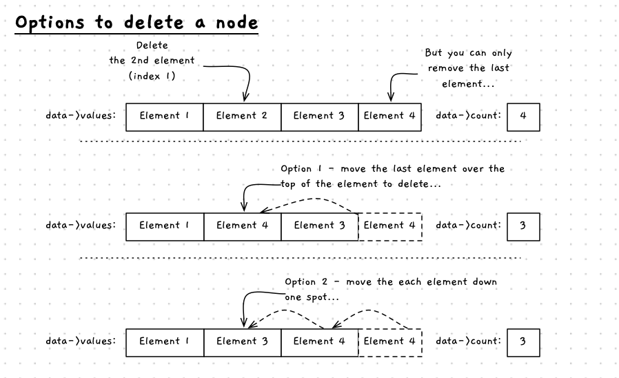
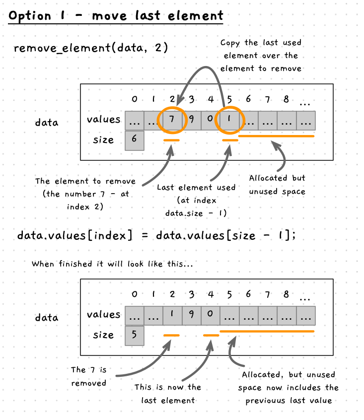
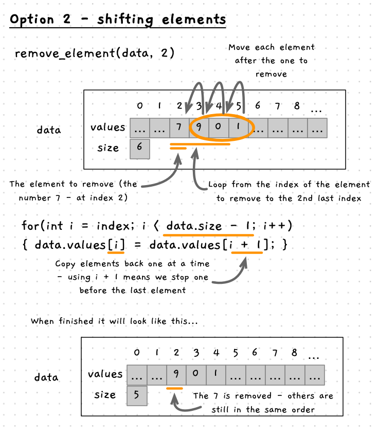

import { Accordion, AccordionItem } from 'accessible-astro-components'

Now that we can add elements to the array within the struct, we can also remove elements from the array. The challenge here is that we can't _actually_ remove an element from an array.

Instead, we move data around within the array, and adjust the number of elements we are using to have the same effect. There are two options for removing an element, as shown in the image below. Both options relate to how we retain the existing data when replacing the element being removed.



## Option 1 - move the last element

The easy way to do this would be to swap the last element of the array into the location where the element to be removed is. Then reduce the size, so that the old last element is no longer considered to be part of the data.



```plaintext
Procedure: Remove Element
Parameters:
- data: reference to number data
Local variables:
- index: integer of element to remove
Steps:
- Call print to output the values in the array with their indexes
- Ask the user which index to remove
- If it is less than 0 or larger than the max index
  - Output an error message
  - Return
- Store the last element of data.values in data.values[index]
- Reduce data.size by one
```

Once we have the index, we can validate it to ensure it is within the appropriate range. If not, we can return with an error message. The removal itself is then simply the process of copying the data from the last element to the index we want to remove and reducing the size. As you can see in the image above, the 7 is removed and the 1 is retained, just in a new location in the array.

:::note
The value at index 5 will still be 1 in our example. This does not matter, as you only have 5 values, so we read from index 0 to 4. When we add a new value, it will be written over the 1 in index 5.
:::

<Accordion>
<AccordionItem header="Code for remove using swap">

```cpp
/**
 * Remove a value from the array
 *
 * @param data the array of values
 */
void remove_value(number_data &data)
{
  print(data);

  int index = read_integer("Enter the index of the value to remove: ");

  if (index >= 0 && index < data.size)
  {
    data.values[index] = data.values[data.size - 1];
    data.size--;
  }
  else
  {
    write_line("Sorry, that is not a valid index.");
  }
}
```

</AccordionItem>
</Accordion>

:::tip[Thought exercise]

What happens if there is only one element in the array, and you remove it?

:::

## Option 2 - Shifting elements one by one

If you want to keep the order the same, then we need to shift more values around. In fact, we need to move *each* value that occurs after the element we are removing back one position in the array.



Most of the removal logic would remain the same, but now we need a for loop to loop for each element after index. Within that loop we can copy the values back one position in the array. Here we need to work with two positions in the array at the same time. As they are adjacent to each other we can use `i` and `i - 1`. Where `i` is the current element in the array (from the perspective of the for loop) and `i - 1` is one position earlier in the array. Similarly, we can use `i + 1` if we wanted the next position in the array.

```plaintext
Procedure: Remove Element
Parameters:
- data: reference to number data
Local variables:
- index: integer of element to remove
- i: integer to loop over array
Steps:
- Output the values in the array with their indexes
- Ask the user which index to remove
- If it is less than 0 or larger than the max index
  - Output an error message
  - Return
- For i = index + 1 to last index ( while i < data.size)
  - Set data.values[i - 1] = data.values[i]
- Reduce data.size by one
```

Any time you are using something like `i + 1` or `i - 1` to access an array element, you need to think about the array boundaries. You want to make sure your code can never go past the end of the array (back past the start, or on past the end). In our case, we start at `index + 1` and index much be >= 0. Therefore, `i - 1` will never read past the start of the array.

<Accordion>
<AccordionItem header="Code for remove by shifting">

```cpp {14-17}
/**
 * Remove a value from the array
 *
 * @param data the array of values
 */
void remove_value(number_data &data)
{
  print(data);

  int index = read_integer("Enter the index of the value to remove: ");

  if (index >= 0 && index < data.size)
  {
    for (int i = index + 1; i < data.size; i++)
    {
      data.values[i - 1] = data.values[i];
    }
    data.size--;
  }
  else
  {
    write_line("Sorry, that is not a valid index.");
  }
}
```

</AccordionItem>
</Accordion>


## Example

This code uses option 1. Notice how the code below checks the index is valid before attempting to remove the element. It is important to sanitise data, particularly in these functions that access array values. There are a range of security exploits that take advantage of code that does not perform these checks which can result in access to values you should not be able to access and potentially the ability to execute arbitrary code.

```cpp {24-35,49}
#include "splashkit.h"
#include "utilities.h"

// The maximum number of values we can store
const int MAX_NUMBERS = 20;

/**
 * The data structure to store the numbers
 *
 * @field values the array of values
 * @field size the number of values in the array - up to MAX_NUMBERS
 */
struct number_data
{
  double values[MAX_NUMBERS];
  int size;
};

/**
 * Remove a value from the array
 *
 * @param data the array of values
 */
void remove_value(number_data &data, int index)
{
  if (index >= 0 && index < data.size)
  {
    data.values[index] = data.values[data.size - 1];
    data.size--;
  }
  else
  {
    write_line("Sorry, that is not a valid index.");
  }
}

int main()
{
  // Initialise struct with an empty array and a size of 0.
  number_data data = {{},0};

  // Save some data
  data.values[0] = 10;
  data.values[1] = 20;
  data.values[2] = 30;
  data.size = 3;

  // Remove the value at index 1
  remove_value(data, 1);
  
  // Loop through printing all values
  for (int i = 0; i < data.size; i++)
  {
    write_line(data.values[i]);
  }

  return 0;
}
```
