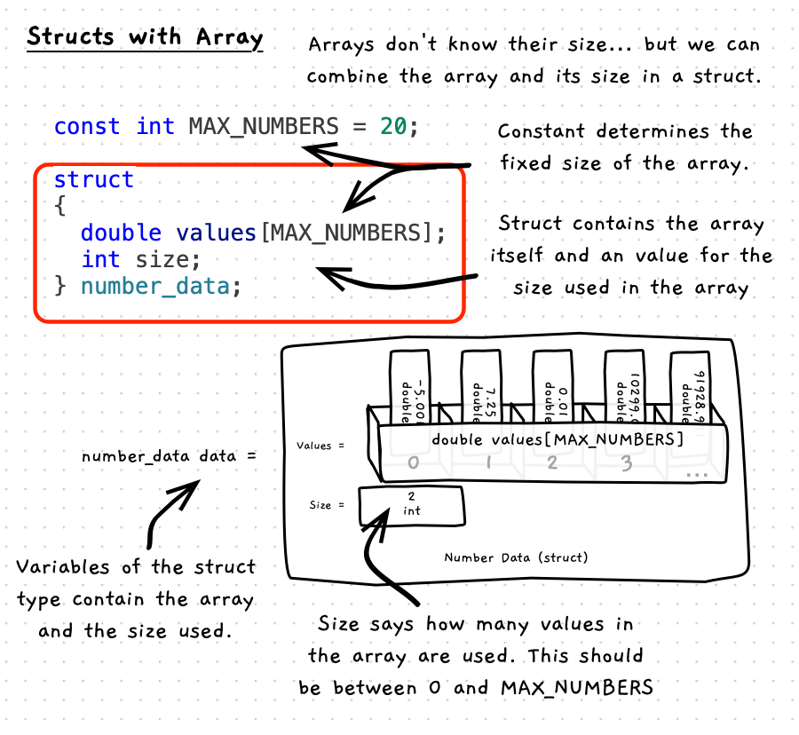

One effective way to work with arrays is to place the array and its size into a struct. This allows you to keep the data and the number of elements that is has nicely together. You can then also use the size to give you the capability of adjusting the number of elements you are using, by changing the value of the array's size. With this, you can then grow and shrink the size of the array, up to a set maximum number of elements.

The following illustrates the code and how to think about a struct that contains an array:



:::note

- You still need to set the maximum size for the array within the struct - so it has a fixed size. A constant works well to make sure this is consistent throughout your program.
- Within the struct you have:
  - a field to store the array. This will have space to store a number of elements, based on the maximum number you set.
  - a size integer field. This will store the number of elements used within the array field. This way you can change the array from have between 0 and the maximum number of elements based on your constant.
- As this is now a struct, you can pass it by value or by reference. So make sure to use references when passing this around in your code.

:::

## Example

```cpp
#include <cstdio>
#include "utilities.h"

// The maximum number of values we can store
const int MAX_NUMBERS = 20;

/**
 * The data structure to store the numbers
 *
 * @field values the array of values
 * @field size the number of values in the array - up to MAX_NUMBERS
 */
struct number_data
{
  double values[MAX_NUMBERS];
  int size;
};

int main()
{
  // Initialise struct with an empty array and a size of 0.
  number_data data = {{},0};

  // You can pass to a procedure by reference, and have it update
  populate_array(data);

  data.values[0] = read_double("Enter a value: ");
  data.size = 1;

  data.values[1] = read_double("Enter a value: ");
  data.size = 2;

  printf("Size is %d\n", data.size);
  printf("Element 1 is %lf\n", data.values[0]);

  return 0;
}
```
