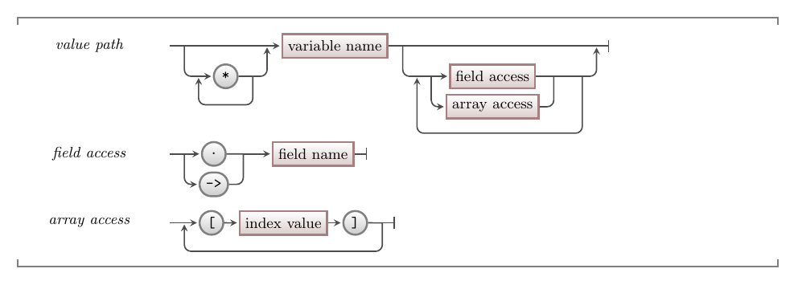

The assignment statement allows you to store a value in a variable. This can now be extended to allow you to store a value in an element of an array. To achieve this you indicate the array you want to store the value in, as well as the index of the element you want to store the value in.

<br/>
import imgArrayAssignmentStatement from './images/mmv-array-assignment-statement.png';

<a id="FigureArrayAssignmentStatement"></a>

<div class="caption"><span class="caption-figure-nbr">Figure x.y: </span>Assigning a value to an element of the array</div><br/>

:::note

- The assignment statement is an **instruction**, storing a value in a variable or array.
- When working with arrays, you can store a value in an element by specify the array and index of the element.
- You can code this in C/C++ using: `data[1] = 127.5 * 2;`. In this case, `data` is the name of the array variable, and 1 is the index of the second element. The code in the snippet stores a 255.0 in the second element of the data array.

:::

## In C/C++

:::tip[Syntax]

The following image shows the syntax for accessing values within your code. This starts with the variable you have access to, which can be dereferenced if it is a pointer. Following the variable, you can have a number of field or array accesses in sequence. Fields can be accessed using `->` if you have a pointer to the struct, or `.` if you have the struct value at this point. Array accesses use `[]` with the index between them to indicate the element of the array you want to access.



:::

## Accessing Values - Why, When, and How

The assignment statement allows you to store a value in memory. You need to use variables to determine where that value is stored. The syntax above shows how you can do this in C/C++. With this, you are walking through the structure of your data to identify where to store this value.

Notice that with this syntax you can combine array and field access. If you have a variable that stores a struct, you can access the fields of that struct. Then, if one of these fields is an array, you can then use the array syntax to access an element of that array. This can continue. So, if the element is itself a new struct, then you can access fields of that struct, and so on.

For example, we could add flys to our fly catch game. If you have the game data struct, you can access the flies. This would be an array of fly data. If we get the fly at index 0, using an array acces, then you have a fly. You could then access the fields of the fly to read its location. This could look something like `game.flies[0].appear_at`. As we have clear ideas of the things in our digital reality, reading this chain of data accesses makes logical sense. You are getting the `appear_at` data for the first fly in the game.

## Assigning all elements of an array

Many languages also allow you to copy the entire contents of an array into another array. In these cases each of the elements of one array are copied into the elements of the destination array (lefthand side of the assignment).

<br/>
import imgArrayCopy from './images/mmv-array-copy.png';

<a id="FigureArrayCopy"></a>

<div class="caption"><span class="caption-figure-nbr">Figure x.y: </span>All of the elements of an array can be copied across in the assignment statement</div><br/>

:::note

- The size of the two arrays should match.
- The value from each of the elements of the array on the righthand side will be copied into the matching element in the array on the lefthand side.

:::

This **cannot** be done in C/C++ with an assignment statement, rather it is achieved using the `memcpy` function. You can, however, assign a struct that contains an array to another struct value. So wrapping your arrays in structs can also help.

The `memcpy` function copies a chunk of memory from one location to another.

```
Function: memcpy
Prorotype: void *memcpy(void *destination, const void *source, size_t num )
Returns: (void *) the destination is returned, can be ignored.
Parameters:
  - destination: The location where the data is copied to.
  - source: The data to copy.
  - num The number of bytes to copy.
```

The destination and source are void pointers (`void *`) which is C's way of saying "a pointer to anything". You pass in the pointer to where to store the data (the left-hand side of an assignment normally), the source (the right-hand side), and the number of bytes to copy.

You can get the number of bytes using the `sizeof` operator. You can read more on this in the [C++ reference site](https://en.cppreference.com/w/cpp/language/sizeof).

```
Operator: sizeof
Returns: (size_t) the number of bytes for a type
Parameter: a type or expression
```

The following code demonstrates the use of `memcpy` and `sizeof` to copy one array into another.

```cpp
/* program: array-copy.c */

#include <string.h>

int main()
{
  int data[3] = {1, 2, 3};
  int other_data[3];
  int more_data[3];
  
  memcpy(other_data, data, 3 * sizeof(int));
  memcpy(more_data, data, sizeof(data));
  
  return 0;
}
```
