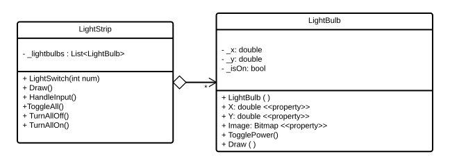

See how to describe different kinds of relationships in UML class diagrams.

UML class diagrams allow you to communicate the structure of the classes within a solution. One important aspect of this is the relationship between classes. There are three kinds of relationships: **dependency**, **association**, and **aggregation**.

## Dependency

Dependency is used to indicate a short lived relationship. The class knew an object (or objects) of the dependent class, but it doesn't maintain a more permanent association. In terms of code, dependency relates to the use of an object via a **local variable** or **parameter**. The object is not permanently remembered, so the relationship is temporary.

In a UML Class Diagram this relationship is represented by a dashed arrow. The example UML Class Diagram above shows that the `Program` is dependent on the `LightSimulator` class. It will use this within its `Main` method, but it does not store it in a field.

## Association

Association is used to indicate a long term relationship. Objects of the class are always _associated_ with the other class. In terms of code, association is implemented using a **field**. The object **knows** about the other object, which is what we use fields for.

In a UML Class Diagram this relationship is shown as a solid line (or arrow) from one class to another. The example UML Class Diagram above shows that the `LightSimulator` is associated with a `LightStrip`. You can see this from the line, and from the field within the class. 

Also consider the `LightSwitch` we created when we first coded this simulator. It could start without knowing which `LightBulb` it was connected to. This would still be drawn as association, as the switch is associated with a bulb. When the switch was not connected to a light it would store `null` in its field. It does still know which light it is connected to: it is connected to _no_ light.

## Aggregation and Multiplicity

Whole part relationships are known as aggregation in UML terminology. These are special kinds of association, where we are indicating that objects of one class can be thought of as part of, or contained with, another class.

In a UML Class Diagram aggregation is shown by adding a diamond to the whole side of an association. In the example UML diagram above we are communicating that the `LightBulb` is _part_ of the `LightStrip`.

The example also shows the use of **multiplicity** with the `*` at the end of the line. This says that there are many `LightBulb` objects associated with the `LightStrip`. The `*` signifies 0 to many. The following table shows how to indicate different options. This annotation goes on the end of the line which will have many objects.

 Line End Annotation | Multiplicity | Note
---------|----------|----------
 \* | 0 to many |
 1..* | 1 to many | You can change the minimum
 3 | exactly 3 | You can indicate any number
 1..3 | 1 to 3 | You can supply any range

Please note that aggregation can exit without multiplicity (though multiplicity generally indicates aggregation). For example a steering wheel (1) can be part of a car. Here the relationship between car and steering wheel can be thought of as aggregation. It is also technically possible to have multiplicity without aggregation, but this is rarely done.
