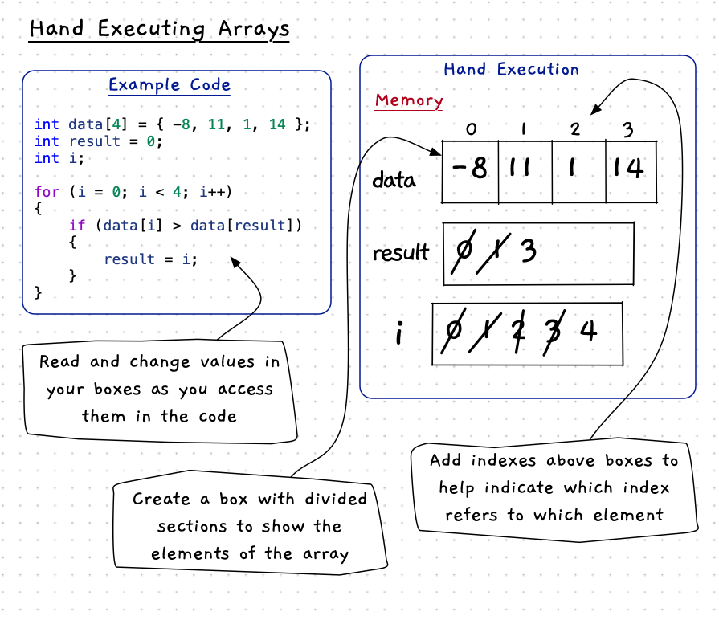
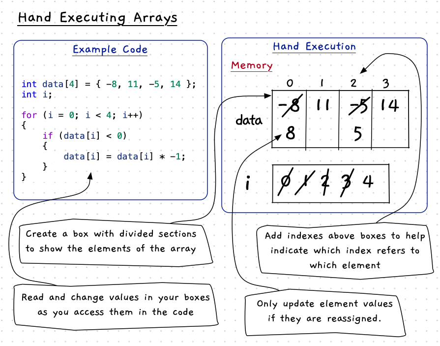
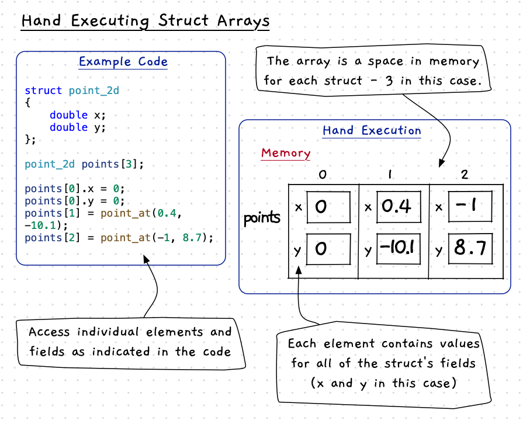

import { YouTube } from 'astro-embed';
import MySwiper from '/src/components/react/myswiper.jsx';

import Slide1 from './images/hand-exec-arrays-slider/Slide1.png';
import Slide2 from './images/hand-exec-arrays-slider/Slide2.png';
import Slide3 from './images/hand-exec-arrays-slider/Slide3.png';
import Slide4 from './images/hand-exec-arrays-slider/Slide4.png';
import Slide5 from './images/hand-exec-arrays-slider/Slide5.png';
import Slide6 from './images/hand-exec-arrays-slider/Slide6.png';
import Slide7 from './images/hand-exec-arrays-slider/Slide7.png';
import Slide8 from './images/hand-exec-arrays-slider/Slide8.png';
import Slide9 from './images/hand-exec-arrays-slider/Slide9.png';
import Slide10 from './images/hand-exec-arrays-slider/Slide10.png';
import Slide11 from './images/hand-exec-arrays-slider/Slide11.png';
import Slide12 from './images/hand-exec-arrays-slider/Slide12.png';
import Slide13 from './images/hand-exec-arrays-slider/Slide13.png';

export const sliderImages = [
  {
    src: Slide1.src,
    altText: "Hand execution of arrays - step 1",
    tipHeader: "Step 1:",
    tipStart: 1,
    tips: [
      "Create the memory (boxes) for the variables: <strong>data</strong>, and <strong>i</strong>."
    ]
  },
  {
    src: Slide2.src,
    altText: "Hand execution of arrays - step 2",
    tipHeader: "Step 2:",
    tipStart: 2,
    tips: [
      "Step into the <strong>for</strong> loop. This will initialise the variable <strong>i</strong>."
    ]
  },
  {
    src: Slide3.src,
    altText: "Hand execution of arrays - step 3",
    tipHeader: "Step 3:",
    tipStart: 3,
    tips: [
      "Evaluate the <strong>if</strong> statement <strong>condition</strong> when <strong>i = 0</strong>."
    ]
  },
  {
    src: Slide4.src,
    altText: "Hand execution of arrays - step 4",
    tipHeader: "Step 4:",
    tipStart: 4,
    tips: [
      "Reassign the array element at index <strong>0</strong>."
    ]
  },
  {
    src: Slide5.src,
    altText: "Hand execution of arrays - step 5",
    tipHeader: "Step 5:",
    tipStart: 5,
    tips: [
      "Increment <strong>i</strong>, then check <strong>for loop condition</strong>."
    ]
  },
  {
    src: Slide6.src,
    altText: "Hand execution of arrays - step 6",
    tipHeader: "Step 6:",
    tipStart: 6,
    tips: [
      "Evaluate the <strong>if statement condition</strong> when <strong>i = 1</strong>."
    ]
  },
  {
    src: Slide7.src,
    altText: "Hand execution of arrays - step 7",
    tipHeader: "Step 7:",
    tipStart: 7,
    tips: [
      "Increment <strong>i</strong>, then check <strong>for loop condition</strong>."
    ]
  },
  {
    src: Slide8.src,
    altText: "Hand execution of arrays - step 8",
    tipHeader: "Step 8:",
    tipStart: 8,
    tips: [
      "Evaluate the <strong>if statement condition</strong> when <strong>i = 2</strong>."
    ]
  },
  {
    src: Slide9.src,
    altText: "Hand execution of arrays - step 9",
    tipHeader: "Step 9:",
    tipStart: 9,
    tips: [
      "Reassign the array element at index <strong>2</strong>."
    ]
  },
  {
    src: Slide10.src,
    altText: "Hand execution of arrays - step 10",
    tipHeader: "Step 10:",
    tipStart: 10,
    tips: [
      "Increment <strong>i</strong>, then check <strong>for loop condition</strong>."
    ]
  },
  {
    src: Slide11.src,
    altText: "Hand execution of arrays - step 11",
    tipHeader: "Step 11:",
    tipStart: 11,
    tips: [
      "Evaluate the <strong>if statement condition</strong> when <strong>i = 3</strong>."
    ]
  },
  {
    src: Slide12.src,
    altText: "Hand execution of arrays - step 12",
    tipHeader: "Step 12:",
    tipStart: 12,
    tips: [
      "Increment <strong>i</strong>, then check <strong>for loop condition</strong>."
    ]
  },
  {
    src: Slide13.src,
    altText: "Hand execution of arrays - step 13",
    tipHeader: "Step 13:",
    tipStart: 13,
    tips: [
      "Finished!"
    ]
  }
];

  <YouTube id="YQ0J_uEhNeY" params="fs=1&modestbranding=1&rel=0"/>

As with indirection, hand execution provides a great way to see how the steps in our code work with an array to achieve its goals. When hand executing an array, you use the same process we explored previously. The only difference is the new ability to have a variable that contains multiple boxes to represent an array.

## Hand execution of arrays

When hand executing arrays with primitive data, the main thing to show are the elements within your arrays and to indicate which index is used to access that element. You can then use these as you step through the code. Use the value of the array index, together with the array name, to determine which value to read when using the array.

### Reassigning array elements

Here is an example that includes reassigning individual elements of the array:

:::tip[Step-by-step]

To see each step of the example above, use the arrows in the panel below:

<MySwiper client:only height="" images={sliderImages}></MySwiper>

:::

## Arrays with structs

The same applies when hand executing arrays with structs. In this case you also use the field name to identify where in memory (i.e. on your paper) the value needs to be written to or read from. For example, `points[0]` refers to the first element in the array, so the first box of the `points` array on your page. Then `points[0].x` refers to the `x` value within that box.

Overall the process is the same. Step through the code and perform the actions one at a time. Use the data you have written on the page to determine the values for your expressions as you go.
