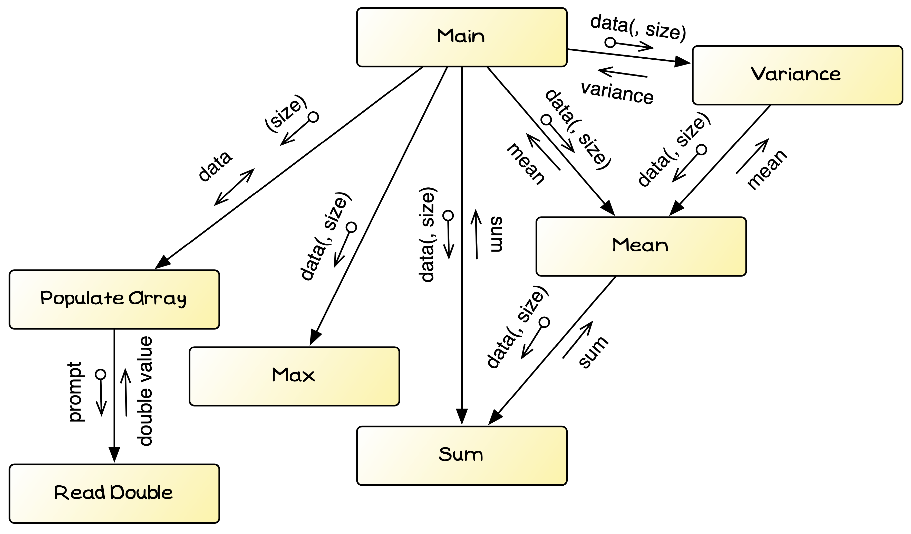

Before we think about the calculations, let's put the infrastructure in place to get the numbers that we will work on within our program. We can quickly get a big picture for the program, and the data it will contain.

## Data Structure

As a first step, we should think about what data we need and how it will be represented in the program.

For this program we are going to need to handle an array of numbers. We will need to pass this around, and loop through all the elements. As C does not remember the size of the array when it is passed, we could track this with separate parameters, but the easier option is to set this up with a struct. So, we can design our program to use a struct to hold the array of numbers and the current number of elements we are using.

The following pseudocode outlines my plan for this. It contains:

- A constant to set the array to the largest number of elements we want to accept. This can start at 20, so that we can easily test trying to add more than 20 values. Later we can easily change this to a larger value.
- The `number data` struct can contain the array and the number of elements we are currently using in the array (its size). This will simplify passing this data around as we build this program up. Note that the size should be less than or equal to the maximum number of elements we can store (`MAX_NUMBERS`).

```plaintext
Const: MAX_NUMBERS int with value 20

Struct: number data
Fields:
- values: array of MAX_NUMBERS double values
- size: an integer for the current number of values
```

## Overview of Statistic Calculator's design

Before we start coding, it is a good idea to think through how the code will come together. This will ensure we have the right things in place before we start coding. This doesn't need to take long, you just want to get a bit of an idea of the direction you are going.

For this program, we will need to:

- Read the data in from the user
- Display the data entered
- Calculate the statistics: mean, maximum, and sum to start

We can break this down into a few functions and procedures:

- `main` will contain the data and coordinate things
- `populate_array` will read the data in from the user. This can use:
  - `read_integer` to get the number of values to enter (up to `MAX_NUMBERS`)
  - `read_double` to get the data from the user.
- `print` will display the data entered
- Three functions (`max`, `mean`, and `sum`) will calculate the statistics

We can represent this in a structure chart to start to visualise how this comes together.


<div class="caption">Structure Chart showing the structure of the statistics calculator program</div><br/>

Our `number_data` struct would work in this context, as it can be passed around to the different functions and procedures.
