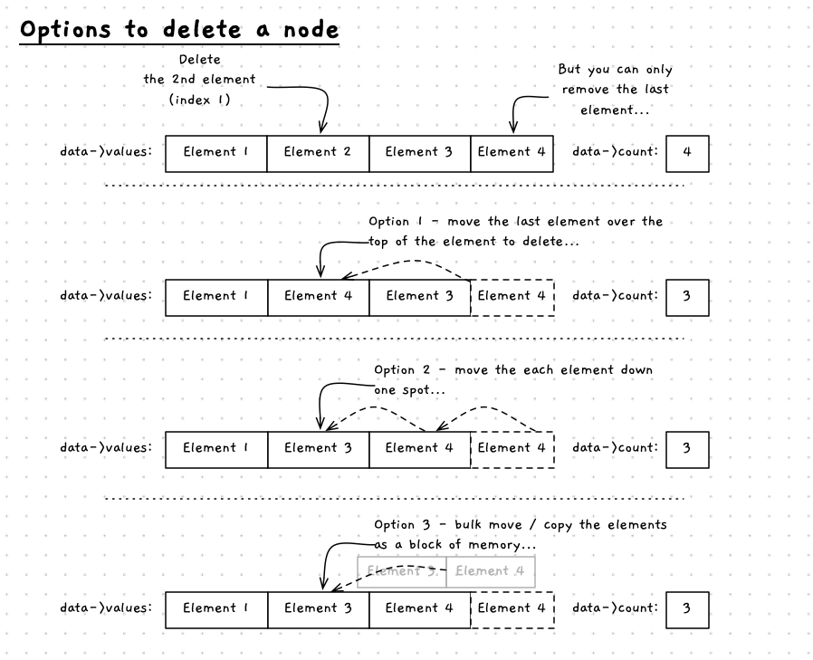

Removing a value is an interesting process. We can't actually remove an element from an array. So we have to move the data around within the array, and adjust the number of elements we are using which will, in effect, remove the element.

There are three options for removing an element as shown in the image below. All the options relate to how we retain the existing data by replacing the element being removed. In the first option, we move the last element over the element to be removed. This does not retain the order, but is fast and simple. The second option is to move each element up one position, moving the data over the element to be removed. This retains the order of elements, but is slower as we have to move each element one at a time. In C/C++ we also have the option to use low level memory copying functions to copy the elements up one position in bulk. This gets the library to perform the instructions, and should therefore be as efficient as possible.



## Option 1 - move the last element

The easy way to do this would be to swap the last element of the array into the location where the element to be removed is. Then reduce the size, so that the old last element is no longer considered to be part of the data.

```
Procedure: Remove Element
Parameters:
- data: reference to number data
Local variables:
- index: integer of element to remove
Steps:
- Output the values in the array with their indexes
- Ask the user which index to remove
- If it is less than 0 or larger than the max index
  - Output an error message
  - Return
- Store the last element of data.values in data.values[index]
- Reduce data.size by one
```

The first action would probably be good as its own procedure. This could accept the number data as a const reference and loop through printing out each element and its index.

Once we have the index, we can validate it to ensure it is within the appropriate range. If not, we can return with an error message.

The removal is then simply the process of copying the data from the last element to the index we want to remove. Then, when we reduce the count, that value is retained (if it is not the element being removed).

With this approach, the issue is that the order of the values has changed.

## Option 2 - Shifting elements one by one

If you want to keep the order the same, then we need to shift more values around. In fact, we need to move *each* value that occurs after the element we are removing back one position in the array.

Most of the removal logic would remain the same, but now we need a for loop to loop for each element after index. Within that loop we can copy the values back one position in the array. Here we need to work with two positions in the array at the same time. As they are adjacent to each other we can use `i` and `i - 1`. Where `i` is the current element in the array (from the perspective of the for loop) and `i - 1` is one position earlier in the array. Similarly, we can use `i + 1` if we wanted the next position in the array.

```
Procedure: Remove Element
Parameters:
- data: reference to number data
Local variables:
- index: integer of element to remove
- i: integer to loop over array
Steps:
- Output the values in the array with their indexes
- Ask the user which index to remove
- If it is less than 0 or larger than the max index
  - Output an error message
  - Return
- For i = index + 1 to last index ( while i < data.size)
  - Set data.values[i - 1] = data.values[i]
- Reduce data.size by one
```

Any time you are using something like `i + 1` or `i - 1` to access an array element, you need to think about the array boundaries. You want to make sure your code can never go past the end of the array (back past the start, or on past the end). In our case, we start at `index + 1` and index much be >= 0. Therefore, `i - 1` will never read past the start of the array.

**TODO: add slider on how to remove element**

## Option 3 - using memory copy functions

In C/C++, the standard library provides a `memcpy` function. We can use this to copy the memory used in the array for all the elements after the removed element, and copy them over the elements starting at the element being removed. This is the same idea as option 2, just using the memory copy function we saw in [copying arrays](../../1-concepts/00-04-clone-array), where in this case we only copy part of the array.

```
Procedure: Remove Element
Parameters:
- data: reference to number data
Local variables:
- index: integer of element to remove
- size: sizet for the size of memory to copy
Steps:
- Output the values in the array with their indexes
- Ask the user which index to remove
- If it is less than 0 or larger than the max index
  - Output an error message
  - Return
- size = sizeof(double) * data.size - index - 1;
- memcpy(address of data.values[index], address of data.values[index + 1], size)
- Reduce data.size by one
```

## Summary

Remember the point of this exercise has been to work through the actions you can perform with arrays. Things like adding a removing elements work the same regardless of the kind of data stored in the array. Understanding how this works using basic data types now, will mean that you can easily work with other data types going forward.
