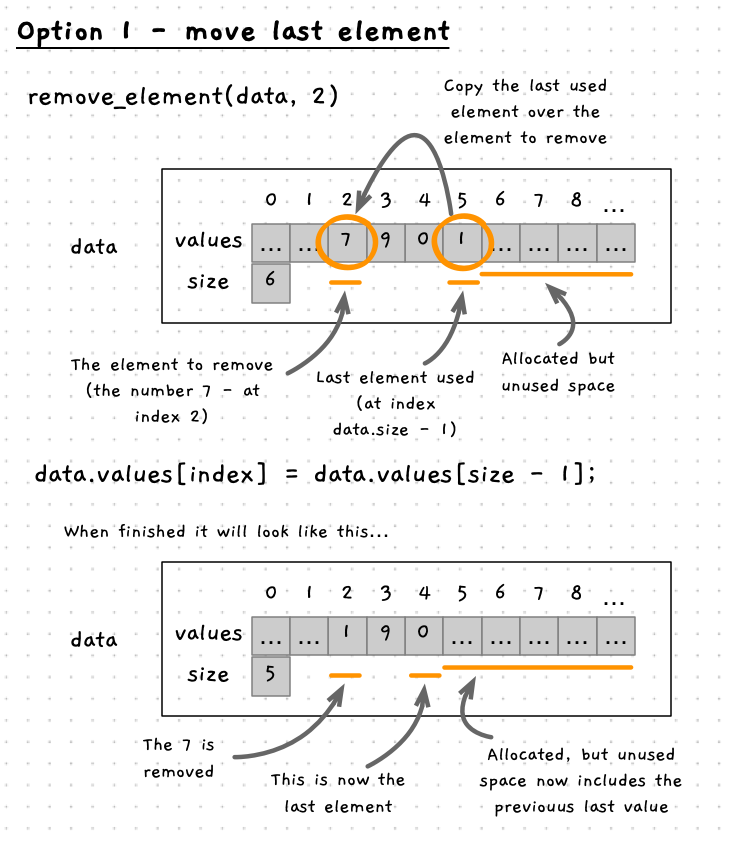
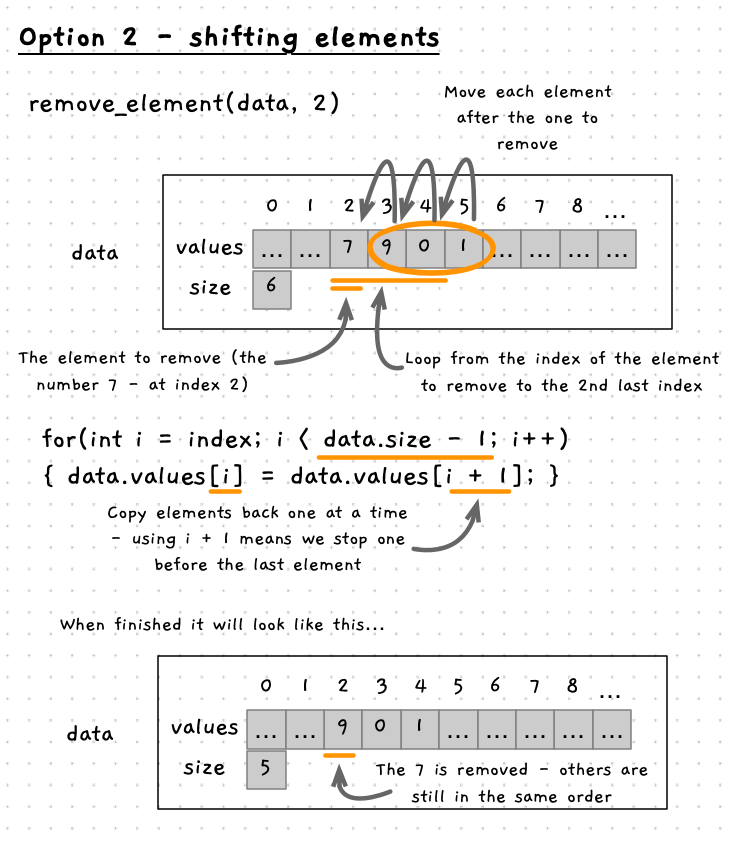
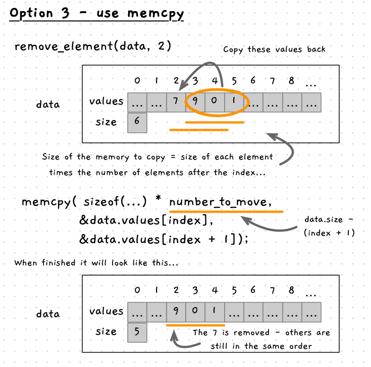

import { Accordion, AccordionItem } from 'accessible-astro-components'

Removing a value is much more challenging than adding a value, but will be great for seeing how to work with arrays.

We can't actually remove an element from an array. Instead, we move data around within the array, and adjust the number of elements we are using to have the same effect. There are three options for removing an element, as shown in the image below. All the options relate to how we retain the existing data when replacing the element being removed.


## Option 1 - move the last element

The easy way to do this would be to swap the last element of the array into the location where the element to be removed is. Then reduce the size, so that the old last element is no longer considered to be part of the data.



```plaintext
Procedure: Remove Element
Parameters:
- data: reference to number data
Local variables:
- index: integer of element to remove
Steps:
- Call print to output the values in the array with their indexes
- Ask the user which index to remove
- If it is less than 0 or larger than the max index
  - Output an error message
  - Return
- Store the last element of data.values in data.values[index]
- Reduce data.size by one
```

Once we have the index, we can validate it to ensure it is within the appropriate range. If not, we can return with an error message. The removal itself is then simply the process of copying the data from the last element to the index we want to remove and reducing the size. As you can see in the image above, the 7 is removed and the 1 is retained, just in a new location in the array.

:::note
The value at index 5 will still be 1 in our example. This does not matter, as you only have 5 values, so we read from index 0 to 4. When we add a new value, it will be written over the 1 in index 5.
:::

Have a go at coding this option. Remember to call it in main, and test it out with a few values.

<Accordion>
<AccordionItem header="Code for remove using swap">

```cpp
/**
 * Remove a value from the array
 *
 * @param data the array of values
 */
void remove_value(number_data &data)
{
  print(data);

  int index = read_integer("Enter the index of the value to remove: ");

  if (index >= 0 && index < data.size)
  {
    data.values[index] = data.values[data.size - 1];
    data.size--;
  }
  else
  {
    printf("Sorry, that is not a valid index.\n");
  }
}
```

</AccordionItem>
</Accordion>

:::tip[Thought exercise]

What happens if there is only one element in the array, and you remove it?

:::

## Option 2 - Shifting elements one by one

If you want to keep the order the same, then we need to shift more values around. In fact, we need to move *each* value that occurs after the element we are removing back one position in the array.



Most of the removal logic would remain the same, but now we need a for loop to loop for each element after index. Within that loop we can copy the values back one position in the array. Here we need to work with two positions in the array at the same time. As they are adjacent to each other we can use `i` and `i - 1`. Where `i` is the current element in the array (from the perspective of the for loop) and `i - 1` is one position earlier in the array. Similarly, we can use `i + 1` if we wanted the next position in the array.

```plaintext
Procedure: Remove Element
Parameters:
- data: reference to number data
Local variables:
- index: integer of element to remove
- i: integer to loop over array
Steps:
- Output the values in the array with their indexes
- Ask the user which index to remove
- If it is less than 0 or larger than the max index
  - Output an error message
  - Return
- For i = index + 1 to last index ( while i < data.size)
  - Set data.values[i - 1] = data.values[i]
- Reduce data.size by one
```

Any time you are using something like `i + 1` or `i - 1` to access an array element, you need to think about the array boundaries. You want to make sure your code can never go past the end of the array (back past the start, or on past the end). In our case, we start at `index + 1` and index much be >= 0. Therefore, `i - 1` will never read past the start of the array.

Have a go at coding this option. Comment out your original code so that you can keep a record of this and go back to it if you want to play with it further.

<Accordion>
<AccordionItem header="Code for remove using swap">

```cpp {14-17}
/**
 * Remove a value from the array
 *
 * @param data the array of values
 */
void remove_value(number_data &data)
{
  print(data);

  int index = read_integer("Enter the index of the value to remove: ");

  if (index >= 0 && index < data.size)
  {
    for (int i = index + 1; i < data.size; i++)
    {
      data.values[i - 1] = data.values[i];
    }
    data.size--;
  }
  else
  {
    printf("Sorry, that is not a valid index.\n");
  }
}
```

</AccordionItem>
</Accordion>

Make sure to test this out before moving on.

## Option 3 - using memory copy functions

What we have so far is effective, but it can be more efficient.

In C/C++, the standard library provides a `memcpy` function. We can use this to copy the memory efficiently. In this case, it can copy all the elements after the removed element, back over the elements starting at the element being removed. This is the same idea as option 2, just using the memory copy function we saw in [copying arrays](/book/part-2-organised-code/5-working-with-multiples/1-concepts/00-04-clone-array). In this case we only copy part of the array, and copying it over the array itself.



The following pseudocode shows how to do this. We need to calculate the number of elements to copy, and use this to determine the number of bytes to copy.

```plaintext
Procedure: Remove Element
Parameters:
- data: reference to number data
Local variables:
- index: integer of element to remove
- number to move: integer of elements to move
- size: integer of bytes to move
Steps:
- Output the values in the array with their indexes
- Ask the user which index to remove
- If it is less than 0 or larger than the max index
  - Output an error message
  - Return
- number to move = data.size - (index + 1)
- size = sizeof(double) * number to move;
- memcpy(address of data.values[index], address of data.values[index + 1], size)
- Reduce data.size by one
```

Have a go at this yourself.

<Accordion>
<AccordionItem header="Code for remove using memcpy">

```cpp {4,22-24}
/* stats-calc.cpp - from the field guide. written by ... */

#include <cstdio>
#include <cstdlib>
#include "utilities.h"

// ... other code here ...

/**
 * Remove a value from the array
 *
 * @param data the array of values
 */
void remove_value(number_data &data)
{
  print(data);

  int index = read_integer("Enter the index of the value to remove: ");

  if (index >= 0 && index < data.size)
  {
    int number_to_move = data.size - (index + 1);
    int bytes_to_move = sizeof(double) * number_to_move;
    memcpy(&data.values[index], &data.values[index + 1], bytes_to_move);
    
    data.size--;
  }
  else
  {
    printf("Sorry, that is not a valid index.\n");
  }
}

// ... other code here ...
```

</AccordionItem>
</Accordion>

## Summary

Remember the point of this exercise has been to work through the actions you can perform with arrays. Things like adding a removing elements work the same regardless of the kind of data stored in the array. Understanding how this works using basic data types now, will mean that you can easily work with other data types going forward.

<Accordion>
<AccordionItem header="Final code">

```cpp
/* stats-calc.cpp - from the field guide. written by ... */

#include <cstdio>
#include <cstdlib>
#include "utilities.h"

// The maximum number of values we can store
const int MAX_NUMBERS = 20;

/**
 * The data structure to store the numbers
 *
 * @field values the array of values
 * @field size the number of values in the array - up to MAX_NUMBERS
 */
typedef struct
{
  double values[MAX_NUMBERS];
  int size;
} number_data;

/**
 * Populate the array with values entered by the user
 *
 * @param data the array of values (passed by reference)
 */
void populate_array(number_data &data)
{
  int size = read_integer("How many values do you want to enter? ");
  if (size > MAX_NUMBERS)
  {
    printf("Sorry, you can only enter %d values.\n", MAX_NUMBERS);
    size = MAX_NUMBERS;
  }
  else if (size < 0)
  {
    size = 0;
  }

  data.size = size;

  // Populate each element - up to data.size
  for (int i = 0; i < data.size; i++)
  {
    data.values[i] = read_double("Enter value: ");
  }
}

/**
 * Output the values in the array
 *
 * @param data the array of values
 */
void print(const number_data &data)
{
  for (int i = 0; i < data.size; i++)
  {
    printf("%d: %lf\n", i, data.values[i]);
  }
}

/**
 * Calculate the sum of the values in the array
 *
 * @param data the array of values
 * @return the sum of the values
 */
double sum(const number_data &data)
{
  int i;
  double result = 0;

  for (i = 0; i < data.size; i++)
  {
    result += data.values[i];
  }

  return result;
}

/**
 * Calculate the mean of the values in the array
 *
 * @param data the array of values
 * @returns the mean of the values
 */
double mean(const number_data &data)
{
  if (data.size > 0)
    return sum(data) / data.size;
  else
    return 0;
}

/**
 * Calculate the largest value in the array
 *
 * @param data the array of values
 * @returns the largest value, or 0 if there are no values
 */
double max(const number_data &data)
{
  // Ensure there is data
  if (data.size == 0)
    return 0;

  // Assume the first value is the largest
  double result = data.values[0];

  // Check the rest of the values
  for (int i = 1; i < data.size; i++)
  {
    if (data.values[i] > result)
    {
      result = data.values[i];
    }
  }

  return result;
}

/**
 * Add a value to the array
 *
 * @param data the array of values
 */
void add_data(number_data &data)
{
  if (data.size < MAX_NUMBERS)
  {
    // Ensure this works if size is negative
    if (data.size < 0)
    {
      data.size = 0;
    }

    double value = read_double("Enter a value to add: ");
    data.values[data.size] = value;
    data.size++;
  }
  else
  {
    printf("Sorry, you can only enter %d values.\n", MAX_NUMBERS);
  }
}

/**
 * Remove a value from the array
 *
 * @param data the array of values
 */
void remove_value(number_data &data)
{
  print(data);

  int index = read_integer("Enter the index of the value to remove: ");

  if (index >= 0 && index < data.size)
  {
    for (int i = index; i < data.size - 1; i++)
    {
      data.values[i] = data.values[i + 1];
    }
    data.size--;
  }
  else
  {
    printf("Sorry, that is not a valid index.\n");
  }
}

/**
 * Print the menu of options
 */
void print_menu()
{
  printf("\nMenu\n");
  printf("1. Add a value\n");
  printf("2. Remove a value\n");
  printf("3. Print the values\n");
  printf("4. Calculate stats\n");
  printf("5. Quit\n");

}

/**
 * The main entry point
 */
int main()
{
  number_data data = {{},0};
  int option;

  populate_array(data);

  print_menu();
  option = read_integer("Enter an option: ", 1, 5);

  while(option != 5)
  {
    switch(option)
    {
      case 1:
        add_data(data);
        break;
      case 2:
        remove_value(data);
        break;
      case 3:
        printf("\nYou entered...\n\n");
        print(data);
        break;
      case 4:
        printf("\nCalculating statistics...\n\n");

        printf("Sum:        %4.2lf\n", sum(data));
        printf("Mean:       %4.2lf\n", mean(data));
        printf("Max:        %4.2lf\n", max(data));
        break;
    }
    read_string("Press Enter to continue...");

    print_menu();
    option = read_integer("Enter an option: ", 1, 5);
  }

  printf("Goodbye!\n");

  return 0;
}
```

</AccordionItem>
</Accordion>
