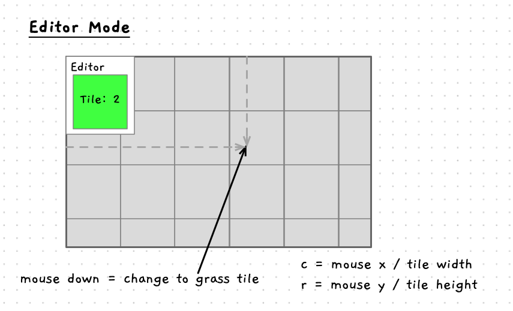

Now we have the map drawing, we need to change the tiles so that we can design maps for the user to explore. To do this, let's add in an editor. This way the user will be able to switch between editing and exploring the map.

## Random Map

Before we add states to the program, let's get something to quickly give us a random map. For this we will have to add in a procedure to handle input, and another to randomise the map.

### Randomise Map

We have the logic in `init_map` to make all tiles grass tiles. To randomise the map we need a similar procedure where we randomise the kind for each tile. A function will be handy here. If you recall, enumerations are just integers. So we can use SplashKit's `rnd` function to give us a random value between 0 and 3 (`rnd(4)`) and this will line up with our enumeration.

:::tip
Remember you need a [type cast](../../../../part-2-organised-code/3-structuring-data/1-concepts/03-02-enum/#underlying-representation-and-casting) here. This will tell the compiler that you want to treat the integer as a `tile_kind`.
:::

### Handling Input

In main, we can now add an extra step within the event loop to handle input. Now, we could pass handle input the map but I know that going forward we will need additional data for the player and status of the program that will need to be outside of the map. So, rather than just passing the map, let's add in a `explorer_data` struct that will contain the map and this additional data as we go forward.

```
Struct: Explorer Data
Fields:
- map: the map data for the current map
```

Now we need to do some refactoring:

1. Change main to have `explorer_data` rather than a map.
2. Create an `init_explorer_data` procedure that you pass the data to by-reference. This can then call `init_map(data.map);`, and we can expand this as we add more data to the explorer.
3. Add a `draw_explorer` that follows the same pattern as `init_explorer_data`. In this case we can move the clear screen, and refresh screen into the procedure as well.

With these changes in place, you can compile and run to make sure things still work, then we can add handle input.

```
Procedure: Handle Input
Parameters:
- data: explorer data passed by reference
Steps:
- If the "R" key is typed:
  - Call randomise map, passing in a reference to data's map
```

Compile and run, making sure you can see the different tiles when you do randomise the map.

## Editor and Playing States

We want to be able to switch between editing and playing. To model this we can think of the game as being in one of two states: playing or editing. If we know this, then different things can happen when you are in these different states.

Modeling this is actually very simple. We can create a `explorer_state_kind` enumeration with the two states, and place a value of this type in the `explorer_data`. Then our code in draw game and handle input can read this value to determine which things to draw and which actions to allow.

1. Add a new enumeration with two states. One to indicate the playing state and one for the editing state.
2. Add a field to the `explorer_data` struct to capture the program's state.
3. In `init_explorer_data`, set the state to the playing state.
4. In `handle_input`:
   - If the user holds down the left shift key and types the "E" key then set the explorer's state to the editing state.
   - When we are in the editing state:
     - If they press the escape key, then set the explorer's state back to the playing state.
     - Randomise the map if they type the "R" key
5. In `draw_game`
   - When in the editing state, draw the text "Editor" at the top left.
   - When in the playing state, draw the text "Playing - Shift E to edit"

Now compile and run the program again. Try pressing "R", nothing should happen. Switch to the editor by holding down the left shift key and typing "E". Now try randomising the map again. Cool isn't it!

:::tip[Using States]

States are a great way to build in different modes in an interactive program where you are controlling the event loop. You can use this to switch between showing menus, playing the game, switching levels, etc.

:::

## Changing a tile

We can extend the editor now so that the user can change the tiles themselves. In editor mode, we can let the user edit the tile kinds using their mouse. An easy option for now could be to have a selected tile kind, and to change any tile the user moves the mouse over when they are holding down the left mouse button. It will be like painting the tiles, and will allow the user to quickly adjust the map as they want.

To switch between the different tile kinds, the user can press use number keys to select the different tile kinds. We can start with grass by default, and the user can change it when they are in editor mode.

### What new data do we need?

In editor mode, we will need to know which kind of tile to use when the user starts changing tiles. This is not part of the map, so we can put it in the `explorer_data` for now. If you start building out the editor's capabilities, you will probably want a separate editor settings struct, but for now this should suffice. To achieve this you will need to make the following changes:

1. Add a `tile_kind` to the `editor_data` struct. This will store the selected editor tile kind.
2. Update `init_explorer_data` to initialise this to the grass kind.

### Updating the code

In `draw_game`, we are going to need to draw the selected tile when we are in editor mode. We can use the following plan to achieve this. It will need you to fill a white rectangle over the map, then within that draw a rectangle the same color as the selected editor tile kind. On top of this you can draw the text to indicate the number of the tile - hinting at using the number keys to select the different tile kinds.



Implement this and test it out. You may have to play with the size and location of things you are drawing to get them looking right. The main thing is that you can see what the current editor tile is.

Back in the code, you can now edit the `handle_input` code. We are going to have a bunch of actions related to the editor, so build a new `handle_editor_input` and call that from `handle_input` when in the editor mode. Move the code in there for randomising the map and switching back to playing mode. Make sure you are passing `handle_editor_input` the `editor_data` by reference, it will need to update things in the program's data in order to make this work.

Now you can add some code to handle changing the selected tile kind in the editor. Use the 1, 2, 3, and 4 number key (key code `NUM_1_KEY` etc in SplashKit) to change this value. When the user types one of these, you can switch the `explorer_data`'s selected tile kind to a given value. Match them with the enum, and then the numeric value will align with the key.

:::tip

In `draw_explorer`, you can use the raw value of the selected tile kind when outputting the text for the current tile kind. Remember to add 1, as the first value in the enum will be 0.

:::

Compile and run to make sure you can select the different kinds of tiles in the editor mode. Once that is working we can add the code to use this to change the tiles in the map.

To use the selected editor tile kind, we need to go back to the `handle_editor_input` code. In this code we can not watch out for the user holding down the mouse button. This will allow the user to hold down the button and move the mouse around to *paint* the selected tile kind. In SplashKit you can use `mouse_down(LEFT_BUTTON)` to detect if the mouse button is held down. Then within the if statement we need to change a tile on the map.

To do this we can take the location of the mouse and use this to determine the row and column that the mouse is over. This can be achieved by dividing the mouse position by the tile width to determine the column index, and by the tile height to determine the row index. We can get the mouse position from SplashKit as a `point_2d`, which has both the x and y location stored as doubles. When we divide this by the tile width/height we will get a double value as well. So we will need to convert this to an integer, which the compiler can do for us. It is good to use a cast here to highlight this. When casting a double for float to an integer the compiler will truncate the value, which is what we want in this case.

The code for this is shown below.

```cpp
    point_2d mouse_pos = mouse_position();
    int c = (int)(mouse_pos.x / TILE_WIDTH);
    int r = (int)(mouse_pos.y / TILE_HEIGHT);
```

Once you have the indexes, you can use these to access the selected tile in the map and change it's `kind` to the value of the selected editor tile kind.

:::tip

This will continually change the tile's kind when the mouse button is held down, but the user won't notice this, and it will allow them to move the mouse around and change tiles without having to click each one.

:::

Give this a go! When you have it working you should be able to design the map to be however you want. Hold down the left mouse button in editor mode, and move it around to design the map.

With the map changing, we need to see how we can move around and explore this place.
