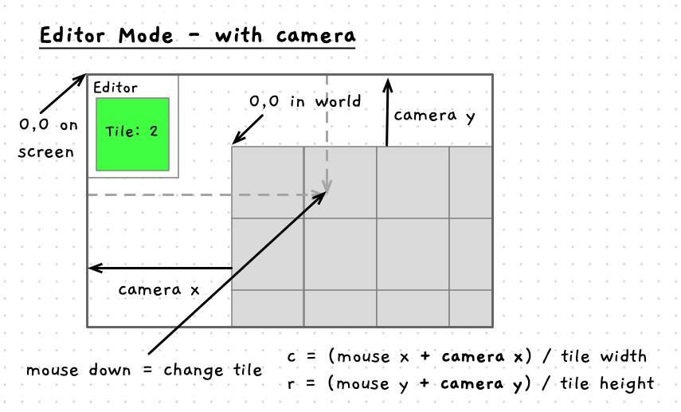
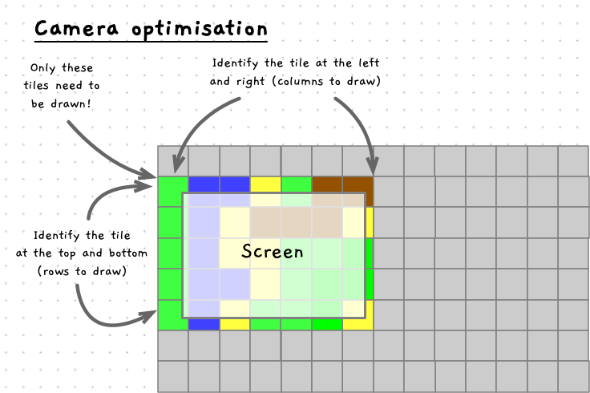

The map for the game is going to be larger than the screen, meaning we need a way to draw different locations on the screen. We can achieve this by creating a virtual camera to help simplify this operation.

:::note

What is the screen? It is nothing more than a 2-dimensional array of pixels. As you manipulate data on the screen you are setting pixel values that the video hardware turns into colors for the user to see. In this section we will look at mapping between these index values in these arrays to allow us to move around the map.

:::

## Drawing with the camera

We have two options if we want to map a large map onto a small part of the screen. Firstly, we could reposition everything manually as we move around changing the world to make sure that the right part appears on the screen. Alternatively, we can draw the world through a virtual camera that adjusts the part that appears on the screen.


The above image shows the two options. In the first case, we keep retain the current screen coordinates. The top left of the screen stays at 0,0, and we move all the tiles so that they appear on the screen in the right location.

This seems like a lot of work, because it is. Moving the world to position it on the screen isn't going to be the right way to approach this. Instead, we can introduce a camera that allows us to pretend that we move the coordinates of the screen. This is shown in the option on the right of the image. Here, the world stays where it is, and we move the position of the screen so that it appears in the right place.

In reality the screen coordinates will still start at 0,0, but by adding a virtual camera we can adjust each drawing operation as it is performed. If we move the camera so that the top left is at 10,15 then when we draw at 15,30 it will be adjusted to be at 5, 15.

Let's consider this one dimension at a time. If the top left of the screen is at `x = 10`, then drawing at `x = 15` will need to be 5 pixels from the left of the screen. If we move the camera to be at `x = 15`, then this same drawing operation will result in the shape appearing 0 pixels from the left of the screen. Move the camera again to `x = 20`, and now the shape is off the left of the screen by 5 pixels, having a screen location of `x = -5`.

As a result of this change, we have two sets of coordinates. World coordinates and screen coordinates. The tiles in the map will be our world coordinates, and the screen coordinates are calculated by subtracting the location of the camera from the respective world coordinate. So, as we saw, when the camera is at `x = 10`, then drawing a world coordinate of `x = 15` will appear at `15 - 10 = 5`.

### The Camera in SplashKit

You can implement your own camera if you want, but SplashKit already provides this functionality. Each time you draw, it will adjust the location of the drawing operation based on the position of the camera in SplashKit.

|**Function/Procedure** | **Required Arguments** |**Description** |
|-----------|------------------------|----------------|
|`set_camera_position`| a `point_2d` value | Moves the camera so that the provided point is the new value for the top left of the screen. |
|`camera_x`| none, returns a double | Returns the x location of the camera. |
|`camera_y`| none, returns a double | Returns the y location of the camera. |
|`option_to_screen`| none, returns a `drawing_options` value | Allows you to tell SplashKit to ignore the camera for a drawing operation. |
|`point_at`| an x and y value, returns a `point_2d` value | Returns a `point_2d` value that has the x and y set to the values provided. |

To implement the camera in the map explorer you will need to do the following:

- Add a `camera_position` field to the `explorer_data`.
- Initialise the `camera_position` to the point at 0,0
- Update `draw_explorer` to:
  - Use `set_camera_position` to move the camera to the point from the `camera_position` in the `explorer_data`.
  - Ignore the camera when drawing the editor details, and prompt text. For example
  
  ```cpp
  fill_rectangle(color_white(), 0, 0, TILE_WIDTH + 10, TILE_HEIGHT + 18, option_to_screen());
  //...
  draw_text("Editor", color_black(), 0, 0, option_to_screen());
  ```

- Update `handle_input` to move the camera by changing the data in `camera_position`.

Compile and run this and then explore the map. It looks like you are moving the map around on the screen, but we know we are really just moving where things are drawn.

Now try editing. We need to fix up the editor so that it takes the camera into consideration when we are clicking. To do this, we need to reverse the action performed by the camera. When we draw, the camera takes a world coordinate, subtracts the camera.x/y value to get a screen coordinate. Now we need to take a screen coordinate (the mouse location) and *add* the camera.x/y value to get the world coordinate. This is shown in the following image.



Notice how the location of the map's origin is offset by the camera values. We need to add these back to the screen coordinates to determine where in the world the user has clicked.

Go ahead and make the changes necessary to fix the editor:

- Update the `handle_edit_input` to find where you have clicked in the world.

Compile and run to make sure that the editor is all working again.

In this section we have seen how to map between two sets of array indexes. Allowing us to adjust how things are positioned by introducing a virtual camera.

## Only draw visible tiles

One thing you may have wondered is the impact of drawing all the tiles, when only some appear on the screen. We should be able to optimise this by only drawing the tiles that are actually on the screen. Let's see how to do that next.

If we think about a really large map, most of it will not be drawn to the screen. At the moment, our code loops over *all* tiles in the map even though only some will actually appear. This is wasted effort which we can avoid. 

The following image gives some ideas on how we can optimise this. Rather than looping from the fist to last column and then the first to last row, we can loop over only a part of these. We need to identify the first column that will appear on the screen and the last column to appear, as the same with the rows. Then you can adjust the loop to only access tiles at these values. This will improve performance by reducing wasted effort.



:::tip[Question]

How can we draw off the screen? The screen is a two-dimensional array of pixel colors. You cannot access values outside the dimensions of the screen. What code must exist in SplashKit to make it so that you can request to draw something that will not appear on the screen?

:::

To identify the first column, we can use the same screen-to-world mapping we did for the editor. In this case we need to know the column that appears at the `x = 0`. This will be the first column. The last column will be the column at `x = SCREEN_WIDTH`. These values can be saved in `start_col` and `end_col` or similar local variables. Then your for loop can iterate from `c = start_col`, while `c <= end_col`.

```cpp
void draw_map(const map_data &map, const point_2d &camera)
{
  int start_col = camera.x / TILE_WIDTH;
  int end_col = (camera.x + screen_width()) / TILE_WIDTH + 1;
  //...

  for(int c = start_col; c < end_col; c++)
  {
    //...
  }
}
```

Have a go at coding this up and make sure you can still see all the tiles on the screen.

### Boundary Checks

If you haven't already noticed an issue, try navigating to see the areas outside map. You should see tiles drawing, though the program will also crash if you explore this too far.

*What is happening here?*

Previously we were always drawing all the tile, whereas now we are calculating which rows and columns to draw. This is all good, but it is possible for the user to move so that they are seeing "rows" and "columns" that are outside the map itself!

For example, at the start of the program the map is showing column 0 on the left edge of the screen. If you move further to the left, then the code will now try to draw column -1, which does not exist. The same occurs if you move up, with the code trying to draw negative rows. Moving right and down, it is possible to go past the number of rows or columns in the map. As with the negative indexes, these do not exist in the map.

*So what is being accessed?*

Array access in C/C++ is based on the distance from the first element. If you access a negative index, then the compiler does not stop you (what were they thinking!) it just accesses data that appears in memory before the array declaration. This may result in a [segmentation fault](../../../4-indirect-access/1-concepts/02-04-segfault) if you access data you shouldn't, but otherwise... it works.

:::caution

The fact it works is a huge problem that results in a range of security related issues. You can now use this access to do things that the developers did not intend. If you can get a program to segmentation fault, then that is a great starting point for hackers to start exploring how they can manipulate data to gain control of the computer.

:::

To fix this, we have to add boundary checks that make sure we are not accessing data that it outside the array. We need to check for values less than 0, and values larger than the maximum number of columns or rows.

We can guard against negative indexes before the start of the loop. Here we can check if the start column or row is less than 0, and then change the start column or row to 0. This will ensure that we do not try to use a negative index.

To guard against going past the end of the array we add a similar if statement or adjust the condition in the for loop. If we adjust the condition, we need to loop while the current column (`c`) is less than the `end_col`, and it is less than `MAX_MAP_COL`. In this way we ensure we do not go past the end of the array.

The code for both of these options are shown in the code snippet below.

```cpp
void draw_map(const map_data &map, const point_2d &camera)
{
  int start_col = camera.x / TILE_WIDTH;
  int end_col = (camera.x + screen_width()) / TILE_WIDTH + 1;
  //...

  if (start_col < 0) start_col = 0;
  //...

  for(int c = start_col; c < end_col && c < MAX_MAP_COLS; c++)
  {
    //...
  }
}
```

Have a go at coding this up yourself. Make sure you that it handles all four edges of the screen/array.

This example demonstrates a great feature of the array. By using an expression as the index, you can create code that helps you access just the parts that you need. In this case we have been able to loop over just the part of the array that is drawn to the screen.

With this functioning nicely, let's look at where we can take this program from here.
