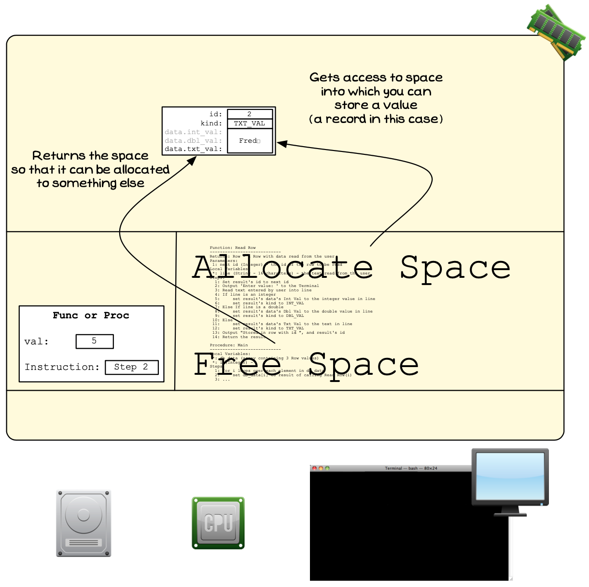
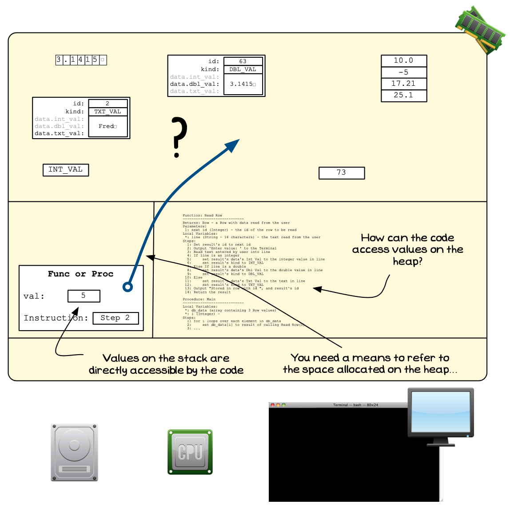

When your program is executed, it is allocated memory to work with. To help ensure system security, this memory is divided into different areas based on the different kinds of values that need to be stored in memory. Previously, our programs' data was housed on the [stack](../../../2-organising-code/1-concepts/01-1-the-stack) which is reserved for local variables and the data needed to keep track of function and procedure calls.

The stack is an essential part of every program. The fact that it is managed by the compiler means that you do not need to think too much about memory allocation for these variables.

However, there are limitations. The compiler needs to know how much space to allocate each variable, and once allocated this is fixed as other values will be been allocated around this. In addition, the space of the stack is very limited, as it is designed to only work with local variables. The heap is intended to be used when you want to work with larger amounts of data.

The **heap** represents the bulk of memory that is accessible to your program, but only if you request space and manage it yourself. Any memory that you allocate to your program will come from the heap.

To work with the heap you will need to learn how to allocation, access, and free space dynamically. These actions are the focus of this chapter.

The Heap is used to store all dynamically allocated values
 

:::note

- [Figure x.y](#FigureTheHeap) includes the following areas:
  1. Your program’s machine code is loaded into the code area.
  2. [The stack](../../../2-organising-code/1-concepts/01-1-the-stack) is used to manage the execution of the program’s functions and procedures.
  3. [Global variables](../../../2-organising-code/1-concepts/06-global-variables) are allocated their own space.
  4. The new area is the **heap**. This is used to store all dynamically allocated values.
- Values can be stored in the global variables, in local variables on the *stack*, and on the *heap* using dynamic memory allocation functions and procedures.
- The space taken up by the global and local variables is fixed based on the size of the variables you have declared
- Each function/procedure takes a fixed amount of space on the stack. The space allocated is enough to store each of the local variables, plus some additional space for overheads associated with managing the function/procedure calls.
- The compiler take care of managing memory in the stack and for the global variables.
- **You** are responsible for any memory allocation done on the heap

:::

## Allocating memory on the heap

Dynamic memory allocation is performed with a couple of operations that will be provided by the programming language you are using. These operations allow you to do the following:

- **Allocate Space**: You ask the operating system to allocate you some space that will then be assigned to your program, and you can use to store data. The operating system will then allocate you space on the heap that is large enough to store the value you require.
- **Free Allocation**: When you have finished using a piece of memory you have been allocated on the heap, you need to release this so that the operating system can allocate it to others.

These are the two basic actions that exist for performing dynamic memory management. Basically, you can ask for memory, and you can give it back. Once you have been allocated space, that space will be reserved for your use until you free that allocation, or your program ends. So it is important to remember to free the memory you have been allocated when you no longer require it.

You can ask for space, and return the space you were allocated
 

:::note

- [Figure x.y](#FigureAllocateHeapMemory) shows the idea behind the two operations.
- You can ask to be allocated space, this will give you access to a space on the heap. You can then use this to store a value.
- You can tell the Operating System when you are finished with the space, so that it can allocate it to something else.

:::

## Accessing dynamically allocated memory

By its very nature, dynamic memory allocation must work a little differently to the way we have been working with values so far. So far, when you wanted to work with a value you declared a variable, or an array. This would have been a [local variable](../../../2-organising-code/1-concepts/03-local-variable), with its value allocated on the stack along with the other variables you were working with in the current function or procedure. The variable and its value can be seen as one, with the value being located within the variable. With dynamic memory allocation, the values you are allocated are on the heap. This means that their values are not bound within a variable, they exist entirely outside any variables that appears in your code.

One of the challenges of working with dynamically allocated memory is that you can no longer *‘see’* these values in your code. When you were working with variables, they were in the code, you could see them and think about the value they stored. With dynamically allocated memory, you cannot do this. Dynamically allocated values will be allocated as a result of the operations that are performed while the code is running. This is why it is called **dynamically** allocated memory. It is not memory allocated to variables, it is **memory allocated upon request**.

This raises one very important question, as illustrated in [Figure x.y](#FigureAccessingMemory): 

> If the values exist outside of variables, how do you access them?

The answer to this is via [pointers](../../../4-indirect-access/1-concepts/02-00-pointer). As we have seen, pointers allow you to store a value that tells you where the data you want is located. We have used this to access variables stored in other functions/procedures on the stack, and we can use these now to also access values on the heap.

How can you access these dynamically allocated values?
 

## The Heap - Why, When, and How

You use the heap and dynamic memory allocation when you want more flexibility than is offered on the stack. You may want to have an array where you can change it size, or you may want to load and work with a large amount of data. In these cases, the stack won't work, so you need to move into the heap.

The general pattern will be to allocate space, and store the address of this space in a pointer. You can then work with that space, accessing it via the pointer, before freeing it when you are done.

As you work through this you need to be able to start picturing the data on the heap, as well as the values you have on the stack. Remember that we are creating digital realities here, so you now need to picture that reality coming into existence you make space for it on the heap. You can connect these things that you are building using pointers, and interact with it in your code. These pictures will be harder to see is you look just at the code, and this is why it is so important to know how to think and picture these things you are creating.

We will explore all of this as we progress through this chapter.
