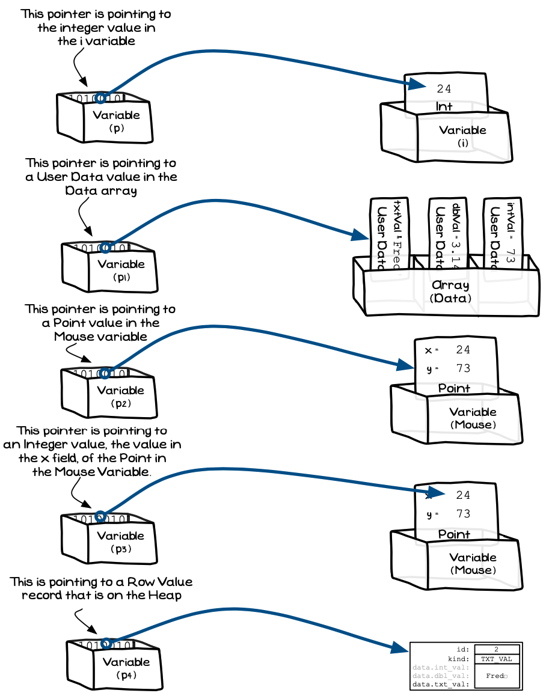
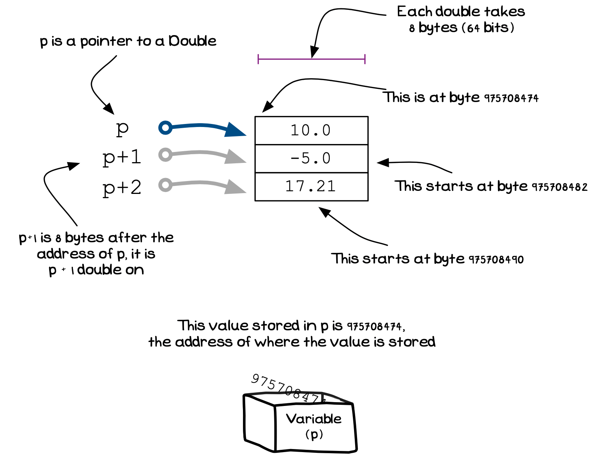

## Concept 

A Pointer is a new kind of data type, just like Integer, Double, and Boolean. A Pointer Value is an address, a location in memory where a value can be found. The name '*Pointer*' is very descriptive, a *Pointer* points to a value. It tells you, 'The data I refer to is over there...'.

Figure x.y: A Pointer Value is the address of a value, in effect it <em>points</em> to a value
 

:::note

- A pointer is an **existing artefact**, a data type that is built into the programming language.
- A pointer has a value, that stores the location of another value.
- It is a good idea to picture a pointer as a value that *points* to another value. 
- The pointer’s value is the memory address of the value it *points* to.
- The CPU architecture tells you the size of its pointers. A 32bit machine has 32bit pointers. A 64bit machine has 64bit pointers.

:::

## Using pointer to access the heap

Pointers can be used to point to locations in the heap. When you ask the Operating System to allocate you space on the heap, it will give you a pointer value that *points* to the space you were allocated. You can use this pointer to access the value at that location.

Figure x.y: You can use pointers to access values on the heap
 

:::note

- Your code can access values stored on the stack, in its local variables and parameters.
- There is no way to directly access values on the heap.
- The memory allocation functions will give you a pointer to the space you were allocated.
- Storing the pointer in a local variable will mean you can use it to access the value on the heap.

:::

## What can a pointer point to?

Pointers store a value that is an address of the value that it points to. This means that you can point to any value in memory, regardless of where it is. You can have pointer values that point to [Local Variables](#), [Global Variables](#), [Parameters](#), [Array](#) elements, fields of [Records](#) or [Unions](#). One of its key ability, however, is the ability to point to values on the [Heap](../01-heap).

Figure x.y: A Pointer can point to any value, at any location in memory
 

:::note

Languages usually require you to declare the kind of data that a Pointer Value will refer to. So rather than just having a generic *pointer*, you will have things like a *pointer to an Integer*, or a *pointer* to a `User Data` value. This makes it easier to work out what you can do with the value the pointer points to.

:::

## Where can pointer values be stored?

A Pointer value is the same as any other value. It can be stored in [Local Variables](#), [Global Variables](#), it can be passed to a function in a [Parameter](#), it can be returned from a [Function](#), and it can also exist on the [Heap](../01-heap).

[Figure x.y](#FigurePointerStore) shows an illustration of some values in memory. The `start` variable is located somewhere on the stack as a local variable. This variable is storing a pointer value that points to a `Node`[1](#FootnoteNode) that is on the Heap. Each of the nodes on the heap are also storing pointer values that refer to other values that are also on the heap.

Figure x.y: Pointers can be stored anywhere a value can be stored
 

:::note

- A pointer value is no different from any other value, and can be stored on the stack, the heap, or in global variables.
- Languages provide a special value for pointers that do not point to a value. In C this is the `NULL` value, in Pascal it is the `nil` value, in both cases it is a value that points to nothing.

:::

1The <code>Node</code> would be a record type declared in the code. This type would contain an Integer value field named <code>data</code>, and a pointer field named <code>next</code>.

## How are pointers used?

You need to be able to perform certain actions to make pointers useful. These include:

- You must be able to get a pointer to a value. For example, you should be able to get a pointer to a value stored in a Variable.
- Once you have a Pointer value, you must be able to follow that pointer to its value so that you can ..
  - Read the value it points to.
  - Store a value at the location pointed to.

Figure x.y: You can get pointers to values, and you can follow pointers to values
 

:::note

- You can get the address of values in [Local Variables](#), [Global Variables](#), [Parameters](#), fields of [Records](#) and [Unions](#). Basically, you can get the address of any value you can read.
- Once you have the address (the Pointer value), you can store, or you can use it.
- You need to follow the pointer, called **dereferencing** the pointer, to read its value or to assign a new value to the location it refers to.
- Remember there are two values with pointers:
  1. There is the value of the pointer itself. This is the address that is pointed to. The circle at the start of the line in the illustrations.
  2. There is the value that pointed to. The one at the end of the arrow in the illustrations.
- You can interact with both of these values, depending on whether you *follow* the pointer or use the pointer’s value directly.

:::

## What is the pointer value? What can you do with it?

Memory is laid out as a sequence of bytes, into which values can be stored. The bytes can be thought of as being in a long line, with each being given numbered based on its position in that line. So the first byte would be byte 0, the next is byte 1, the next byte 2, and so on. This number is then the **address** of that byte. So byte 975708474 is next to byte 975708475, which is next to byte 975708476, etc. This number is also unique, so there is only one byte 975708474. It is this number that is the Pointer value, the number of the byte that it is pointing to.

[Figure x.y](#FigurePointerValue) shows an example of memory used by an array of three values. Each value is a Double, so each one occupies 8 bytes. If the first is at address 975708474, then the second starts at address 975708482 (975708474 + 8 bytes). This Figure also shows a pointer, `p`, that points to this value. That means that `p` has the value 975708474, being the address of this value, stored within it.

One feature that languages have is called **pointer arithmetic**. When you add, or subtract, a value from a pointer the compiler will work in terms of the kinds of values the pointer points to. So in [Figure x.y](#FigurePointerValue) `p` is a pointer to a Double, this means that when you add one to p you get the value 975708482, which is 1 **Double** past `p`. Therefore, `p + 2` would be 2 *doubles* past `p`, at 975708490, and so on.

Figure x.y: The pointer value is the <em>address</em> of the value it points to
 

:::note

- Pointer arithmetic is something you need to know exists, but not something that you would work with frequently.

:::