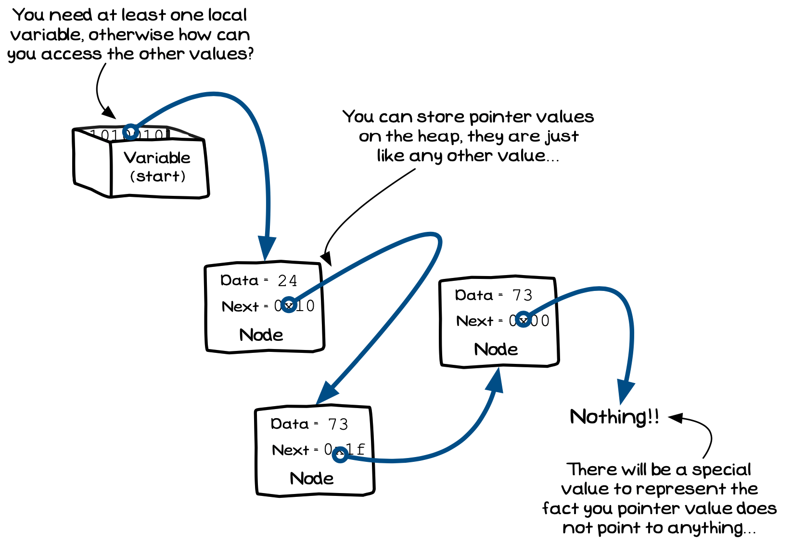
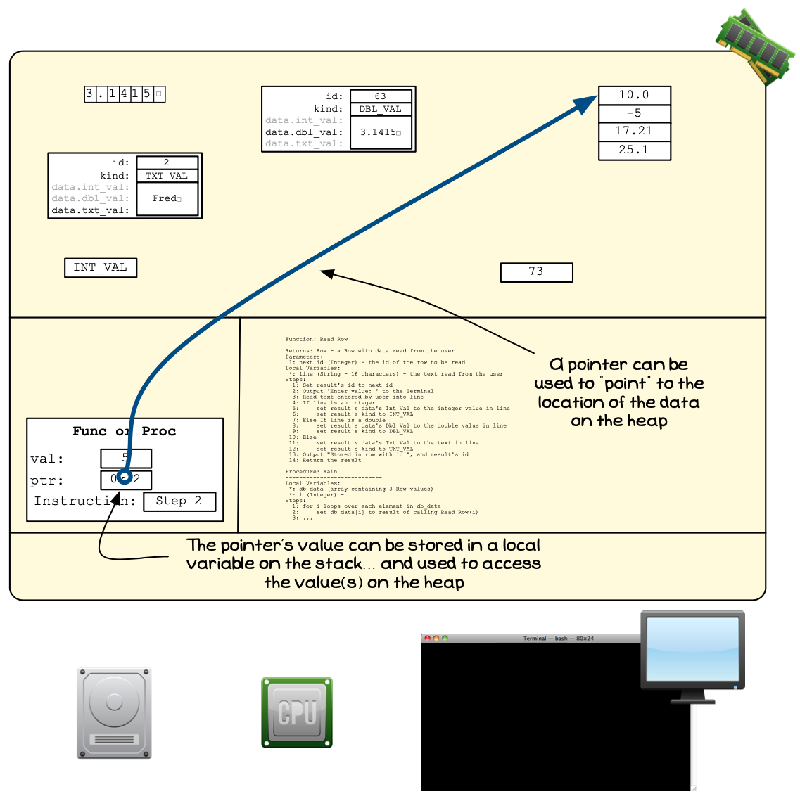

[Pointers](../../../4-indirect-access/1-concepts/02-00-pointer) store the address of a value somewhere in memory. This can be used to create relationships between entities, allow you to update values passed to parameters, and can be used to access space allocated on the [heap](../01-heap).

In your code you can access variables, the local variables and global variables that are in scope. Memory on the heap is not within variables, and therefore you must access it via a pointer.

[Figure x.y](#FigurePointerStore) shows an illustration of some values in memory. The `start` variable is located somewhere on the stack as a local variable. This variable is storing a pointer value that points to a `Node` (a struct containing data and a next value) that is on the heap. Each of the nodes on the heap also stores a pointer values that refer to other values that are also on the heap.

Pointers can be stored anywhere a value can be stored
 

## Using pointer to access the heap

Pointers can be used to point to locations in the heap. When you ask the operating system to allocate you space on the heap, it will give you the address of the space you were allocated. You can store this in a pointer variable, and then use that to access the value(s) at that location.

You can use pointers to access values on the heap
 

:::note

- Your code can access values stored on the stack, in its local variables and parameters.
- There is no way to directly access values on the heap.
- The memory allocation functions will give you a pointer to the space you were allocated.
- Storing the pointer in a local variable will mean you can use it to access value(s) on the heap.

:::
