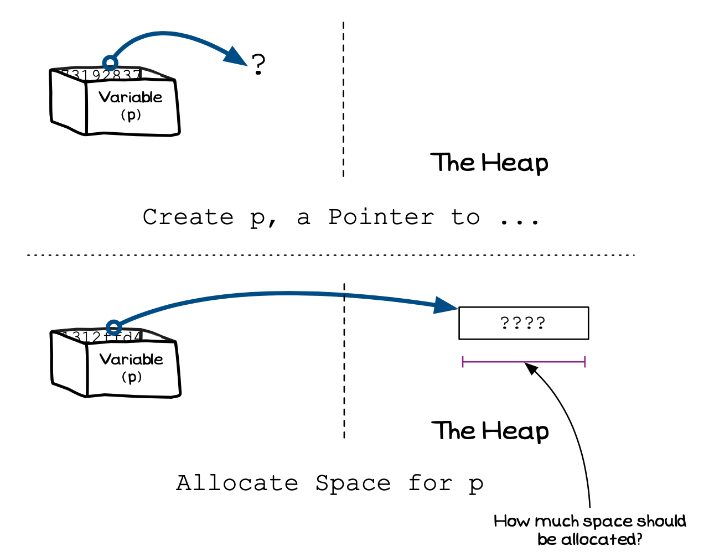

import MySwiper from '../../../../../../components/react/myswiper.jsx'


import sliderMalloc01 from './images/slider-malloc/Slide1.png';
import sliderMalloc02 from './images/slider-malloc/Slide2.png';
import sliderMalloc03 from './images/slider-malloc/Slide3.png';
import sliderMalloc04 from './images/slider-malloc/Slide4.png';
import sliderMalloc05 from './images/slider-malloc/Slide5.png';
import sliderMalloc06 from './images/slider-malloc/Slide6.png';
import sliderMalloc07 from './images/slider-malloc/Slide7.png';
import sliderMalloc08 from './images/slider-malloc/Slide8.png';
import sliderMalloc09 from './images/slider-malloc/Slide9.png';
import sliderMalloc10 from './images/slider-malloc/Slide10.png';
import sliderMalloc11 from './images/slider-malloc/Slide11.png';
import sliderMalloc12 from './images/slider-malloc/Slide12.png';
import sliderMalloc13 from './images/slider-malloc/Slide13.png';
import sliderMalloc14 from './images/slider-malloc/Slide14.png';

export const sliderMalloc = [
  {
    src: sliderMalloc01.src,
    altText: "The program begins at main() and line 3 declares an int pointer variable",
    tipStart: 1,
    tips: [
      "The program begins at <strong>main()</strong> and line 3 declares an int pointer variable"
    ]
  },
  {
    src: sliderMalloc02.src,
    altText: "Line 4 will allocate some memory space on the heap by calling the malloc() function, and return a pointer to this memory region which we can use to initialize the variable p. Let's break line 4 down into steps. The first thing malloc() needs is an argument which specifies how much memory needs to be allocated in bytes. Because we are creating space for an integer, we call the sizeof(int) function, which will return the size of an integer on our system (often this will be 4 bytes, but it depends on your computer). We then pass this value as an argument to malloc() (step 4a)",
    tipStart: 2,
    tips: [
      "Line 4 will allocate some memory space on the heap by calling the <strong>malloc()</strong> function, and return a pointer to this memory region which we can use to initialize the variable <strong>p</strong>. Let's break line 4 down into steps",
      "The first thing <strong>malloc()</strong> needs is an argument which specifies how much memory needs to be allocated in bytes",
      "Because we are creating space for an integer, we call the sizeof(int) function, which will return the size of an integer on our system (often this will be 4 bytes, but it depends on your computer)",
      "We then pass this value as an argument to <strong>malloc()</strong> (step 4a)"
    ]
  },
  {
    src: sliderMalloc03.src,
    altText: "At step 4b, malloc() is called and memory is allocated on the heap for an integer. The initial value of the integer isn't guaranteed by malloc(). As you can see here, it happens to have allocated a region of memory where the bits have an integer value of 5155. NOTE: We've shown the bit-representation of an integer to help you see the actual low-level memory allocation that is performed in this step. The last thing to note here is that malloc() will return a void pointer...",
    tipStart: 3,
    tips: [
      "At step 4b, <strong>malloc()</strong> is called and memory is allocated on the heap for an integer",
      "The initial value of the integer isn't guaranteed by <strong>malloc()</strong>. As you can see here, it happens to have allocated a region of memory where the bits have an integer value of 5155.",
      "<strong>NOTE:</strong> We've shown the bit-representation of an integer to help you see the actual low-level memory allocation that is performed in this step",
      "The last thing to note here is that <strong>malloc()</strong> will return a <strong>void</strong> pointer..."
    ]
  },
  {
    src: sliderMalloc04.src,
    altText: "Because malloc() returns a void pointer, we need to cast it to the type of pointer our variable will hold, in this case an int pointer (step 4c). Now that we know these bytes are an int, the value at that location in memory is 5155",
    tipStart: 4,
    tips: [
      "...because <strong>malloc()</strong> returns a <strong>void</strong> pointer, we need to cast it to the type of pointer our variable will hold, in this case an <strong>int</strong> pointer (step 4c)",
      "Now that we know these bytes are an int, the value at that location in memory is 5155"
    ]
  },
  {
    src: sliderMalloc05.src,
    altText: "The last step of line 4 (step 4d) is the assignment step. The address of the memory space that has been allocated on the heap is copied into the variable p",
    tipStart: 5,
    tips: [
      "The last step of line 4 (step 4d) is the assignment step",
      "The address of the memory space that has been allocated on the heap is copied into the variable <strong>p</strong>"
    ]
  },
  {
    src: sliderMalloc06.src,
    altText: "Line 5 prints the value of p to the terminal. Remember that p is a pointer variable so it holds the address of a memory space on the heap",
    tipStart: 6,
    tips: [
      "Line 5 prints the value of <strong>p</strong> to the terminal",
      "Remember that p is a pointer variable so it holds the <em>address</em> of a memory space on the heap"
    ]
  },
  {
    src: sliderMalloc07.src,
    altText: "Line 6 prints the dereferenced value of p to the terminal. Remember that when we dereference a pointer using the *p notation, what we are doing is getting the address stored in the pointer, then finding the value at that location in memory (in this case 5155)",
    tipStart: 7,
    tips: [
      "Line 6 prints the dereferenced value of  <strong>p</strong> to the terminal",
      "Remember that when we dereference a pointer using the <strong>*p</strong> notation, what we are doing is getting the address stored in the pointer, then finding the value at that location in memory (in this case 5155)"
    ]
  },
  {
    src: sliderMalloc08.src,
    altText: "Line 7 assigns the dereferenced value of p, the new value of 10. Once again remember that dereferencing a pointer using the notation *p means that we are dealing with the value at the location of the memory address (not the memory address value itself). You can see that the value has changed from 5155 to 10 on the heap",
    tipStart: 8,
    tips: [
      "Line 7 assigns the dereferenced value of <strong>p</strong>, the new value of 10",
      "Once again remember that dereferencing a pointer using the notation <strong>*p</strong> means that we are dealing with the value at the location of the memory address (not the memory address value itself)",
      "You can see that the value has changed from 5155 to 10 on the heap"
    ]
  },
  {
    src: sliderMalloc09.src,
    altText: "Line 8 prints the new dereferenced value of p to the terminal",
    tipStart: 9,
    tips: [
      "Line 8 prints the new dereferenced value of <strong>p</strong> to the terminal"
    ]
  },
  {
    src: sliderMalloc10.src,
    altText: "Line 9 calls the <strong>free</strong> function, passing it the pointer p. This will free the space allocated on the heap for the memory area that was allocated to the pointer p. NOTE: however, that although the area on the heap is deallocated and available for use by other code within our program, the value of our pointer p has not changed and is still pointing to that area (it's a dangling pointer)",
    tipStart: 10,
    tips: [
      "Line 9 calls the <strong>free</strong> function, passing it the pointer <strong>p</strong>",
      "This will free the space allocated on the heap for the memory area that was allocated to the pointer <strong>p</strong>",
      "<strong>NOTE:</strong> however, that although the area on the heap is deallocated and available for use by other code within our program, the value of our pointer <strong>p</strong> has not changed and is still pointing to that area (it's a <strong>dangling pointer</strong>)..."
    ]
  },
  {
    src: sliderMalloc11.src,
    altText: "...this means that when we print the value of p, it will still show the same address of the memory area that was in use before (but now deallocated)",
    tipStart: 11,
    tips: [
      "...this means that when we print the value of <strong>p</strong>, it will still show the same address of the memory area that was in use before (but now deallocated)"
    ]
  },
  {
    src: sliderMalloc12.src,
    altText: "To avoid problems with any later use of variables that have acted as pointers, the best practice is to reset the value of p to a NULL value. We do this by assigning p> the value nullptr, which is a which is a a built in constant that is a shorthand for a null pointer",
    tipStart: 12,
    tips: [
      "To avoid problems with any later use of variables that have acted as pointers, the best practice is to reset the value of <strong>p</strong> to a <strong>NULL</strong> value",
      "We do this by assigning <strong>p</strong> the value <strong>nullptr</strong>, which is a a built in constant that is a shorthand for a <em>null pointer</em>"

    ]
  },
  {
    src: sliderMalloc13.src,
    altText: "This time when we print the value of p, we can see that it has been reset to null, by printing 0",
    tipStart: 13,
    tips: [
      "This time when we print the value of <strong>p</strong>, we can see that it has been reset to null, by printing <strong>0</strong>"
    ]
  },
  {
    src: sliderMalloc14.src,
    altText: "Finally we hit the return statement, and control returns to our caller, ending our program",
    tipStart: 14,
    tips: [
      "Finally we hit the <strong>return</strong> statement, and control returns to our caller, ending our program"
    ]
  }
];

With dynamic memory management, one of the tasks you can perform is to request space from the heap. With this request, the operating system will locate available space and allocate this to you for use in your code. The only thing the operating system really needs to know is how much space you require? It can then search for a free space of that size, allocate this to you, and then give you the address of (a pointer to) this newly allocated area of memory.

<a id="FigureAllocatingMemory"></a>


<div class="caption"><span class="caption-figure-nbr">Figure x.y: </span>When requesting a memory allocation you need to specify the size you want</div><br/>

:::note

Allocating memory is an **action** you can perform by calling appropriate Functions or Procedures offered to you by the Programming Language.

- Your request for memory must include an indicating of the amount of memory that you require. 
- You also need to have a pointer that will refer to the memory you are allocated.
- It is possible that your request will be denied, this occurs when the computer has run out of memory to allocate.
 
:::

## Memory Allocation: Why, When, and How

If you want to load a value onto the heap, you use these memory allocation functions to allocate you space. Once you have the space allocated, you can access it via the pointer you receive back from the functions.

## In C/C++

C includes two memory allocation functions: `malloc`, and `calloc`. Let's see how each of these work.

|**Function** | **Required Arguments** | **Returns** | **Description** |
|-----------|------------------------|-------|---------|
| `malloc` | the `size` in bytes that you want. | a pointer (`void *`) | Allocates memory and returns a pointer to it. |
| `calloc` | the number of items, and the size of each item | a pointer (`void *`) | Allocates and clears memory, returning a pointer to the space allocated. |

These functions are used in combination with the `sizeof` operator. You can use `sizeof` to get the number of bytes that a data type or variable requires.

```
Operator: sizeof
Returns: (size_t) the number of bytes for a type
Parameter: a type or expression
```

### Allocate memory with malloc

The `malloc` function is declared within **stdlib.h**. It has the following function prototype.

```cpp
void *malloc(size_t size)
```

`malloc` is the standard memory allocation function in C. You tell it how much space you want, it allocates you that many bytes on the heap, and returns a pointer to that address.

The following example demonstrates the use of `malloc` to store an integer value on the heap. In this case we use `malloc` to allocate sufficient space to store an integer on the heap. The `sizeof` operator can give us the size of an integer, which we can then pass to `malloc` to ensure we ask for the right number of bytes. The result returned from `malloc` is a void pointer (an untyped pointer), so we need to cast this to be an `int` pointer (`int *`).

<a id="ListingMallocExample"></a>

```c
#include <stdlib.h>
#include <stdio.h>

int main()
{
    int *p;

    // get space for one integer from the heap
    p = (int *)malloc(sizeof(int));

    // Access the data from the heap
    printf("The value on the heap is %d.\n", *p);
    
    // Assign the value 10 to the space on the heap
    *p = 10;

    // Access the data from the heap
    printf("The value on the heap is now %d.\n", *p);

    // free all sapce allocated
    free(p);
    p = nullptr;

    return 0;
}
```
<div class="caption"><span class="caption-figure-nbr">Listing x.y: </span>Example calls to <code>malloc</code></div>

:::note

- `malloc` is used for memory allocation.
- You need to include **stdlib.h** to use `malloc`.
- `malloc` allows you to allocate space on the heap. It returns a pointer to this space.
- `malloc` returns a `void` pointer (`void *`), you need to type cast this to the kind of pointer you want, for example `(int *)` casts it to an integer pointer.
- `malloc` returns `NULL` if it fails to allocate memory. This will occur if you run out of memory.
:::

<br/>
<MySwiper client:only height="" images={sliderMalloc}></MySwiper>

### Allocate memory with calloc

Like `malloc`, `calloc` is used to allocate space on the heap. The difference between `calloc` and `malloc` is that `calloc` clears the memory allocation. This will ensure that each byte in the space allocated is set to 0. Whereas, with `malloc` any previous values that happen to have been in memory will remain there giving the value a seemingly random value.

The other difference with `calloc` is that you pass it both a number, and a size. This allows you to allocate arrays easily with `calloc`, as it returns you a pointer to a block of memory that is `number x size` bytes.

```c
#include <stdlib.h>
#include <stdio.h>

int main()
{
    int *p;

    // get space for one integer from the heap
    p = (int *)calloc(1, sizeof(int));

    // Access the data from the heap - will always be 0 as it was cleared
    printf("The value on the heap is %d.\n", *p);
    
    // Assign the value 10 to the space on the heap
    *p = 10;

    // Access the data from the heap
    printf("The value on the heap is now %d.\n", *p);

    // free all sapce allocated
    free(p);
    p = nullptr;

    return 0;
}
```
<div class="caption"><span class="caption-figure-nbr">Listing x.y: </span>Example calls to <code>calloc</code></div>

:::note

- `calloc` is used for getting a *cleared memory allocation*.
- You need to include **stdlib.h** to use `calloc`.
- `calloc` performs a similar task to `malloc`, with the addition of clearing the space allocated.
- After calling `calloc` the memory you are allocated will have all of its bytes set to 0, whereas with `malloc` the memory retains whatever value was there previously.
- `calloc` returns `NULL` if it fails to allocate memory.
:::


import sliderCalloc01 from './images/slider-calloc/Slide1.png';
import sliderCalloc02 from './images/slider-calloc/Slide2.png';
import sliderCalloc03 from './images/slider-calloc/Slide3.png';
import sliderCalloc04 from './images/slider-calloc/Slide4.png';
import sliderCalloc05 from './images/slider-calloc/Slide5.png';
import sliderCalloc06 from './images/slider-calloc/Slide6.png';
import sliderCalloc07 from './images/slider-calloc/Slide7.png';
import sliderCalloc08 from './images/slider-calloc/Slide8.png';
import sliderCalloc09 from './images/slider-calloc/Slide9.png';
import sliderCalloc10 from './images/slider-calloc/Slide10.png';
import sliderCalloc11 from './images/slider-calloc/Slide11.png';
import sliderCalloc12 from './images/slider-calloc/Slide12.png';
import sliderCalloc13 from './images/slider-calloc/Slide13.png';
import sliderCalloc14 from './images/slider-calloc/Slide14.png';
import sliderCalloc15 from './images/slider-calloc/Slide15.png';

export const sliderCalloc = [
  {
    src: sliderCalloc01.src,
    altText: "The program begins at main() and line 3 declares an int pointer variable",
    tipStart: 1,
    tips: [
      "The program begins at <strong>main()</strong> and line 3 declares an int pointer variable"
    ]
  },
  {
    src: sliderCalloc02.src,
    altText: "Line 4 will allocate some memory space on the heap by calling the calloc() function, and return a pointer to this memory region which we can use to initialize the variable p. Let's break line 4 down into steps. At step 4a, the first thing calloc() needs is two arguments which specifies how much memory needs to be allocated in bytes. Because we are creating space for a single integer, we specify: 1 for as the first argument to calloc() which says that we want space for one integer.Then as the second argument we call the sizeof(int) function, which will return the size of an integer on our system (often this will be 4 bytes, but it depends on your computer)calloc() will use these two arguments to calculate how much memory space needs to be allocated",
    tipStart: 2,
    tips: [
      "Line 4 will allocate some memory space on the heap by calling the <strong>calloc()</strong> function, and return a pointer to this memory region which we can use to initialize the variable <strong>p</strong>. Let's break line 4 down into steps",
      "At step 4a, the first thing <strong>calloc()</strong> needs is two arguments which specifies how much memory needs to be allocated in bytes",
      "Because we are creating space for a single integer, we specify: <ul><li><strong>1</strong> for as the first argument to <strong>calloc()</strong> which says that we want space for one integer</li><li>Then as the second argument we call the <strong>sizeof(int)</strong> function, which will return the size of an integer on our system (often this will be 4 bytes, but it depends on your computer)</li><li><strong>calloc()</strong> will use these two arguments to calculate how much memory space needs to be allocated</li></ul>"
    ]
  },
  {
    src: sliderCalloc03.src,
    altText: "At step 4b, calloc() is called and memory is allocated on the heap for an integer. You can see that once calloc() has allocated the memory, there is initially a residual value left over in the memory area where the space was created... NOTE: We've shown the bit-representation of an integer to help you see the actual low-level memory allocation that is performed in this step. The last thing to note here is that calloc() will return a void pointer...",
    tipStart: 3,
    tips: [
      "At step 4b, <strong>calloc()</strong> is called and memory is allocated on the heap for an integer",
      "You can see that once <strong>calloc()</strong> has allocated the memory, there is initially a residual value left over in the memory area where the space was created...",
      "<strong>NOTE:</strong><ul><li>We've shown the bit-representation of an integer to help you see the actual low-level memory allocation that is performed in this step</li><li>The last thing to note here is that <strong>calloc()</strong> will return a void pointer</li></ul>"
    ]
  },
  {
    src: sliderCalloc04.src,
    altText: "At step 4c, after calloc() has allocated memory space, it will overwrite the memory region allocated with zeros, guaranteeing that the we will always start with a 0 in any memory area allocated by calloc()",
    tipStart: 4,
    tips: [
      "At step 4c, after <strong>calloc()</strong> has allocated memory space, it will overwrite the memory region allocated with zeros, guaranteeing that the we will always start with a 0 in any memory area allocated by <strong>calloc()</strong>"
    ]
  },
  {
    src: sliderCalloc05.src,
    altText: "Because calloc() returns a void pointer, we need to cast it to the type of pointer our variable will hold, in this case an int pointer (step 4d). Now that we know these bytes are an int, the value at that location in memory is 0",
    tipStart: 5,
    tips: [
      "...because <strong>calloc()</strong> returns a <strong>void</strong> pointer, we need to cast it to the type of pointer our variable will hold, in this case an <strong>int</strong> pointer (step 4d)",
      "Now that we know these bytes are an int, the value at that location in memory is 0"
    ]
  },
  {
    src: sliderCalloc06.src,
    altText: "The last step of line 4 (step 4e) is the assignment step. The address of the memory space that has been allocated on the heap is copied into the variable p",
    tipStart: 6,
    tips: [
      "The last step of line 4 (step 4e) is the assignment step",
      "The address of the memory space that has been allocated on the heap is copied into the variable <strong>p</strong>"
    ]
  },
  {
    src: sliderCalloc07.src,
    altText: "Line 5 prints the value of p to the terminal. Remember that p is a pointer variable so it holds the address of a memory space on the heap",
    tipStart: 7,
    tips: [
      "Line 5 prints the value of <strong>p</strong> to the terminal",
      "Remember that p is a pointer variable so it holds the <em>address</em> of a memory space on the heap"
    ]
  },
  {
    src: sliderCalloc08.src,
    altText: "Line 6 prints the dereferenced value of p to the terminal. Remember that when we dereference a pointer using the *p notation, what we are doing is getting the address stored in the pointer, then finding the value at that location in memory (in this case our initial value of 0)",
    tipStart: 8,
    tips: [
      "Line 6 prints the dereferenced value of  <strong>p</strong> to the terminal",
      "Remember that when we dereference a pointer using the <strong>*p</strong> notation, what we are doing is getting the address stored in the pointer, then finding the value at that location in memory (in this case our initial value of 0)"
    ]
  },
  {
    src: sliderCalloc09.src,
    altText: "Line 9 assigns the dereferenced value of p, the new value of 10. Once again remember that dereferencing a pointer using the notation *p means that we are dealing with the value at the location of the memory address (not the memory address value itself). You can see that the value has changed from 0 to 10 on the heap",
    tipStart: 9,
    tips: [
      "Line 7 assigns the dereferenced value of <strong>p</strong>, the new value of 10",
      "Once again remember that dereferencing a pointer using the notation <strong>*p</strong> means that we are dealing with the value at the location of the memory address (not the memory address value itself)",
      "You can see that the value has changed from our initial value of 0 to our new value of 10 on the heap"
    ]
  },
  {
    src: sliderCalloc10.src,
    altText: "Line 8 prints the new dereferenced value of p to the terminal",
    tipStart: 10,
    tips: [
      "Line 8 prints the new dereferenced value of <strong>p</strong> to the terminal"
    ]
  },
  {
    src: sliderCalloc11.src,
    altText: "Line 9 calls the <strong>free</strong> function, passing it the pointer p. This will free the space allocated on the heap for the memory area that was allocated to the pointer p. NOTE: however, that although the area on the heap is deallocated and available for use by other code within our program, the value of our pointer p has not changed and is still pointing to that area (it's a dangling pointer)",
    tipStart: 11,
    tips: [
      "Line 9 calls the <strong>free</strong> function, passing it the pointer <strong>p</strong>",
      "This will free the space allocated on the heap for the memory area that was allocated to the pointer <strong>p</strong>",
      "<strong>NOTE:</strong> however, that although the area on the heap is deallocated and available for use by other code within our program, the value of our pointer <strong>p</strong> has not changed and is still pointing to that area (it's a <strong>dangling pointer</strong>)..."
    ]
  },
  {
    src: sliderCalloc12.src,
    altText: "...this means that when we print the value of p, it will still show the same address of the memory area that was in use before (but now deallocated)",
    tipStart: 12,
    tips: [
      "...this means that when we print the value of <strong>p</strong>, it will still show the same address of the memory area that was in use before (but now deallocated)"
    ]
  },
  {
    src: sliderCalloc13.src,
    altText: "To avoid problems with any later use of variables that have acted as pointers, the best practice is to reset the value of p to a NULL value. We do this by assigning p> the value nullptr, which is a which is a a built in constant that is a shorthand for a null pointer",
    tipStart: 13,
    tips: [
      "To avoid problems with any later use of variables that have acted as pointers, the best practice is to reset the value of <strong>p</strong> to a <strong>NULL</strong> value",
      "We do this by assigning <strong>p</strong> the value <strong>nullptr</strong>, which is a a built in constant that is a shorthand for a <em>null pointer</em>"

    ]
  },
  {
    src: sliderCalloc14.src,
    altText: "This time when we print the value of p, we can see that it has been reset to null, by printing 0",
    tipStart: 14,
    tips: [
      "This time when we print the value of <strong>p</strong>, we can see that it has been reset to null, by printing <strong>0</strong>"
    ]
  },
  {
    src: sliderCalloc15.src,
    altText: "Finally we hit the return statement, and control returns to our caller, ending our program",
    tipStart: 15,
    tips: [
      "Finally we hit the <strong>return</strong> statement, and control returns to our caller, ending our program"
    ]
  }
];

<MySwiper client:only height="" images={sliderCalloc}></MySwiper>
