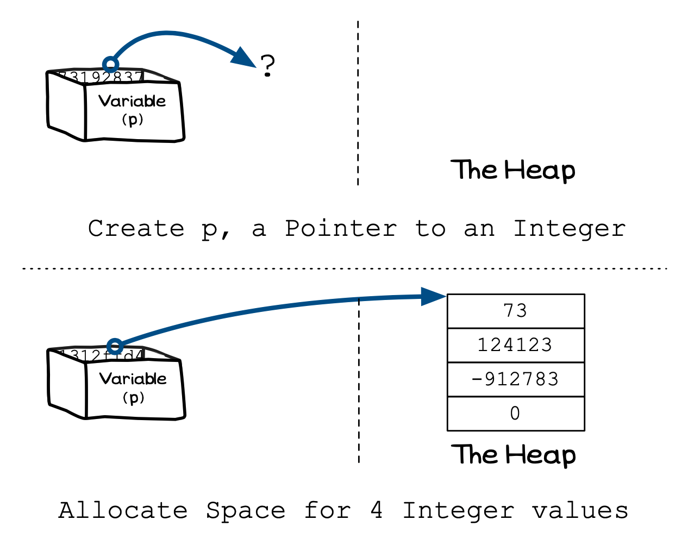

import MySwiper from '../../../../../../components/react/myswiper.jsx'


import sliderAllocateArray01 from './images/slider-allocate-array/Slide1.png';
import sliderAllocateArray02 from './images/slider-allocate-array/Slide2.png';
import sliderAllocateArray03 from './images/slider-allocate-array/Slide3.png';
import sliderAllocateArray04 from './images/slider-allocate-array/Slide4.png';
import sliderAllocateArray05 from './images/slider-allocate-array/Slide5.png';
import sliderAllocateArray06 from './images/slider-allocate-array/Slide6.png';
import sliderAllocateArray07 from './images/slider-allocate-array/Slide7.png';
import sliderAllocateArray08 from './images/slider-allocate-array/Slide8.png';
import sliderAllocateArray09 from './images/slider-allocate-array/Slide9.png';

export const sliderAllocateArray = [
  {
    src: sliderAllocateArray01.src,
    altText: "We begin by declaring a constant variable ARR_SIZE which defines our array size. This variable is stored on the stack.",
    tipStart: 1,
    tips: [
      "We begin by declaring a constant variable <strong>ARR_SIZE</strong> which defines our array size",
      "This variable is stored on the stack"
    ]
  },
  {
    src: sliderAllocateArray02.src,
    altText: "The program begins at main() and a pointer to an integer is declared as the first step. This variable is also allocated on the stack.",
    tipStart: 2,
    tips: [
      "The program begins at <strong>main()</strong> and a pointer to an integer (the variable <strong>p</strong>) is declared as the first step",
      "<strong>p</strong> is also allocated on the stack"
    ]
  },  
  {
    src: sliderAllocateArray03.src,
    altText: "calloc() is called, which assigns enough memory space for an array of ARR_SIZE integers on the heap (in this case a 4-integer array). calloc() will also initialize the space to 0",
    tipStart: 3,
    tips: [
      "<strong>calloc()</strong> is called, which assigns enough memory space for an array of <strong>ARR_SIZE</strong> integers on the heap (in this case a 4-integer array)",
      "<strong>calloc()</strong> will also initialize the space to 0"
    ]
  },
  {
    src: sliderAllocateArray04.src,
    altText: "A for loop runs, iterating over the elements in our array, and printing the initial value of each element to the terminal. NOTE: That we can use array notation p[i] to access elements in a memory region allocated by malloc, calloc or realloc. p[i] is equivalent to *(p + i) (which accesses the memory region using pointer notation instead of array notation)Since p is the memory address of the start of the memory region, (p+i) refers to an offset from that start point, where i refers to the i-th element. The actual offset in bytes is determined by the system using the formula i*sizeof(int)Although we can use this pointer notation, it's much more convenient to use the array notation",
    tipStart: 4,
    tips: [
      "A for loop runs, iterating over the elements in our array, and printing the initial value of each element to the terminal",
      "<strong>NOTE:</strong> That we can use array notation <strong>p[i]</strong> to access elements in a memory region allocated by malloc, calloc or realloc",
      "<span style='border: 2px solid black; border-radius: 4px; background-color: #ffd966; padding-top: 3px; padding-bottom: 3px; padding-left: 5px; padding-right: 5px;margin-bottom: 2px; margin-top: 4px;'><strong>p[i]</strong> is equivalent to <strong>*(p + i)</strong></span> (which accesses the memory region using pointer notation instead of array notation)<ul><li>Since p is the memory address of the start of the memory region, (p+i) refers to an offset from that start point, where i refers to the i-th element</li><li>The actual offset in bytes is determined by the system using the formula <span style='border: 2px solid black; border-radius: 4px; background-color: #ffd966; padding-top: 3px; padding-bottom: 3px; padding-left: 5px; padding-right: 5px;margin-bottom: 4px;margin-top:4px;'>i*sizeof(int)</span></li><li>Although we can use this pointer notation, it's much more convenient to use the array notation</li></ul>"
    ]
  },
  {
    src: sliderAllocateArray05.src,
    altText: "Next, another for loop runs, iterating over the elements in our array, and setting the value of each element of our array to the value of the loop counter i multiplied by 10. You can see that the values are set to 0, 10, 20 and 30 respectively in the space on the heap",
    tipStart: 5,
    tips: [
      "Next, another for loop runs, iterating over the elements in our array, and setting the value of each element of our array to the value of the loop counter <strong>i</strong> multiplied by 10",
      "You can see that the values are set to 0, 10, 20 and 30 respectively in the space on the heap"
    ]
  },
  {
    src: sliderAllocateArray06.src,
    altText: "The third (and last) for loop then runs, and once again iterates over our array elements on the heap, printing out their values to the terminal",
    tipStart: 6,
    tips: [
      "The third (and last) for loop then runs, and once again iterates over our array elements on the heap, printing out their values to the terminal"
    ]
  },
  {
    src: sliderAllocateArray07.src,
    altText: "Line 18 calls the <strong>free</strong> function, passing it the pointer p. This will free the space allocated on the heap for the memory area that was allocated to the pointer p. p then becomes a dangling pointer",
    tipStart: 7,
    tips: [
      "Line 18 calls the <strong>free</strong> function, passing it the pointer <strong>p</strong>",
      "This will free the space allocated on the heap for the memory area that was allocated to the pointer <strong>p</strong>",
      "<strong>p</strong> then becomes a <strong>dangling pointer</strong>..."
    ]
  },
  {
    src: sliderAllocateArray08.src,
    altText: "p is then assigned the null pointer value (nullptr), cutting it's ties to the heap space that was allocated previously",
    tipStart: 8,
    tips: [
      "<strong>p</strong> is then assigned the null pointer value (<strong>nullptr</strong>), cutting it's ties to the heap space that was allocated previously"
    ]
  },
  {
    src: sliderAllocateArray09.src,
    altText: "Finally, the program returns 0 and ends",
    tipStart: 9,
    tips: [
      "Finally, the program returns 0 and ends"
    ]
  },
];

Storing single values on the heap can be useful, but often you want to be able to allocate enough space for a number of values. This uses the same memory allocation functions, but requires you to pass in the size of the type you want multiplied by the number of elements you want.

<a id="FigureArrayAllocateMemory"></a>


<div class="caption"><span class="caption-figure-nbr">Figure x.y: </span>You can ask to be allocated a number of values</div><br/>

## In C/C++

In C you can use `malloc` to allocate space for a number of elements. Alternatively the `calloc` function from `stdlib.h` provides direct support for allocating space for an array. This function takes two parameter, the first takes the number of elements to allocation, the second the size of those elements. `calloc` also clears its allocation, setting each byte allocated to 0. 

The following code allocates 4 integer values as shown in [Figure x.y](#FigureArrayAllocateMemory): `p = (int*) malloc(4 * sizeof(int));` or using `calloc`, which would set all values to 0, you could use `p = (int*) calloc(4, sizeof(int));`

In C you can use the standard array access mechanisms with pointers to access subsequent elements. So `p[0]` is the value in the first element of the array dynamically allocated in [Figure x.y](#FigureArrayAllocateMemory), `p[1]` is the value of the second element, `p[2]` is the value of the third element, and so on. This relates back to pointer arithmetic discussed when we first looked at [pointers](../../../4-indirect-access/1-concepts/02-01-pointer-use), and mirrors the way we used [arrays](../../../5-working-with-multiples/1-concepts/00-05-array-params) when passed to parameters.

## Array Allocation: Why, When, and How

Arrays on the stack must be of a fixed length, whereas with the heap there is the capacity to change the size of a memory allocation. This means you can use the heap to create **variable length arrays**, where you can add and remove elements from the array and have its size in memory change.

## Example

The following example demonstrates how to allocate space for an array of 4 elements using `malloc`. The example code to use `calloc` is shown in a comment, and produces the same results as using `malloc` but with the guarantee that all values are set to 0.

```c
#include <stdlib.h>
#include <stdio.h>

// Define the size we will use for this array
const int ARR_SIZE = 4;

int main()
{
    int *p;

    // get space for four integers on the heap
    p = (int *)malloc(ARR_SIZE * sizeof(int));

    // or with calloc using:
    // p = (int *)calloc(ARR_SIZE, sizeof(int));

    // Access the data from the heap...
    for(int i = 0; i < ARR_SIZE; i++)
    {
        printf("The value on the heap is %d.\n", p[i]);
    }
    
    // Assign the value 10 x i to each element on the heap
    for(int i = 0; i < ARR_SIZE; i++)
    {
        p[i] = 10 * i;
    }

    // Access the data from the heap
    for(int i = 0; i < ARR_SIZE; i++)
    {
        printf("The value on the heap is now %d.\n", p[i]);
    }

    // free all sapce allocated
    free(p);
    p = nullptr;

    return 0;
}
```
<br/>
Navigate the slide-show below which details the steps for allocating space for an array of 4 elements.
<br/>
<MySwiper client:only height="" images={sliderAllocateArray}></MySwiper>