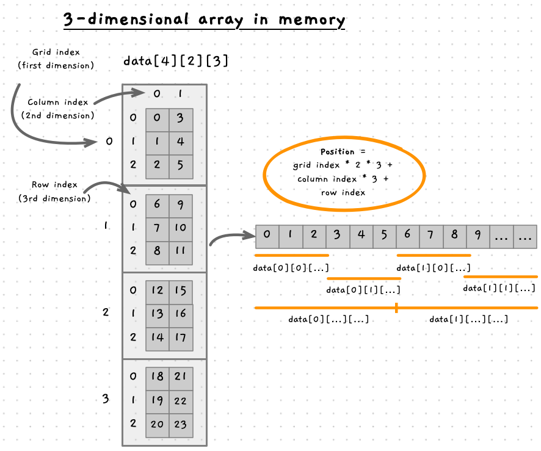

Memory allocations allow you to ask for a number of bytes, and this can be used to create arrays that contain multiple values. In some cases you may want to allocate space for a multidimensional array, so how can that be done?

## Multiple array indexes

Memory is always managed as a sequence of bytes, with each byte having an address that indicates its distance from the start of memory. So how are multidimensional arrays represented, and how could we map these to allocated memory?

Let's consider an array declared as `int data[2][3];`. This array has a total of six elements in it, and can be visualised as a grid with 2 columns, each containing 3 elements. However, in memory this is stored as six elements in sequence (next to each other in memory).

To calculate the location of an element, we use the indexes of each dimension. Have a look at the following image that will try to help explain how this works. If you look at the first column, we can see that for the first column the row index is all we need to identify the element. So in column 0, we can just use the row index. So the cell at `data[0][0]` is in memory at index 0 (we could call this `memory[0]`). The element at `data[0][1]` is therefor at `memory[1]`, `data[0][2]` is at `memory[2]`.


Next, look at the first index in the second column, element `data[1][0]`. It appears at index 3 in memory (`memory[3]`). Notice how this relates to the size of the 2nd dimension. Each column contains **3** elements, so they have taken indexes 0 to 2, the first element in the next column will be at index 3. If we had another column, it would be at index 6 (2 * the size of each column), the next would be at index 9 (3 * the size of each column), then 12 and so on.

See how this works with the array of a different size, where the visualisation shows the array `data[3][2]`. This has three columns, each with two elements. So the first element in each column are at indexes 0, 2, and 4. If we had the array `my_array[5][7]` then the index of the first element within each column would be 0, 7, 14, 21, and 28.

Given this, we can work out the position of any element in memory from the two indexes. The position in memory is the *column index* multiplied by the number of elements within that dimension. Test this out with our two array illustrations. In `int data[3][2]`, the element `data[1][2]` is at element with index 5 in memory (`memory[5]`) based on 1 * 3 + 2 = 5.

:::tip

See how the 0-based array indexes really help here. Using the offset makes it easier to calculate where these values are in memory, which is a sequence of bytes that we can interact with.

:::

## Adding more dimensions

In the example above we considered a two-dimensional array, but the same idea applies to any number of dimensions. In each case, we need to work out the size of the lower dimensions to determine where the value is stored in memory.

The following image illustrates this with a three-dimensional array structure: `int data[4][2][3]`. This array has four *grids*, each with two columns or three rows. In the lowest dimension, the 3 rows, each index is next to the previous element - so the size of this dimension is the size of a single integer. At the next dimension, the 2 columns, each column contains three rows. Each row is the size of an integer, so the size of a column is three integers. At the top dimension, each grid has two columns, each column has three rows, so we need space for six elements. You should be able to see this visually in the image.



We work out the positions in memory using basically the same equation. The index of each dimension is multiplied by the size of that dimension, as that is the space needed to store that dimensions data. To get the element at `data[2][1][0]` we know that we need to skip 2 "*grids*" each with 6 (2 * 3) elements, then we need to ship one column with 3 elements, and skip 0 rows. Giving us the index 2 * (2 * 3) + 1 * 3 + 0 = 15. Double check that visually in the image.

Test this out yourself. What is the position in memory of the following? Double-check your answers visually.

- `data[3][0][1]`
- `data[0][2][2]`
- `data[2][0][0]`
- `data[0][0][0]`
- `data[1][1][1]`
- `data[4][3][5]`
- `data[0][4][1]`

<details>
  <summary role="button">Answer</summary>
  <ul>
    <li>3 * (2 * 3) + 0 * 3 + 1 = 19</li>
    <li>0 * (2 * 3) + 2 * 3 + 2 = 8</li>
    <li>2 * (2 * 3) + 0 * 3 + 0 = 12</li>
    <li>0 * (2 * 3) + 0 * 3 + 0 = 0</li>
    <li>1 * (2 * 3) + 1 * 3 + 1 = 10</li>
    <li>4 * (2 * 3) + 3 * 3 + 5 = 38. Though we only have 24 values in memory! Potential access violation.</li>
    <li>0 * (2 * 3) + 4 * 3 + 1 = 13. But it is not the row at index 1, in column 4, of grid 0. It is data[2][0][1]!. You have to watch each index is valid.</li>
  </ul>
</details>

:::tip

Remember the index of each dimension is multiplied by the size of that dimension when you are determining its location in memory.

:::

## Allocating space for multidimensional arrays

If you need to allocate space for a multidimensional array, then you need to perform this mapping in the background. You will allocate a set amount of memory, then you can calculate the position in memory based on the indexes you are provided.

To allocate space for the 3-dimensional array illustrated above we would allocate space for 4 * 2 * 3 = 24 integers. Then you would create a function to map the indexes to the value, and a procedure to change the value. For example:

```cpp

int grid_data_index(int grid_index, int column_index, int row_index)
{
    if ( grid_index < 0 || grid_index >= MAX_GRID ||
         column_index < 0 || column_index >= MAX_COL ||
         row_index < 0 || row_index >= MAX_ROW )
    {
        return -1;
    }

    return grid_index * (MAX_COL * MAX_ROW) + 
           column_index * MAX_ROW +
           row_index;
}

int read_grid_data(int *grid, int grid_index, int column_index, int row_index)
{
    int idx = grid_data_index(grid_index, column_index, row_index);

    if ( idx != -1 )
    {
        return grid[idx];
    }
    return 0;
}

int set_grid_data(int *grid, int grid_index, int column_index, int row_index, int value)
{
    int idx = grid_data_index(grid_index, column_index, row_index);

    if ( idx != -1 )
    {
        grid[idx] = value;
    }
}
```

Where you have variable length dimensions, you can use the same approach but you would need to capture the current size of each dimension within a struct or set of variables rather than relying upon the `MAX_` constants we have used here.
