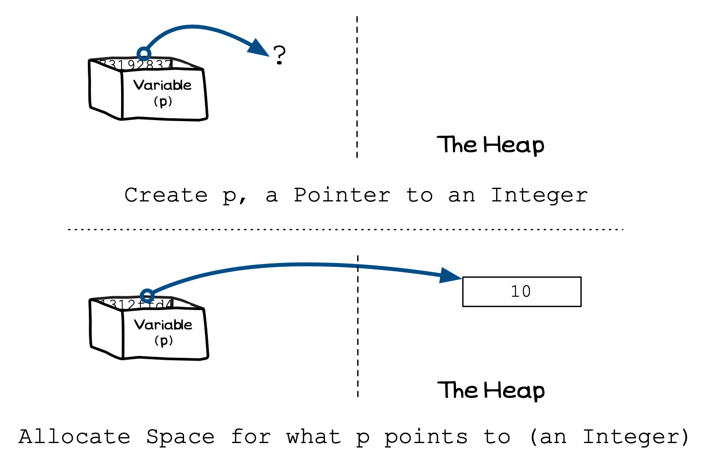

## Concept

With dynamic memory management, one of the tasks you can perform is to request space from the heap. With this request the Operating System will locate available space and allocate this to you for use in your code. The only thing the Operating System really needs to know is how much space do you require? It can then search for a free space of that size, allocate this to you, and then give you a pointer to this newly allocated area of memory.

Figure x.y: When requesting a memory allocation you need to specify the size you want
 

:::note

Allocating memory is an **action** you can perform by calling appropriate Functions or Procedures offered to you by the Programming Language.

- Your request for memory must include an indicating of the amount of memory that you require. 
- You also need to have a pointer that will refer to the memory you are allocated.
- It is possible that your request will be denied, this occurs when the computer has run out of memory to allocate.
 
:::

## Explicitly allocating memory for a single value

If you want to store a single value on the heap you can ask to be allocated enough space for a single value. [Figure x.y](#FigureAllocatingMemorySingleValue) shows a Pointer (`p`) that points to an Integer value. If you want this value to be on the Heap you can ask to be allocated enough space to store an integer (4 bytes). The Operating System will then allocate you 4 bytes of space from the Heap, and give you the address of this space.

Figure x.y: You can ask to be allocated enough space to store one value
 

:::note[C#]

In C the`malloc` function from `stdlib.h` is used to allocate memory. With `malloc` you must specify the size of the memory you require in bytes. The `sizeof` function can be used to give you the size of the value you require. For the above example you would perform the following, with `sizeof(int)` giving you the number of bytes needed to store an `int` value: `p = (int*) malloc(sizeof(int));`

:::

## Explicitly allocating memory for an array

Storing single values on the Heap can be useful, but often you want to be able to allocate enough space for a number of values. Arrays on the Stack must be of a fixed length, so this dynamic allocation allows you to have **variable length arrays**.

Figure x.y: You can ask to be allocated a number of values
 

:::note[C#]

In C you can use `malloc` to allocate space for a number of element. Alternatively the
`calloc` function from `stdlib.h` provides direct support for allocating space for an array. This function takes two parameter, the first takes the number of elements to allocation, the second the size of those elements. `calloc` also clears its allocation, setting each byte allocated to 0. The following code allocates 4 integer values as shown in [Figure x.y](#FigureArrayAllocateMemory): `p = (int*) malloc(4 * sizeof(int));` or using `calloc`, which would set all values to 0, you could use `p = (int*) calloc(4, sizeof(int));`

In C you can use the standard array access mechanisms with pointers to access subsequent elements. So `p[0]` is the value in the first element of the array dynamically allocated in [Figure x.y](#FigureArrayAllocateMemory), `p[1]` is the value of the second element, `p[2]` is the value of the third element, and so on. This relates back to Pointer arithmetic discussed in [Pointers](../02-pointer).

:::

## Changing the size of a dynamically allocated array

The advantage of dynamic memory allocation is that you can change your allocations. If you asked for an array of two values, you may later want to be able to expand that array to three or four elements. Alternatively, an array with twenty elements may have some data removed and be shrunk down to only 5 elements. All of this is possible with dynamic memory allocation. You can ask to have the memory you were allocated changed to a different size.

Figure x.y: You can change the size of the allocation, growing or shrinking the number of element
 

:::note

- These reallocations will keep the data that was in the array previously. Obviously if the new allocation is smaller than than existing one you will lose some values, but the others are kept. 
- It is possible that the Operating System will need to move your new allocation, so if you change the size of an array you need to be careful if other pointers refer to elements in their old locations.

:::

:::note[C#]

The `realloc` function from `stdlib.h` allows you to change the memory allocation of
a pointer. The following C code performs the reallocation shown in [Figure x.y](#FigureArraySizeChange): `p = (int*) realloc(p, 2 * sizeof(int));`

:::