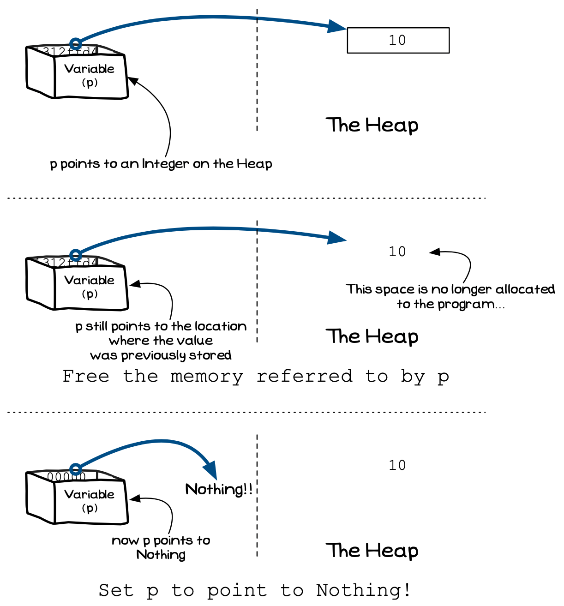

## Concept

Dynamic memory allocation requires that you manage the memory you are allocated yourself. You ask to be allocated memory, and it is your responsibility to tell the Operating System when you are finished with that memory. This is one of the main challenges of working with dynamically allocated memory. You need to take care to ensure that you do free the memory you have been allocated when you are finished with it, but at the same time you must make sure that you do not free the memory while it is still needed.

Figure x.y: You can ask to be allocated enough space to store one value
 

:::note[C#]

The `free` function releases the memory allocated to a pointer. To free the memory allocated
to `p` as shown in [Figure x.y](#FigurePointerFreeing) you would use: `free(p); p = NULL;` This will both free the ♢ memory allocation and point `p` to nothing so that you cannot accidentally access it later.

:::

