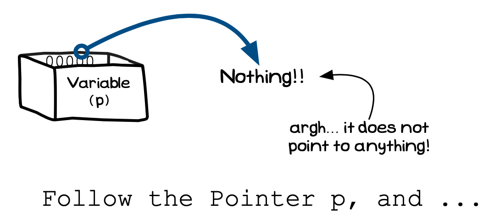

We first discussed [segmentation faults](../../../4-indirect-access/1-concepts/02-04-segfault) in the chapter on indirect access, but we always need to keep this in mind when we are working with pointers. You are likely to encounter more of these kinds of issues once you start dealing with memory management, as there will be more opportunities for these issues to occur.

Access violations occur when you try to access memory in a way that isn't permitted by memory protection in the operating system. This will cause your program to crash. [Figure x.y](#FigurePointerRuntimeError) shows a common example where this occurs. Trying to follow a pointer to *nothing* (address 0, which uses the symbol `NULL` in C/C++) will crash the program with an access violation. This applies whether you are reading or writing to the value at that address. The common name for this kind of error is a **segmentation fault**, *segfault* for short.

The only way to avoid these access violations is to **take care** with your pointers, see [Figure x.y](#FigurePointerCartoon). When you start working with pointers you need to go a little slower, and think a little more carefully about what it is you are doing. Having a good understanding of how these dynamic memory allocation tools work is the first step toward achieving this.

Trying to follow a pointer that goes nowhere is a runtime error
 

Image from <a href="http://xkcd.com/371" target="_blank">XKCD</a>, licensed under <a href="https://creativecommons.org/licenses/by-nc/2.5/">Creative Commons Attribution-NonCommercial 2.5</a> (CC-BY-NC 2.5)

:::note

Here are some tips to help you avoid these access violations:

- If there is any doubt, check your pointers before using them.
- Always initialise your pointers to `NULL`, as uninitialised pointers may contain something that looks like an address, but is really just a random value.
- You can not see dynamically allocated memory in your code, so use a pencil and paper to sketch out how these operations are designed to work as you think through the code.

:::
