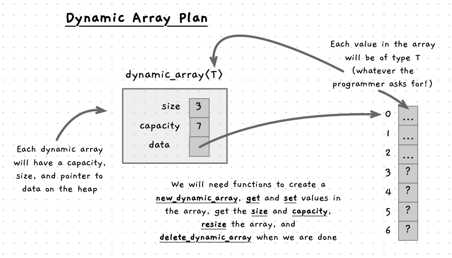

An array is relatively straightforward to picture. It is a variable which contains multiple values. In C/C++, arrays have a fixed size. Now we know about memory management we can build our own data type and functions to build a **dynamic array**, where its size can grow and shrink based on its usage.

## The Plan

Ok, let's think about what we are planning on doing. We are going to create a dynamic array. This will need some data, which we can put within a struct, and then we will need some functions and procedures to help us work with this new type we have created. The following image shows sketches out the main aspects of the plan.

We will have a `dynamic_array<T>` struct. This will use [generics](../../1-concepts/06-generics) so that the array can contain any type the programmer who uses it wants (including ourselves). Within the struct we will need fields to keep track of the `size` and the location of the `data`.

To avoid resizing every time the user adds something, we can also have a `capacity` that keeps track of how big the allocation is in memory. Our code will need to make sure that size is always less than or equal to capacity. If you try to add something when we are at capacity, then the size of the array can be changed. As a start, we can double the capacity of the array each time we fill it. This will also help avoid resizing the array frequently. We can create a `resize` function to handle the necessary steps to manage memory for us.

Notice in the image, the example struct has a size of 3, but a capacity of 7. This means we can add 4 more values to this array before it will need to resize. When we add the 5th element, it will need to resize to be double its capacity allowing it to store up to 14 elements.

In terms of functionality, we can build the following functions and procedures. These functions should allow us to provide a convenient tool, and we can extend the features as we go. To avoid issues where the user copies `dynamic_array`, we can make sure that we always work with a pointer to the `dynamic_array`.

- A `new_dynamic_array` function that will initialise the data in the struct. As we want to have this on the heap, this will allocate the memory for the `dynamic_array` and enough space for the initial capacity in the array's `data` field.
- Once we add the code to create the array, we should next create a `delete_dynamic_array` to free these allocations. This can free both the `data` and the `dynamic_array`. We can set values in memory to avoid issues if there are [dangling pointers](../../1-concepts/05-3-dangling-pointer).
- Providing functions to access `size` and `capacity` will make it easy for people to access these values when they are wanting to check what is happening within the dynamic array. This will mean that you should not need to access the fields of the struct directly.
- To put data in the array we can create an `add` function. This will check if there is capacity, and resize if needed. We can make this return a boolean so that it can return `false` if it cannot get space to add the data. This will only happen if we are out of memory, so it wont happen often.
-  

