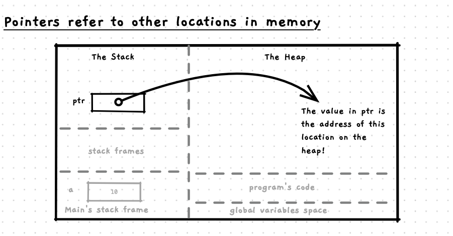

By its very nature, dynamic memory allocation must work a little differently to the way we have been working with values so far. So far, when you wanted to work with a value you declared a variable, or an array. This would have been a [local variable](/book/part-2-organised-code/1-structuring-code/5-reference/03-local-variable), with its value allocated on the stack along with the other variables you were working with in the current function or procedure. The variable and its value can be seen as one, with the value being located within the variable.

With dynamic memory allocation, the values you are allocated are on the heap. This means that their values are not bound within a variable, they exist entirely outside any variables that appears in your code. Instead, we need to use [pointers](/book/part-2-organised-code/6-indirect-access/5-reference/01-00-pointer), a new kind of type used to *point* to another location in memory. We can then use local pointer variables to track where the memory is that we can use on the heap. This is shown in the following image.

How can you access these dynamically allocated values? Using pointers.
 

Pointers allow you to store a value that tells you where the data you want is located. We can use this to access variables stored in other functions/procedures on the stack (as we have previously with references), and we can use these now to also access values on the heap.

:::tip[Pointers and References]
Pointers are very similar to references. They allow you to refer to other locations in memory. The difference is that pointers allow you to work directly with the address itself. With C/C++, we need to use pointers in order to work with its dynamic memory functionality.

Newer languages are likely to only give you access to references, as directly working with pointers can result in unintended consequences and related security issues. These languages will provide dynamic memory functionality related to their references (which will be much easier and safer to work with).
:::

## Challenges visualising this

One of the challenges of working with dynamically allocated memory is that you can no longer *‘see’* these values in your code. When you were working with variables, they were in the code, you could see them and think about the value they stored.

With dynamically allocated memory, you cannot do this. Dynamically allocated values will be allocated as a result of the operations that are performed when the code is run. This is why it is called **dynamically** allocated memory. It is not memory allocated to variables, it is **memory allocated upon request**.

You will now need to picture pointers on the stack referring to the location of the dynamically allocated memory in the heap. This is what we are trying to capture in the image above.
