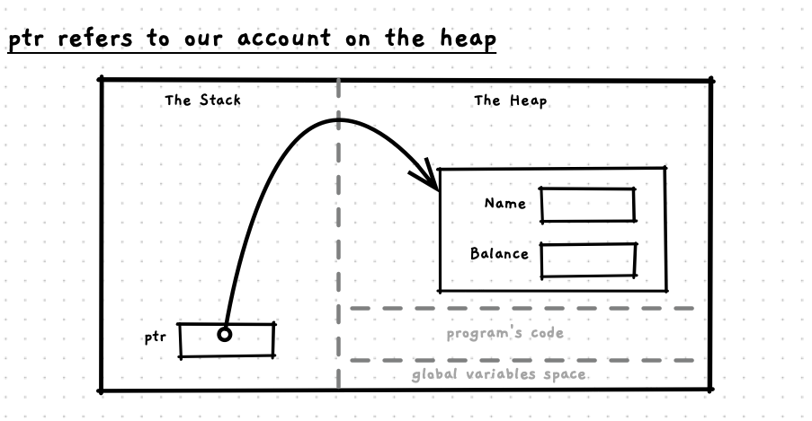

import { Accordion, AccordionItem } from 'accessible-astro-components'

C and C++ have different memory management tools. To start off, let's have a look at how to use the `new` and `delete` operators in C++. These will allow you to allocate space (using `new`) and then free that space (using `delete`).

Create a file called `test-cpp-alloc.cpp`. In this program we will create an account struct, and allocate space for it on the heap. We have added a sample `print_account` procedure that accepts a reference to an account that we can use - this should help you see how you can integrate these ideas in with the current programming skills you have.

Here is some starting code:

```cpp
#include "splashkit.h"
#include "utilities.h"

/**
 * An account value storing the name and balance of an account.
 * 
 * @field name The name of the account.
 * @field balance The amount of funds allocated to the account.
 */
struct account
{
    string name;
    int balance;
};

/**
 * Print the account details to the terminal.
 * 
 * @param act the account to print.
 */
void print_account(account &act)
{
    write_line("Name: " + act.name);
    write_line("Balance: " + to_string(act.balance));
}

int main()
{
    //TODO: declare an account pointer
    
    //TODO: Create a new account on the heap

    //TODO: Allocate details to the account's fields
    
    //TODO: Print the account using the pointer

    //TODO: Print the account using the function

    //TODO: Clean up
}
```

## Create the account on the heap

To get started using new and delete, start with the first two TODO items. Declare an account pointer variable that you can use to refer to the account we create on the heap. Then use the `new` operator to create a new account on the heap, storing the pointer in the variable you created.

Pointers variables are declared like other local variables, we just add a `*` in front of the variable name. So, to declare our account pointer we can use:

```cpp {3-4}
int main()
{
    // Create an account on the heap
    account *ptr;

    //TODO: Allocate details to the account's fields
    //...
}
```

Now that we have our pointer, we can use `new` to allocate space on the heap for an `account` and store the result in our pointer variable. The code will look like this:

```cpp {5}
int main()
{
    // Create an account on the heap
    account *ptr;
    ptr = new account();

    //TODO: Allocate details to the account's fields
    //...
}
```

We now have an account value on the heap, and `ptr` is referring to this. Note that `ptr` is not the account, it just tells us where the account is. This is shown in the following image.



## Store data in the account

Now you can interact with the account object on the heap. The code is the same as accessing a struct via a pointer, where ever the struct is stored. With a pointer you use the `->` operator to access the struct's fields.

You should end up with something like this:

```cpp {7-9,11-13}
int main()
{
    // Create an account on the heap
    account *ptr;
    ptr = new account();

    // Store data in the account
    ptr->name = "My Account";
    ptr->balance = 154;

    // Print the account using the pointer
    write_line("Name: " + ptr->name);
    write_line("Balance: " + to_string(ptr->balance));

    // Print the account using the function
    // ...
}
```

## Print the account

Now let's have a go at calling the `print_account` procedure - for this you will need to **dereference** the pointer when you pass it to the parameter. When you dereference a pointer, you are telling the compiler to access the value that the pointer refers to.

To dereference a pointer, you add a `*` before the variable name in an expression. So in our case that will be `*ptr`: where `ptr` is the pointer, and `*ptr` is the value that the pointer refers to.

Have a go at this yourself, then check in with our changes below.

```cpp {15,16}
int main()
{
    // Create an account on the heap
    account *ptr;
    ptr = new account();

    // Store data in the account
    ptr->name = "My Account";
    ptr->balance = 154;
    
    // Print the account using the pointer
    write_line("Name: " + ptr->name);
    write_line("Balance: " + to_string(ptr->balance));

    // Print the account using the function
    print_account(*ptr);

    //TODO: Clean up
}
```

## Cleaning up

Now you can wrap this up by deleting the account - this kind of action would be used when an account was removed from the system. The `delete` operator in C++ is passed a pointer to operate on. It will then free the space that was allocated to this pointer. In our case, the `ptr` pointer variable refers to the space we allocated on the heap. So when we are finished with this space, we need to `delete` it.

It is also good practice to set your pointer variable to `nullptr` after deleting it. Why? The memory still exists, and the data there will still *look like* the account you were working with. Setting the variable to `nullptr` means that it refers to a space that cannot be used, and will cause an error if you do happen to use this after deleting the dynamically allocated memory.

After making these changes you should end up with something like this:

```cpp {18-20}
int main()
{
    // Create an account on the heap
    account *ptr;
    ptr = new account();

    // Store data in the account
    ptr->name = "My Account";
    ptr->balance = 154;
    
    // Print the details out
    write_line("Name: " + ptr->name);
    write_line("Balance: " + to_string(ptr->balance));

    //Print the account using the function
    print_account(*ptr);

    //Clean up
    delete ptr;
    ptr = nullptr;
}
```

This case creates an account on the heap, interacts with it to read and write data on the heap, then frees the space used. These are all the operations you need work with dynamic memory allocation.

In the next section we will look at how we can use these ideas to create a dynamic list in memory.
