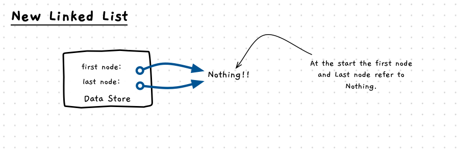

import { Accordion, AccordionItem } from 'accessible-astro-components'

To build a linked list we need to start with a class that can be used to manage the list itself. This will contain a pointer to the start of the list, and another pointer that refers to the end of the list. The pointer to the start can be used when we need to access the nodes of the list, this tells us where to start. The pointer to the last node can be used when we want to add a new node to the end of the list.

When we start a new list, the start and end pointers both need to point to nothing (`NULL`) as shown in the following image. With the linked list, the `NULL` indicates there is no node at this location.



To build this we will need to create a class for the node, and a class for the linked list. We'll keep our classes generic, so we'll have a [template parameter](/book/part-2-organised-code/5-operators-generics/5-reference/07-generics/) as well for the data type (just like the [generic array](/book/part-2-organised-code/5-operators-generics/3-guided-tour/2-generic-array/)). We will also mark everything `public:` for now - this will make it easier to test as we develop it.

Have a go at building the following template types:

|   |   |
|---|---|
| **Class** | *`node<T>`* |
| **Fields** | `next`: a `node<T>` that points to the next node in the list|
|            | `data`: (T) The data that is stored in the node |

|   |   |
|---|---|
| **Class** | *`linked_list<T>`* |
| **Fields** | `first`: a `node<T>` pointer to the first node in the list |
|            | `last`: a `node<T>` pointer to the last node in the list |

<Accordion>
  <AccordionItem header="My code for node and linked list">

```cpp
/**
 * A node is a class that contains a pointer to the next node,
 * and a data value.
 * 
 * @tparam T The type of the data that will be stored in the node.
 * @field next A pointer to the next node in the list.
 * @field data The data that is stored in the node.
 */
template <typename T>
class node
{
    public:
    node *next;
    T data;
};

/**
 * A linked list is a class that contains a pointer to the
 * first node, and the last node of the list.
 * 
 * @tparam T The type of the data that will be stored in the list.
 * @field first A pointer to the first node in the list.
 * @field last A pointer to the last node in the list.
 */
template <typename T>
class linked_list
{
    public:
    node<T> *first;
    node<T> *last;
};
```

  </AccordionItem>
</Accordion>

## Creating a new linked list

Similar to our generic array, let's give our `linked_list` class a default constructor that initialises it with zero elements. We'll need to set the `first` and `last` fields to `nullptr` - have a go at adding the default constructor now.

<Accordion>
  <AccordionItem header="My code for new linked list">

```cpp
template <typename T>
class linked_list
{

    ...

    linked_list()
    {
        first = nullptr;
        last = nullptr;
    }
};
```

  </AccordionItem>
</Accordion>
