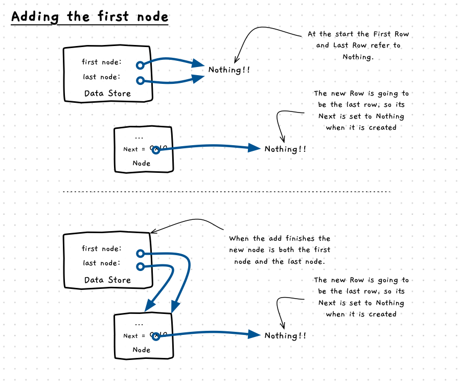

import { Accordion, AccordionItem } from 'accessible-astro-components'
import CodeScroll from '/src/components/CodeScroll.astro'

Before we start writing this code, let's think about how this needs to work.

The following illustration shows what we need to happen in memory when we add our first element. This logic needs to allocate the space for the node, set its data, set its next to `NULL`/`nullptr`, and then update it to be the first and last node in the list.



:::tip

Drawing out the memory allocations, and linking them with arrows is a great way to think through this kind of dynamic memory allocation tasks. Paper and pencil are your friend here.

Similarly, when things don't work you can create the drawing as you step through the code. This will allow you to *see* what is happening in a way that will be easier to understand than just looking at pointer address values.

:::

## Adding more nodes

The logic for the 2nd node, and all subsequent nodes, will differ as we need to link it to the existing nodes in the list. We need to add the node after the list's `last` node.

The following illustration shows how we need to connect the new node in the list. The logic includes allocating space for the node, set its data, set its next to `NULL`/`nullptr`, update the `last` node's `next` to refer to the new node, and then change which node is `last` in the list.


## The Code

Now let's try implementing this logic, by creating an `node<T>* add_node(T data)` method inside `linked_list`. It will append the node to the end of the linked list, and return a pointer to it.

Start with adding the first node - you'll need to `new` the node, assign the data, and connect up the pointers. Then, move on to adding the logic for adding more nodes.

Here's some code you can place inside `main` to test your linked list. Have a read over it - you'll see how it first adds some nodes, then tests their values by accessing them in different ways.

<CodeScroll>
```c++
linked_list<int> list;

// ---- Test first node ----
node<int>* first_node = list.add_node(2);

write("This should be 2: ");
write_line(list.first->data);

write("This should also be 2: ");
write_line(first_node->data);

write("This should also be 2: ");
write_line(list.last->data);

// ---- Test adding more nodes ----

list.add_node(4);
list.add_node(8);
list.add_node(16);

write("This should be 4: ");
write_line(list.first->next->data);

write("This should be 8: ");
write_line(list.first->next->next->data);

write("This should be 16: ");
write_line(list.last->data);
```

</CodeScroll>

Make sure to double check that things are working for the first node, and that all subsequent nodes are added to the list.

<Accordion>
  <AccordionItem header="My code for if you get stuck">

```cpp

template <typename T>
class linked_list
{
    ...

    /**
    * Add a new node to the end of the list.
    *
    * @param data The data to store in the new node.
    */
    node<T>* add_node(T data)
    {
        node<T> *new_node = new node<T>();

        new_node->data = data;
        new_node->next = nullptr;
        if (first == nullptr)
        {
            first = new_node;
            last = new_node;
        }
        else
        {
            last->next = new_node;
            last = new_node;
        }

        return new_node;
    }
};
```

  </AccordionItem>
</Accordion>
